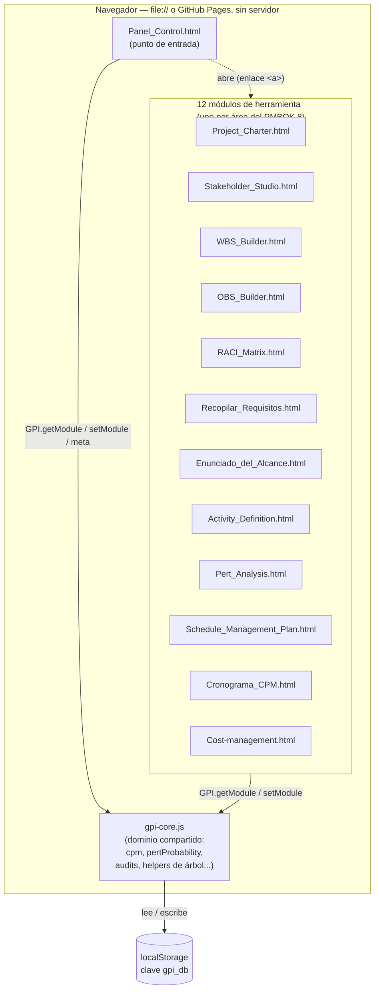

# Arquitectura

Referencia técnica permanente: qué patrón usa cada módulo, por qué varios
se apartan del patrón común, y cómo verificar que un cambio no alteró el
comportamiento observable. Este documento no se organiza cronológicamente
ni se "cierra" — se actualiza cada vez que cambia algo real de cómo está
construido el sistema.

- Reglas operativas del día a día (comandos, qué no tocar, cómo agregar
  un módulo nuevo): [CLAUDE.md](CLAUDE.md).
- Documentación funcional de cara al alumno: [README.md](README.md).
- Crónica histórica de cómo se migró de JS suelto a TypeScript + Vite
  (con fecha y evidencia puntual de cada paso): [MIGRATION.md](MIGRATION.md).

## Modelo general

13 módulos HTML autocontenidos comparten un núcleo de datos
(`gpi-core.js`, compilado desde `src/core/gpi-core.ts`) sobre
`localStorage["gpi_db"]`. Sitio 100% estático: sin backend, sin paso de
build en producción — GitHub Pages sirve la raíz tal cual, y cada HTML
también debe poder abrirse suelto por doble clic (`file://`). Por eso
todo build es IIFE (nunca `type="module"`, que `file://` bloquea por
CORS) y los artefactos compilados se commitean junto a su fuente.



Cada módulo es un HTML independiente: no hay router ni SPA. El Panel
solo enlaza a los demás con `<a href="...html">`; todo el acoplamiento
real entre módulos pasa por `gpi-core.js` y `localStorage`, nunca por
imports directos entre módulos de herramienta.

Cada módulo puede funcionar en dos modos:

- **Modo independiente** ("standalone"): sin proyecto activo en el
  Panel, con datos de ejemplo propios o en blanco. Debe seguir
  funcionando aunque `gpi-core.js` no cargue (de ahí que cada módulo
  mantenga su propio `esc()` local en vez de depender de `GPI.ui.esc`).
- **Modo integrado**: con un proyecto activo, lee/escribe su rebanada de
  `gpi_db.projects.<id>.modules.<clave>` y puede leer en vivo módulos de
  los que depende (p. ej. Definir Actividades lee la EDT).

## Esquema de `localStorage["gpi_db"]`

Referencia de orientación, no la fuente de verdad — los tipos reales
(y los únicos que el compilador valida) viven en
[`src/core/types.ts`](src/core/types.ts). Este apartado documenta la
forma general y las reglas de compatibilidad para no tener que releer
`gpi-core.ts` entero cada vez. **No se toca el esquema sin necesidad
real** (CLAUDE.md, regla #3): hay `.json` exportados por alumnos reales
que deben poder reabrirse.

### Dónde vive y cómo se accede

- Clave: `localStorage["gpi_db"]` (constante `KEY` en `gpi-core.ts`),
  JSON serializado de un único objeto `GpiDb`.
- **Respaldo en memoria**: si `localStorage` no está disponible (vista
  en un iframe, cuota agotada al leer, modo privado restrictivo), el
  núcleo cae a una variable de módulo (`mem`) y sigue funcionando
  dentro de esa misma carga de página — se pierde al recargar, pero no
  rompe la interfaz. Es el mismo mecanismo que ejercita
  `tests/smoke/gpi-core.artifact.smoke.test.ts` bajo un origen `file:`
  simulado (jsdom bloquea `localStorage` ahí, igual que lo haría un
  navegador real en un caso extremo).
- **Cuota llena**: si `localStorage.setItem` falla al guardar
  (`QuotaExceededError` u otro), `gpi-core.ts` muestra un aviso visible
  en pantalla (`showQuotaNotice`) en vez de perder cambios en silencio
  — comportamiento agregado durante la migración, no estaba en el JS
  original.

### Forma general

```
GpiDb {
  version: number                    // versión del contenedor, hoy siempre 1
  activeId: string | null            // qué proyecto ve el Panel al abrir
  projects: {
    [id]: GpiProject {
      schema: string                 // "gpi.project/v1" hoy — ver detectTool()
      meta: ProjectMeta              // nombre, cliente, fechas, moneda, CAPEX...
      modules: ProjectModules {      // una rebanada opcional por herramienta
        charter, stakeholders, wbs, activities, pert, obs, raci,
        schedulePlan, cost, requirements, scopeStatement, schedule
      }
    }
  }
}
```

Cada campo de `modules.*` es independiente y puede faltar (`undefined`)
o venir `null` (un módulo "vaciado" explícitamente desde el Panel, ver
`GPI.setModule(key, null)`) — ningún módulo asume que otro ya se llenó.

### Los 12 tipos de módulo, uno por herramienta

| Clave en `modules.*` | Tipo (en `core/types.ts`) | Lo escribe |
|---|---|---|
| `charter` | `CharterModule` | Project_Charter.html |
| `stakeholders` | `StakeholdersModule` | Stakeholder_Studio.html |
| `wbs` | `WbsModule` | WBS_Builder.html |
| `activities` | `ActivitiesModule` | Activity_Definition.html |
| `pert` | `PertModule` | Pert_Analysis.html |
| `obs` | `ObsModule` | OBS_Builder.html |
| `raci` | `RaciModule` | RACI_Matrix.html |
| `schedulePlan` | `SchedulePlanModule` | Schedule_Management_Plan.html |
| `cost` | `CostModule` | Cost-management.html |
| `requirements` | `RequirementsModule` | Recopilar_Requisitos.html |
| `scopeStatement` | `ScopeStatementModule` | Enunciado_del_Alcance.html |
| `schedule` | `ScheduleModule` | Cronograma_CPM.html |

`SchedulePlanModule` es deliberadamente laxo (varios campos
`Record<string, unknown>`): el dueño real de ese esquema es
`src/modules/schedule-plan/main.ts` (tipado localmente, con su propio
`ScheduleState`), no el núcleo — ver ARCHITECTURE.md, sección de
`Schedule_Management_Plan.html`, para el porqué.

### Compatibilidad con datos antiguos

`gpi-core.ts` tolera datos guardados por versiones anteriores del
esquema en vez de rechazarlos — por diseño, no por descuido (regla #3
de CLAUDE.md). Ejemplos reales en el código, buscar por nombre de
función si hace falta tocar esa zona:

- `normalizeToProject()` / `detectTool()`: reconocen e ingieren
  exportaciones `.json` de versiones o herramientas anteriores.
- `charterRans()`: acepta que `charter.requirements` sea un arreglo de
  strings (esquema viejo) o de objetos `{id, code, text}` (esquema
  actual), sin exigir migrar los datos guardados.
- Los audits (`charterAudit`, `schedulePlanAudit`, etc.) leen cada
  campo con `|| {}` / `|| []` defensivo, nunca asumen que un proyecto
  guardado hace meses tiene todos los campos que el formulario de hoy
  espera.

Si TypeScript marca una de estas ramas como "código muerto" o
"inalcanzable", **no se borra sin más**: casi siempre existe porque un
`.json` real y antiguo todavía la necesita (ver la nota equivalente en
MIGRATION.md, Fase 1).

## Las tres formas de referenciar el núcleo

Cada módulo referencia `GPI` de una de tres formas — no asumir que es
uniforme antes de tocar un archivo:

1. **`window.GPI` explícito** en cada llamada, con
   `interface Window { GPI?: GpiApi }` — la mayoría de los módulos
   (OBS, RACI, WBS, Activity Definition, PERT, Schedule Plan, Enunciado
   del Alcance, Stakeholder Studio, Project Charter).
2. **`GPI` como identificador global *ambiental* bare** (sin prefijo
   `window.`), vía `declare global { var GPI: GpiApi | undefined }` —
   `cost` y `requirements`. El script original ya lo escribía así.
3. **`GPI` como variable de módulo local** que hace *shadow* del
   global, capturada una vez de `window.GPI` — `cronograma-cpm` (`let
   GPI`, reasignada dentro de `init()`) y `panel-control` (`const GPI`,
   porque es el único módulo sin ningún modo "funciona sin el núcleo":
   depende incondicionalmente de `gpi-core.js`, así que no necesita
   `GPI?`/`GPI!` en cada uno de sus ~90 sitios de uso).

## Patrones y particularidades por módulo

Convenciones que comparten los 13 (no se repiten abajo salvo que un
módulo se aparte): `addEventListener` para cablear la UI (no atributos
`onclick` inline, salvo las dos excepciones marcadas abajo), IIFE
propio, `<script src="gpi-core.js">` en la cabecera, CSS de modal
basada en `gpi-shared.css` con overrides puntuales de ancho.

**Panel_Control.html** — punto de entrada del ecosistema.
- `MODULES`, `GROUPS`, `MODULOS_ENTREGADOS`, `MODULOS_EXTRA` y
  `probeModules` son la única zona que edita el profesorado para
  entregar módulos a los alumnos (ver CLAUDE.md, regla #4).
- Único módulo sin modo "funciona sin el núcleo" — de ahí el patrón 3
  de referenciar `GPI` (arriba).
- El módulo con más lecturas cruzadas de todo el ecosistema:
  `renderDashboard` combina `wbsRollup`, `requirementsAudit`,
  `scopeAudit`, `activitiesStats`, `pertStats`, `obsNodes`,
  `raciCoverage`, `charterAudit`, `schedulePlanAudit` y `scheduleStats`
  en una sola vista — los 10 cálculos de auditoría/agregación del
  núcleo, todos cubiertos por Vitest.

**Project_Charter.html**
- Único módulo con **binding genérico por ruta de puntos**: los campos
  usan `data-bind="identification.sponsor"` resuelto en runtime vía
  `getPath`/`setPath` sobre el estado completo (tipadas con `any` a
  propósito en el cruce dinámico — no hay forma limpia de tipar un
  accesor de ruta arbitraria sin maquinaria de tipos condicional que no
  se justifica aquí).
- Relación bidireccional con los metadatos comunes del proyecto: el
  acta escribe sponsor/director/cliente/CAPEX en `GPI.patchMeta()` al
  guardar, pero si el acta está vacía se precarga desde esos mismos
  metadatos.
- Lee `GPI.util.wbsPhases` (EDT) y `GPI.getModule("stakeholders")`
  (filtrando el cuadrante "gestionar de cerca", poder e interés ≥ 50).

**Stakeholder_Studio.html**
- Escrito en JavaScript moderno (`const`/`let`, arrow functions,
  template literals) a diferencia del resto (ES5, `var`/`function`).
- **No espera `DOMContentLoaded`**: el `<script>` está al final de
  `<body>`, así que ejecuta `loadSample(); wireToolbar(); render();` a
  nivel de módulo apenas carga. No "corregir" a un listener explícito.
- Poder e Interés son **campos derivados** de 5 criterios ponderados
  cada uno (nunca editables directamente) — patrón de cálculo
  multicriterio único en la suite.

**Cronograma_CPM.html** — algorítmicamente el más crítico.
- Único módulo que **depende duro de `gpi-core.js`** incluso para su
  lógica local (no solo para sincronizar con el Panel): el cálculo CPM
  vive únicamente en `GPI.util.cpm`, sin copia local. Si el núcleo no
  carga, la herramienta queda inoperante más allá del cableado de
  botones (comportamiento preexistente, no introducido por la
  migración).
- CSS del modal con más variaciones locales que el resto: ancho 420px,
  `max-height:90vh`, variante `.wide` (760px) para el editor de enlaces
  y la previsualización del pegado.

**Schedule_Management_Plan.html**
- Es un **documento vivo** de 15 secciones (checklist AACE RP 38R-06),
  no un módulo de cálculo con "modo ejemplo" separado: `init()` carga
  el ejemplo DISTRIB+ incondicionalmente, y un segundo listener
  (`gpiBridge`) lo sobrescribe con un estado en blanco si hay un
  proyecto activo sin plan guardado — así nunca graba el ejemplo encima
  de un proyecto real por accidente al salir de la página.
- El esquema completo (`ScheduleState`) se tipa **localmente en el
  módulo**, no en `SchedulePlanModule` de `core/types.ts` (deliberadamente
  laxo — varios campos `Record<string, unknown>` — porque el núcleo
  solo necesita leer un puñado de sub-campos para `schedulePlanAudit`).
  Este módulo es el dueño real del esquema completo.

**Pert_Analysis.html**
- Calcula la ruta crítica **probabilística**: recalcula el CPM con
  duraciones esperadas (TE) de cada actividad — el "CPM sobre TE"
  clásico del método PERT — a diferencia de Cronograma/CPM
  (determinístico).
- La M (más probable) tiene un modo "automático" que sigue en vivo la
  duración `Dur = Met/(#Eq×R)` de Definir Actividades; escribir un
  valor la fija manualmente, borrarlo la regresa a automático.
- Grilla estilo Excel (pegado TSV, navegación de teclado, menú
  contextual), compartida en espíritu con Cronograma/CPM.

**Activity_Definition.html**
- Único módulo que depende de una librería externa vía CDN
  (`window.JSZip`, para exportar/importar `.xlsx`), tipada con una
  interfaz mínima local (`JSZipInstance`/`JSZipCtor`) en vez de
  `@types/jszip`. Si `JSZip` no carga, la exportación cae a un CSV
  equivalente (`buildTemplateCsv()`).
- Lee la EDT en vivo desde `GPI.getModule("wbs")` (nunca la duplica);
  las actividades viven en un módulo propio, `GPI.getModule("activities")`,
  indexado por el id de cada paquete de trabajo. Numeración de filas al
  estilo MS Project (`fullRows()`): fila 0 es siempre el proyecto.
- **Rediseñado de grilla interactiva a import/export de plantilla
  Excel** (el cronograma real del curso se trabaja en MS Project, no en
  el simulador): la tabla es de solo lectura; "⇩ Descargar plantilla
  EDT" genera un `.xlsx` con una fila por paquete de trabajo (código +
  nombre pre-llenados), y "⇧ Importar actividades desde Excel" lee el
  archivo completado afuera y **reemplaza** `byLeaf` entero (no hace
  merge — la plantilla no lleva id de actividad estable, así que un
  merge sería ambiguo). El emparejamiento de filas importadas usa el
  código EDT (vía `leafRows()`) y el de columnas usa el TEXTO del
  encabezado normalizado (no la posición), así que reordenar columnas en
  Excel no rompe el import. El parser de `.xlsx` es hand-rolled: resuelve
  la hoja de datos real vía `xl/workbook.xml` + sus `_rels` (nunca asume
  `sheet1.xml`), y soporta tanto `xl/sharedStrings.xml` (formato real de
  Excel) como `t="inlineStr"` (el propio formato de exportación de este
  proyecto). La duración sigue sin persistirse: se recalcula en pantalla
  igual que en `pert`/`cronograma-cpm`.

**WBS_Builder.html** — el de mayor fan-out.
- Lee `raci` (bloquea "Responsable" si la RACI ya asignó un "R" —
  `raciLocksResource`), `obs` y `scopeStatement` (siembra de entregables
  como ramas de nivel 1, `seedFromScope`).
- **Coherencia de Costo/Fechas/Responsable**: al definir la EDT es
  imposible conocer el costo, la duración o las fechas reales de un
  paquete — son estimaciones. El WBS deja explícito cuándo un valor es
  estimado y cuándo viene de otro módulo:
  - **Responsable**: nunca texto libre. Si la RACI ya asignó un "R" para
    el paquete, el campo es de solo lectura (`raciLocksResource`). Si no,
    es una lista desplegable (`resourceFieldHtml`) restringida a los
    cargos del OBS ("Cargo — Persona"); si el proyecto todavía no tiene
    OBS, el campo queda deshabilitado con el aviso de crearla primero —
    nunca permite escribir un nombre arbitrario. Un valor previo que ya
    no coincide con ningún cargo actual del OBS se conserva como opción
    "(valor anterior)" en vez de perderse.
  - **Fechas/Duración**: si el paquete ya tiene actividades definidas
    (`activities`) y una ruta crítica calculable (sin ciclos, con fecha
    de inicio de proyecto en Metadatos), `GPI.util.applyScheduleToWbs`
    (gpi-core.ts) recalcula el CPM con la misma duración determinística
    (Metrado/Rendimiento) que usa Cronograma_CPM.html en su modo por
    defecto, y fija start/end del paquete a esas fechas reales —
    `cpmLocksDates` bloquea entonces los campos de fecha y duración en
    la UI ("🔗 Tomado del Cronograma"). Sin esa ruta crítica calculable,
    los campos siguen editables a mano y se etiquetan "📐 Estimado".
    Mismo patrón que RACI→Responsable, pero para fechas.
  - **Costo**: siempre una estimación bottom-up ingresada en la propia
    EDT — hoy ningún otro módulo del curso calcula un costo real por
    paquete de trabajo (el módulo `cost` hace lo opuesto: LEE el rollup
    de costo del WBS como su "costo base" para calcular el BAC, no al
    revés). El campo se etiqueta "📐 Estimado" en vez de dar a entender
    que es un valor definitivo.

**Enunciado_del_Alcance.html**
- El módulo de solo-lectura más complejo: su pestaña "Consistencia"
  consume `GPI.util.traceMatrix` (RAN→REQ→DEL→WP), la función de
  integración vertical más elaborada del núcleo.

**Recopilar_Requisitos.html**
- Una de las dos excepciones que usan atributos `onclick`/`onchange`
  inline (13 funciones expuestas vía `Object.assign(window, {...})`) en
  vez de `addEventListener`, porque el HTML original ya estaba así y
  reescribirlo habría sido un cambio de alcance mayor a "portar a
  TypeScript".
- Usa su propio modal (`.ov`/`.modal`), no `.modal-overlay`/`.modal-card`.
- El módulo con más lecturas cruzadas: `charter` (RAN), `stakeholders`
  (origen del requisito) y `wbs` (trazabilidad), con datos de
  demostración propios (`DEMO`) para el modo suelto.

**Cost-management.html**
- La otra excepción con atributos `onclick`/`onchange`/`oninput`
  inline (`Object.assign(window, { exportJSON, importJSON, save,
  recalcCont, onBaseInput, pullFromWBS, addCO, coStatus, delCO,
  buildDoc })`).
- Referencia `GPI` como identificador global bare (patrón 2 de la
  sección anterior).
- No usa modales — usa un toast propio. No carga `gpi-shared.css`.
- Regla de oro propia: no crea `modules.cost` hasta la primera edición
  real del alumno (`save()` sin editar nada no persiste nada).

**RACI_Matrix.html**
- Depende de `window.GPI.util` para su propia lógica en modo "live"
  (`wbsLeaves`, `obsNodes`, `raciAudit`, `applyRaciToWbs`), no solo para
  sincronizar con el Panel. El modo "sample" sigue funcionando sin GPI.
- `GPI.util.raciAudit` espera filas completas (`resource`/`email`); el
  estado local no los necesita, así que se adaptan solo en la frontera
  de esa llamada (`rows.map(r => ({...r, resource: ""}))`).
- El ejemplo DISTRIB+ trae 7 errores deliberados: el Velocímetro de
  Gobernanza debe marcar "🔴 RECHAZADO" — si algún día pasa a "🟢
  CERTIFICADO", es señal de que `raciAudit` o el dataset se rompieron.

**OBS_Builder.html**
- Piloto de la migración: valida de punta a punta el patrón que
  siguieron los demás (`addEventListener`, `window.GPI`, `esc()` local,
  `gpi-shared.css` para el modal).

## Cómo verificar equivalencia de comportamiento (metodología A/B)

Técnica reutilizable para comprobar que un cambio (una migración, una
subida de versión de Vite/TypeScript, un refactor grande) no alteró el
comportamiento observable de la suite, comparando contra cualquier
commit/tag de referencia:

1. **Montar la versión de referencia en un `git worktree` aparte**
   (p. ej. `git worktree add ../ref-check baseline-pre-migracion`), sin
   tocar el checkout de trabajo.
2. **Generar un fixture real**: recorrer la versión de referencia
   cargando el ejemplo DISTRIB+ en cadena por las herramientas
   relevantes, arrastrando el `localStorage` de una página a la
   siguiente como haría un navegador (un script jsdom-sobre-HTTP-local,
   no `file://` directo — ver la nota de jsdom en CLAUDE.md).
3. **Servir ambas versiones por HTTP local** (nunca `file://` en el
   harness: jsdom trata ese origen como opaco y bloquea `localStorage`,
   cosa que los navegadores reales no hacen) y abrir cada página
   relevante en ambas con el mismo `gpi_db` de partida.
4. **Comparar dos cosas por página**: el texto renderizado del
   `<body>` (excluyendo `<script>`/`<style>`) y el `gpi_db` resultante
   tras disparar el guardado (`beforeunload`). Normalizar únicamente
   las marcas de tiempo escritas en el momento de la corrida.
5. Repetir el mismo recorrido abriendo cada página por `file://` en
   ambas versiones, para validar el caso de uso de doble clic aparte
   del servido por HTTP.

Cualquier diferencia debe explicarse una por una (ruido temporal,
cambio de configuración deliberado, etc.) antes de dar el cambio por
equivalente — nunca descartarla sin más. El registro de la última
corrida completa de esta metodología (13 módulos contra
`baseline-pre-migracion`) vive en [MIGRATION.md](MIGRATION.md).

## Dataset de referencia (DISTRIB+)

El caso de ejemplo "DISTRIB+" es el dataset dorado de la suite: los
tests unitarios de `GPI.util.cpm` y los smoke tests lo usan como
regresión end-to-end. Resultado esperado del cronograma (12
actividades, 13 enlaces): **53 días laborables, fin 2026-09-16, ruta
crítica `a1-a2-a3-a4-a8-a9-a10-a11-a12`**. Si este número cambia sin un
cambio deliberado en `cpm()` o en el dataset, algo se rompió.

### Regla: UN SOLO proyecto ejemplo coherente en los 12 módulos

Cada módulo (excepto `panel-control`) genera su propio "Cargar ejemplo"
/ "Modo ejemplo" de forma **independiente en su propio código** — no
hay un proyecto DISTRIB+ único guardado una vez en `localStorage` que
todos lean; cada `main.ts` tiene su propia función (`loadSample()`,
`SAMPLE`, `sampleState()`, `buildSample()`...). Por diseño, **todas
deben describir el MISMO proyecto ficticio** ("DISTRIB+ S.A. — Almacén
Lurín"), con los mismos códigos, nombres, personas y fechas — auditado
end-to-end el 2026-09-13 (12/12 módulos coherentes; ver detalle de la
corrida en el historial de conversación si hace falta el detalle
completo). Catálogo canónico para no tener que releer los 12 archivos
cada vez que se agrega o toca un módulo:

- **Proyecto**: "DISTRIB+ S.A. — Almacén Lurín" (Lima), 12.000 m² en
  Lurín. Código de manager `DPLU-2026`. Inicio **2026-07-06**, cierre
  **2026-11-06**. CAPEX **USD 8.500.000** (moneda del proyecto: USD en
  todos los módulos que la mencionan — `cost` debe arrancar en USD por
  defecto también, no en PEN, aunque su monto base 7.100.000 numérico
  coincida con el total del WBS).
- **EDT** (`wbs`/`activities`/`pert`/`cronograma-cpm`/`raci` la
  replican tal cual): 1 Dirección de Proyecto (1.1–1.3) · 2 Ingeniería
  y Diseño (2.1 Estudio de suelos, 2.2 Diseño estructural, 2.3 Diseño
  eléctrico y sanitario, **2.4 Permisos y licencias municipales**) · 3
  Procura (3.1 Estructuras metálicas, 3.2 Materiales de construcción,
  3.3 Equipos eléctricos e instalaciones) · 4 Construcción (4.1–4.5) ·
  5 Pruebas y Puesta en Marcha (5.1–5.3). Costo total del WBS: **S/
  7.100.000** (18 paquetes).
- **OBS** (`obs`/`raci` la replican): Comité Directivo/Sponsor →
  Gerencia General DISTRIB+ · Director de Proyecto → PM · Jefe de
  Ingeniería/Ing. Civil → Geotecnia, Ing. Estructural, Ing. MEP · Jefe
  de Logística/Logística → Proveedor A/B/C · Residente de Obra →
  Cuadrilla A–D, Subcontrata MEP · Control de Calidad/QA-QC · Asesoría
  Legal/Legal. `raci/main.ts` agrega a propósito un cargo "Coordinador
  HSE" que NO existe en `obs` — es un error didáctico deliberado (ver
  el comentario "Nota didáctica" en `SAMPLE_ASSIGNMENTS`, dispara la
  regla SR-03 del Velocímetro de Gobernanza); no es una incoherencia a
  corregir.
- **Interesados** (`stakeholder-studio`, ids `s1`…`s12`, referenciados
  por id desde `requirements`): Gerencia General DISTRIB+ (s1), Banco
  financista/BCP, Constructora/Contratista EPC, Municipalidad de Lurín
  (s4), OEFA, SUNAFIL (s6), Junta de vecinos, Sindicato de construcción
  civil, Futuros operarios (s9), Clientes/distribuidores (s10),
  Proveedor de estructuras/Proveedor A, Prensa/medios locales.
- **Requisitos/Alcance** (`project-charter` RAN.01–RAN.04 →
  `requirements` `ran1`-`ran4`/`q#` → `scope-statement` deliverables):
  encadenados por id, no por texto — cualquier módulo nuevo que agregue
  un requisito o entregable del caso debe seguir esa misma cadena de
  ids en vez de inventar los suyos.
- **Hitos/fechas clave** (`schedule-plan`, calzan con `wbs`/`charter`):
  aprobación del plan 2026-07-20, fin Ingeniería 2026-08-14, permisos
  2026-08-21, fin Procura 2026-08-26 (lo cierra 3.3, no 3.1 — 3.1
  termina antes, el 08-19), fin cimentaciones 2026-09-04, entrega final
  2026-11-06. Feriados de ejemplo: 2026-07-28/29, 2026-08-30.

**Regla para trabajo futuro**: al agregar un módulo o una función
nueva que necesite datos de ejemplo, el ejemplo se **AMPLÍA** a partir
de este mismo caso (mismos códigos EDT, mismas personas del OBS,
mismas fechas, mismo proyecto) — nunca se inventa un escenario nuevo
ni se cambia un dato ya usado por otro módulo sin propagar el cambio a
todos los que lo referencian. Si la ampliación agrega un elemento
verdaderamente nuevo al caso (una fase, un cargo, un interesado, un
hito), se documenta aquí mismo para que la próxima ampliación lo
encuentre.
