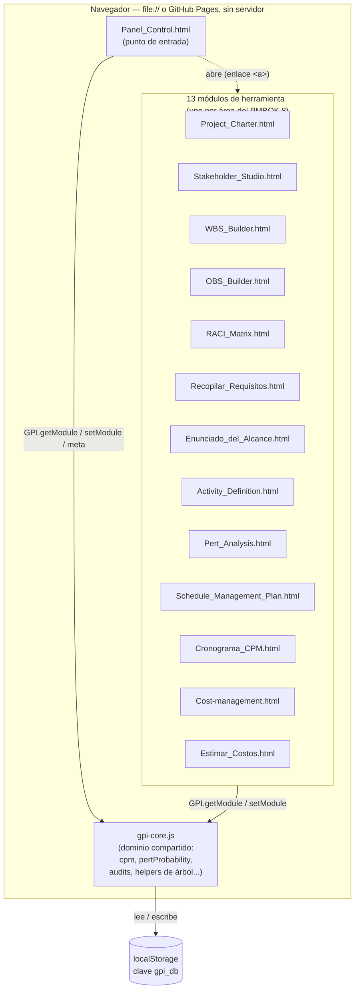

# Arquitectura

Referencia técnica permanente: qué patrón usa cada módulo, por qué varios
se apartan del patrón común, y cómo verificar que un cambio no alteró el
comportamiento observable. Este documento no se organiza cronológicamente
ni se "cierra" — se actualiza cada vez que cambia algo real de cómo está
construido el sistema.

- Reglas operativas del día a día (comandos, qué no tocar, cómo agregar
  un módulo nuevo): [CLAUDE.md](CLAUDE.md).
- Documentación funcional de cara al alumno: [README.md](README.md).
- Crónica histórica de cómo se migró de JS suelto a TypeScript + Vite
  (con fecha y evidencia puntual de cada paso): [MIGRATION.md](MIGRATION.md).

## Modelo general

14 módulos HTML autocontenidos comparten un núcleo de datos
(`gpi-core.js`, compilado desde `src/core/gpi-core.ts`) sobre
`localStorage["gpi_db"]`. Sitio 100% estático: sin backend, sin paso de
build en producción — GitHub Pages sirve la raíz tal cual, y cada HTML
también debe poder abrirse suelto por doble clic (`file://`). Por eso
todo build es IIFE (nunca `type="module"`, que `file://` bloquea por
CORS) y los artefactos compilados se commitean junto a su fuente.



Cada módulo es un HTML independiente: no hay router ni SPA. El Panel
solo enlaza a los demás con `<a href="...html">`; todo el acoplamiento
real entre módulos pasa por `gpi-core.js` y `localStorage`, nunca por
imports directos entre módulos de herramienta.

Cada módulo puede funcionar en dos modos:

- **Modo independiente** ("standalone"): sin proyecto activo en el
  Panel, con datos de ejemplo propios o en blanco. Debe seguir
  funcionando aunque `gpi-core.js` no cargue (de ahí que cada módulo
  mantenga su propio `esc()` local en vez de depender de `GPI.ui.esc`).
- **Modo integrado**: con un proyecto activo, lee/escribe su rebanada de
  `gpi_db.projects.<id>.modules.<clave>` y puede leer en vivo módulos de
  los que depende (p. ej. Definir Actividades lee la EDT).

## Esquema de `localStorage["gpi_db"]`

Referencia de orientación, no la fuente de verdad — los tipos reales
(y los únicos que el compilador valida) viven en
[`src/core/types.ts`](src/core/types.ts). Este apartado documenta la
forma general y las reglas de compatibilidad para no tener que releer
`gpi-core.ts` entero cada vez. **No se toca el esquema sin necesidad
real** (CLAUDE.md, regla #3): hay `.json` exportados por alumnos reales
que deben poder reabrirse.

### Dónde vive y cómo se accede

- Clave: `localStorage["gpi_db"]` (constante `KEY` en `gpi-core.ts`),
  JSON serializado de un único objeto `GpiDb`.
- **Respaldo en memoria**: si `localStorage` no está disponible (vista
  en un iframe, cuota agotada al leer, modo privado restrictivo), el
  núcleo cae a una variable de módulo (`mem`) y sigue funcionando
  dentro de esa misma carga de página — se pierde al recargar, pero no
  rompe la interfaz. Es el mismo mecanismo que ejercita
  `tests/smoke/gpi-core.artifact.smoke.test.ts` bajo un origen `file:`
  simulado (jsdom bloquea `localStorage` ahí, igual que lo haría un
  navegador real en un caso extremo).
- **Cuota llena**: si `localStorage.setItem` falla al guardar
  (`QuotaExceededError` u otro), `gpi-core.ts` muestra un aviso visible
  en pantalla (`showQuotaNotice`) en vez de perder cambios en silencio
  — comportamiento agregado durante la migración, no estaba en el JS
  original.

### Forma general

```
GpiDb {
  version: number                    // versión del contenedor, hoy siempre 1
  activeId: string | null            // qué proyecto ve el Panel al abrir
  projects: {
    [id]: GpiProject {
      schema: string                 // "gpi.project/v1" hoy — ver detectTool()
      meta: ProjectMeta              // nombre, cliente, fechas, moneda, CAPEX...
      modules: ProjectModules {      // una rebanada opcional por herramienta
        charter, stakeholders, wbs, activities, pert, obs, raci,
        schedulePlan, cost, requirements, scopeStatement, schedule
      }
    }
  }
}
```

Cada campo de `modules.*` es independiente y puede faltar (`undefined`)
o venir `null` (un módulo "vaciado" explícitamente desde el Panel, ver
`GPI.setModule(key, null)`) — ningún módulo asume que otro ya se llenó.

### Los 13 tipos de módulo, uno por herramienta

| Clave en `modules.*` | Tipo (en `core/types.ts`) | Lo escribe |
|---|---|---|
| `charter` | `CharterModule` | Project_Charter.html |
| `stakeholders` | `StakeholdersModule` | Stakeholder_Studio.html |
| `wbs` | `WbsModule` | WBS_Builder.html |
| `activities` | `ActivitiesModule` | Activity_Definition.html |
| `pert` | `PertModule` | Pert_Analysis.html |
| `obs` | `ObsModule` | OBS_Builder.html |
| `raci` | `RaciModule` | RACI_Matrix.html |
| `schedulePlan` | `SchedulePlanModule` | Schedule_Management_Plan.html |
| `cost` | `CostModule` | Cost-management.html |
| `costEstimate` | `CostEstimateModule` | Estimar_Costos.html |
| `requirements` | `RequirementsModule` | Recopilar_Requisitos.html |
| `scopeStatement` | `ScopeStatementModule` | Enunciado_del_Alcance.html |
| `schedule` | `ScheduleModule` | Cronograma_CPM.html |

`SchedulePlanModule` es deliberadamente laxo (varios campos
`Record<string, unknown>`): el dueño real de ese esquema es
`src/modules/schedule-plan/main.ts` (tipado localmente, con su propio
`ScheduleState`), no el núcleo — ver ARCHITECTURE.md, sección de
`Schedule_Management_Plan.html`, para el porqué.

### Compatibilidad con datos antiguos

`gpi-core.ts` tolera datos guardados por versiones anteriores del
esquema en vez de rechazarlos — por diseño, no por descuido (regla #3
de CLAUDE.md). Ejemplos reales en el código, buscar por nombre de
función si hace falta tocar esa zona:

- `normalizeToProject()` / `detectTool()`: reconocen e ingieren
  exportaciones `.json` de versiones o herramientas anteriores.
- `charterRans()`: acepta que `charter.requirements` sea un arreglo de
  strings (esquema viejo) o de objetos `{id, code, text}` (esquema
  actual), sin exigir migrar los datos guardados.
- Los audits (`charterAudit`, `schedulePlanAudit`, etc.) leen cada
  campo con `|| {}` / `|| []` defensivo, nunca asumen que un proyecto
  guardado hace meses tiene todos los campos que el formulario de hoy
  espera.

Si TypeScript marca una de estas ramas como "código muerto" o
"inalcanzable", **no se borra sin más**: casi siempre existe porque un
`.json` real y antiguo todavía la necesita (ver la nota equivalente en
MIGRATION.md, Fase 1).

### Guardar/Abrir `.json` es responsabilidad EXCLUSIVA de Panel de Control

Hasta hace poco, cada uno de los 13 módulos-herramienta tenía su propio
par de botones "⭳ Guardar (.json)" / "⭱ Abrir (.json)" (respaldo de
SOLO la porción de datos de ese módulo). A pedido explícito del
usuario, se retiraron de los 13 módulos por generar confusión: no
quedaba claro si ese `.json` era "el respaldo del proyecto" o algo
aparte, y coexistía con el propio flujo de Panel de Control sin que
ninguno de los dos se explicara — ver el razonamiento completo en la
conversación que originó este cambio. El respaldo/restauración de datos
ahora vive ÚNICAMENTE en `Panel_Control.html`, con dos niveles:

- **"⭳ Exportar proyecto" / "⭱ Importar proyecto"** (`btnExport`/
  `btnImport` + `fileProject`, `_mode = "project"`): el archivo
  completo, TODOS los módulos juntos (`importProject()`/`exportActive()`).
- **"⭱ Importar .json" en cada tarjeta del lanzador** (`data-import`,
  `importToolInto()` → `_mode = "module"` → `GPI.ingestToolExport()`):
  acepta el `.json` de UN SOLO módulo — el mismo formato que cada
  herramienta seguía sabiendo generar únicamente en la mente de quien
  ya tuviera un archivo viejo guardado — y lo enchufa solo en esa
  porción del proyecto activo, vía `detectTool()`. Como esta acción
  vive en el Panel y no en el módulo, **`detectTool()` tiene que
  reconocer la exportación de los 13 módulos sin excepción** — retirar
  el import propio de "Recopilar Requisitos" y "Estimar los Costos"
  expuso que sus formatos (`gpi.requirements/v1`, `gpi.costEstimate/v1`)
  nunca habían tenido caso en `detectTool()`: el botón "Importar .json"
  de esas dos tarjetas existía pero fallaba en silencio
  (`unknown-format`). Se agregaron los dos casos que faltaban al mismo
  tiempo que se retiraban los botones — ver `tests/unit/tool-export-import.test.ts`,
  que fija los 13 formatos reconocidos uno por uno (más los casos
  `unknown-format`/`no-active`).
- **Excepción deliberada, no un descuido**: la matriz RACI
  (`RACI_Matrix.html`) restauraba antes, desde su propio `.json`, no
  solo `assignments` sino también un "congelado" (`rowsSnapshot`/
  `colsSnapshot`) de las filas/columnas tal como estaban al exportar —
  útil para reabrir una matriz vieja aunque el WBS/OBS actual ya haya
  cambiado. `detectTool()` para `gpi.raci/v1` solo extrae
  `assignments`; el congelado NO se replicó al centralizar (reimportar
  vía Panel de Control siempre recalcula filas/columnas contra el
  WBS/OBS VIVOS, igual que el modo "live" normal del módulo) — un
  recorte de alcance consciente, no un bug, documentado aquí para no
  "redescubrirlo" como regresión.

## Las tres formas de referenciar el núcleo

Cada módulo referencia `GPI` de una de tres formas — no asumir que es
uniforme antes de tocar un archivo:

1. **`window.GPI` explícito** en cada llamada, con
   `interface Window { GPI?: GpiApi }` — la mayoría de los módulos
   (OBS, RACI, WBS, Activity Definition, PERT, Schedule Plan, Enunciado
   del Alcance, Stakeholder Studio, Project Charter).
2. **`GPI` como identificador global *ambiental* bare** (sin prefijo
   `window.`), vía `declare global { var GPI: GpiApi | undefined }` —
   `cost` y `requirements`. El script original ya lo escribía así.
3. **`GPI` como variable de módulo local** que hace *shadow* del
   global, capturada una vez de `window.GPI` — `cronograma-cpm` (`let
   GPI`, reasignada dentro de `init()`) y `panel-control` (`const GPI`,
   porque es el único módulo sin ningún modo "funciona sin el núcleo":
   depende incondicionalmente de `gpi-core.js`, así que no necesita
   `GPI?`/`GPI!` en cada uno de sus ~90 sitios de uso).

## El "Id." de Definir las Actividades, Estimar los Costos, Análisis PERT y Cronograma/CPM

Los cuatro módulos del cronograma leen la MISMA EDT (`wbs`) y las MISMAS
actividades (`activities.byLeaf`) en vivo desde gpi-core, y cada uno
arma su propia `fullRows()`/`fullRowsSnapshot()` recorriendo esa EDT con
el mismo algoritmo MS Project: fila 0 = proyecto, luego cada fase,
paquete y actividad en orden jerárquico, con un correlativo (`n`/`netId`)
que antes se llamaba "N.º" y ahora se muestra como **"Id."** en la
cabecera de las cuatro tablas.

**Regla de oro (corregida a pedido explícito del usuario, ver historial
de commits): el Id. es SIEMPRE consecutivo y SIN SALTOS, exactamente
como el Task ID que MS Project asigna a cada fila de un cronograma —
incluidos los hitos.** Un alumno pega o exporta estas tablas contra un
cronograma real de MS Project, donde una fila (tarea o hito) siempre
tiene un ID entero consecutivo; si esta tabla dejara un hueco (p. ej.
"—") en la fila de un hito, esa correspondencia 1:1 con MS Project se
rompería. Por eso **ninguna fila deja de incrementar el contador de
Id.** — ni siquiera un elemento que solo existe en un módulo. La primera
versión de este diseño hacía lo contrario (los hitos no consumían Id.,
para que el número coincidiera entre los cuatro módulos); se revirtió
porque romper la correlación con MS Project es más grave que perder esa
coincidencia entre módulos.

Consecuencia directa: dentro de un mismo proyecto, el Id. de **Definir
las Actividades** y de **Estimar los Costos** siempre coincide entre sí
(ambos muestran hitos), y el Id. de **Análisis PERT** y de
**Cronograma/CPM** siempre coincide entre sí (ninguno de los dos lee
`activities.milestones`, así que ninguno muestra hitos). Pero entre esos
dos PARES, el Id. solo coincide **hasta el primer hito** del proyecto —
a partir de ahí, Definir las Actividades/Estimar los Costos van "un
número más adelante" que PERT/Cronograma-CPM para el mismo paquete o
actividad, porque los primeros sí le dan un número real al hito y los
segundos ni lo ven. Esto es esperado, no un bug: cada par de tablas
mantiene su propia correlación 1:1 con MS Project (que es lo que
realmente importa), a costa de que el Id. dejе de ser una clave universal
entre los cuatro cuando hay hitos de por medio.

Los hitos ya siguen esta regla: en `fullRows()` de `activities/main.ts` y
`cost-estimate/main.ts`, las líneas `milestones.filter(...)` /
`placeLooseMilestones(...)` pasan `n: n++` igual que cualquier otra fila
(nunca `n: -1` ni un valor especial) — ver el detalle en la sección de
Activity_Definition.html más abajo. Cualquier elemento futuro que solo
exista en un módulo debe seguir el mismo patrón: consumir su número como
cualquier fila, nunca dejar un hueco.

Cubierto por tests: `tests/smoke/activity-definition.smoke.test.ts` y
`cost-estimate.smoke.test.ts` siembran un proyecto con un hito de por
medio y verifican la secuencia sin saltos `0,1,2,3,4,5,6,7` (el hito
ocupa el 5); `pert-analysis.smoke.test.ts` y `cronograma-cpm.smoke.test.ts`
siembran el MISMO proyecto y verifican que su propia secuencia
`0,1,2,3,4,5,6` no se ve afectada por el hito (nunca lo ven).

## Patrones y particularidades por módulo

Convenciones que comparten los 14 (no se repiten abajo salvo que un
módulo se aparte): `addEventListener` para cablear la UI (no atributos
`onclick` inline, salvo las dos excepciones marcadas abajo), IIFE
propio, `<script src="gpi-core.js">` en la cabecera, CSS de modal
basada en `gpi-shared.css` con overrides puntuales de ancho.

**Panel_Control.html** — punto de entrada del ecosistema.
- `MODULES`, `GROUPS`, `MODULOS_ENTREGADOS`, `MODULOS_EXTRA` y
  `probeModules` son la única zona que edita el profesorado para
  entregar módulos a los alumnos (ver CLAUDE.md, regla #4).
- Único módulo sin modo "funciona sin el núcleo" — de ahí el patrón 3
  de referenciar `GPI` (arriba).
- El módulo con más lecturas cruzadas de todo el ecosistema:
  `renderDashboard` combina `wbsRollup`, `requirementsAudit`,
  `scopeAudit`, `activitiesStats`, `pertStats`, `obsNodes`,
  `raciCoverage`, `charterAudit`, `schedulePlanAudit` y `scheduleStats`
  en una sola vista — los 10 cálculos de auditoría/agregación del
  núcleo, todos cubiertos por Vitest.

**Project_Charter.html**
- Único módulo con **binding genérico por ruta de puntos**: los campos
  usan `data-bind="identification.sponsor"` resuelto en runtime vía
  `getPath`/`setPath` sobre el estado completo (tipadas con `any` a
  propósito en el cruce dinámico — no hay forma limpia de tipar un
  accesor de ruta arbitraria sin maquinaria de tipos condicional que no
  se justifica aquí).
- Relación bidireccional con los metadatos comunes del proyecto: el
  acta escribe sponsor/director/cliente/CAPEX en `GPI.patchMeta()` al
  guardar, pero si el acta está vacía se precarga desde esos mismos
  metadatos.
- Lee `GPI.util.wbsPhases` (EDT) y `GPI.getModule("stakeholders")`
  (filtrando el cuadrante "gestionar de cerca", poder e interés ≥ 50).

**Stakeholder_Studio.html**
- Escrito en JavaScript moderno (`const`/`let`, arrow functions,
  template literals) a diferencia del resto (ES5, `var`/`function`).
- **No espera `DOMContentLoaded`**: el `<script>` está al final de
  `<body>`, así que ejecuta `loadSample(); wireToolbar(); render();` a
  nivel de módulo apenas carga. No "corregir" a un listener explícito.
- Poder e Interés son **campos derivados** de 5 criterios ponderados
  cada uno (nunca editables directamente) — patrón de cálculo
  multicriterio único en la suite.

**Cronograma_CPM.html** — algorítmicamente el más crítico.
- Único módulo que **depende duro de `gpi-core.js`** incluso para su
  lógica local (no solo para sincronizar con el Panel): el cálculo CPM
  vive únicamente en `GPI.util.cpm`, sin copia local. Si el núcleo no
  carga, la herramienta queda inoperante más allá del cableado de
  botones (comportamiento preexistente, no introducido por la
  migración).
- CSS del modal con más variaciones locales que el resto: ancho 420px,
  `max-height:90vh`, variante `.wide` (760px) para el editor de enlaces
  y la previsualización del pegado.

**Schedule_Management_Plan.html**
- Es un **documento vivo** de 15 secciones (checklist AACE RP 38R-06),
  no un módulo de cálculo con "modo ejemplo" separado: `init()` carga
  el ejemplo DISTRIB+ incondicionalmente, y un segundo listener
  (`gpiBridge`) lo sobrescribe con un estado en blanco si hay un
  proyecto activo sin plan guardado — así nunca graba el ejemplo encima
  de un proyecto real por accidente al salir de la página.
- El esquema completo (`ScheduleState`) se tipa **localmente en el
  módulo**, no en `SchedulePlanModule` de `core/types.ts` (deliberadamente
  laxo — varios campos `Record<string, unknown>` — porque el núcleo
  solo necesita leer un puñado de sub-campos para `schedulePlanAudit`).
  Este módulo es el dueño real del esquema completo.

**Pert_Analysis.html**
- Calcula la ruta crítica **probabilística**: recalcula el CPM con
  duraciones esperadas (TE) de cada actividad — el "CPM sobre TE"
  clásico del método PERT — a diferencia de Cronograma/CPM
  (determinístico).
- La M (más probable) tiene un modo "automático" que sigue en vivo la
  duración `Dur = Met/(#Eq×R)` de Definir Actividades; escribir un
  valor la fija manualmente, borrarlo la regresa a automático.
- Grilla estilo Excel (pegado TSV, navegación de teclado, menú
  contextual), compartida en espíritu con Cronograma/CPM.

**Activity_Definition.html**
- Único módulo que depende de una librería externa vía CDN
  (`window.JSZip`, para exportar/importar `.xlsx`), tipada con una
  interfaz mínima local (`JSZipInstance`/`JSZipCtor`) en vez de
  `@types/jszip`. Si `JSZip` no carga, la exportación cae a un CSV
  equivalente (`buildTemplateCsv()`).
- Lee la EDT en vivo desde `GPI.getModule("wbs")` (nunca la duplica);
  las actividades viven en un módulo propio, `GPI.getModule("activities")`,
  indexado por el id de cada paquete de trabajo. Numeración de filas al
  estilo MS Project (`fullRows()`): fila 0 es siempre el proyecto.
- **Rediseñado de grilla interactiva a import/export de plantilla
  Excel** (el cronograma real del curso se trabaja en MS Project, no en
  el simulador): la tabla es de solo lectura; "⇩ Descargar plantilla
  EDT" genera un `.xlsx` con una fila por paquete de trabajo (código +
  nombre pre-llenados), y "⇧ Importar actividades desde Excel" lee el
  archivo completado afuera y **reemplaza** `byLeaf` entero (no hace
  merge — la plantilla no lleva id de actividad estable, así que un
  merge sería ambiguo). El emparejamiento de filas importadas usa el
  código EDT (vía `leafRows()`) y el de columnas usa el TEXTO EXACTO del
  encabezado normalizado (mayúsculas/acentos/espacios ignorados, pero NO
  substrings ni sinónimos) contra `TEMPLATE_HEADERS`, así que reordenar
  columnas en Excel no rompe el import pero renombrarlas o abreviarlas
  ("EDT" en vez de "Código EDT") sí se rechaza — antes bastaba una
  coincidencia parcial, lo que podía colar una columna ajena por error.
  El parser de `.xlsx` es hand-rolled: resuelve la hoja de datos vía
  `xl/workbook.xml` + sus `_rels`, pero **buscando por NOMBRE** entre
  TODAS las hojas del libro (`resolveDataSheetPath()`, nunca
  `getElementsByTagName("sheet")[0]`) — necesario para que un alumno
  pueda juntar en un solo `.xlsx` las hojas de varios módulos (p. ej.
  "EDT" + "Estimado") sin que este módulo tome por error la hoja de
  otro; se rechaza con un aviso (listando qué hojas sí tiene el
  archivo) si ninguna hoja se llama exactamente "EDT" (`DATA_SHEET_NAME`,
  el mismo nombre que ya escribe `buildTemplateXlsxBlob()`). Soporta
  tanto `xl/sharedStrings.xml` (formato real de Excel) como
  `t="inlineStr"` (el propio formato de exportación de este proyecto).
  La duración sigue sin persistirse: se recalcula en pantalla igual que
  en `pert`/`cronograma-cpm`.
- **"⇩ Cargar ejemplo en el proyecto" (`loadSampleIntoProject`) — distinto
  de "Modo ejemplo"**: "Modo ejemplo" es un sandbox que nunca toca el
  proyecto activo (documentado desde su rediseño). Pero eso dejaba un
  hueco de coherencia: si el alumno ya cargó el ejemplo DISTRIB+ en WBS
  Builder (que SÍ reemplaza el proyecto real, igual que este botón),
  "Definir las Actividades" sobre ESE MISMO proyecto seguía viéndose sin
  ninguna actividad — el ejemplo rico de actividades (`sampleActivities()`)
  quedaba atrapado en el sandbox. Este botón reconcilia
  `sampleActivities()` contra la EDT REAL del proyecto activo
  reutilizando **la misma `reconcileImportRows()`** que usa el import de
  Excel real (construye "filas virtuales" con `sampleVirtualRows()` y las
  pasa por el mismo camino que un archivo importado) — mismo
  emparejamiento por Código EDT, mismos avisos de códigos no encontrados.
  Requiere confirmación explícita antes de reemplazar (mismo texto que
  WBS Builder), y deja `mode` en `"live"` (nunca cambia a `"sample"`).
- **Hitos** (`MilestoneItem` en `types.ts`, `milestones?: MilestoneItem[]`
  en `ActivitiesModule`): duración cero por definición, con un **código
  propio** asignado por el alumno (convención "H1", "H2"... no se valida
  el prefijo) en vez de la numeración automática `4.2.1` del paquete.
  Viven en un array SEPARADO de `byLeaf` porque, a diferencia de una
  actividad, un hito puede ir **suelto** (`leafId: null`, hito del
  proyecto en general) o **atado** a un paquete de trabajo (`leafId` =
  id del paquete). Se marcan en el `.xlsx` con el mismo mecanismo que
  Primavera P6 usa para su "Activity Type": una columna **"Tipo"**
  (vacío = actividad normal, "Hito" = hito) + una columna **"Código de
  hito"** para el código libre — ambas se detectan de forma tolerante
  (`isMilestone` = Tipo contiene "hito" **o** hay Código de hito, así
  alcanza con completar uno de los dos). Un hito con Código EDT
  coincide con ese paquete; vacío = suelto; un código que no coincide
  con ningún paquete real se reporta como huérfano y NO se importa
  (igual criterio que una actividad con EDT inexistente).
  - **Un hito suelto puede ir en CUALQUIER posición del listado — nunca
    se agrupa en un capítulo aparte tipo "Hitos del proyecto"** (diseño
    corregido: la primera versión sí los agrupaba al final, y eso
    impedía representar, por ejemplo, un hito de inicio de proyecto).
    `afterLeafId` (junto a `leafId`, ambos en `MilestoneItem`) dice
    después de qué paquete se posiciona un hito suelto: `null`/vacío =
    al principio de todo (antes de la fase 1, p. ej. un hito de inicio
    de proyecto); el id de un paquete real = justo después de ese
    paquete (el id del ÚLTIMO paquete produce un hito de fin de
    proyecto); un id que ya no existe = huérfano, se muestra al final
    para no perder el dato. `afterLeafId` nunca cuenta para la
    numeración EDT. Al importar un `.xlsx`, `afterLeafId` se deriva de
    dónde el alumno insertó la fila del hito respecto de las filas de
    paquete: `reconcileImportRows` rastrea `lastLeafId` (el último
    paquete reconocido, en el orden de las filas del archivo) — una
    fila de hito suelto ANTES de la primera fila de paquete queda sin
    ancla (al principio); DESPUÉS de la última fila de paquete queda
    anclada a ese último paquete (al final). `fullRows()` usa
    `placeLooseMilestones()` (helper compartido, misma copia local en
    `activities/main.ts` y `cost-estimate/main.ts`) para intercalar
    cada hito suelto en su posición exacta.
  - `fullRows()` lista los hitos atados después de las actividades de
    su paquete; siempre con Duración "0" (valor por definición, nunca
    "—" de dato faltante) e ícono ◆ distintivo
    (`.milestone-row`/`.milestone-code`).
  - **Un hito SÍ consume un Id. real, consecutivo, sin saltos** (ver la
    sección general más arriba): su fila pasa `n: n++` igual que
    cualquier otra, nunca un valor especial ni "—" — porque esta tabla
    se pega/exporta contra MS Project, donde un hito también es una fila
    con su propio Task ID. Consecuencia: el paquete/actividad que viene
    después de un hito queda con un Id. distinto al que le asignan PERT
    y Cronograma-CPM para ese mismo paquete (que nunca ven hitos) — es
    un trade-off aceptado, no un bug (la correlación con MS Project pesa
    más que la coincidencia exacta entre las cuatro tablas).
  - El modo ejemplo trae tres hitos ilustrativos: "H1 Inicio del
    Proyecto" (suelto, `afterLeafId: null`, al principio de todo), "H2
    Fin de Cimentaciones" (atado a 4.2), "H3 Cierre del Proyecto"
    (suelto, `afterLeafId` = el id del último paquete, 5.3, al final de
    todo) — cubren los tres casos que soporta el modelo.
  - **Fuera de alcance deliberado**: PERT y Cronograma CPM no leen
    `milestones` (piden explícitamente solo `byLeaf`) — un hito no
    aparece en la red ni en el Gantt de esos dos módulos.

**WBS_Builder.html** — el de mayor fan-out.
- Lee `raci` (bloquea "Responsable" si la RACI ya asignó un "R" —
  `raciLocksResource`), `obs` y `scopeStatement` (siembra de entregables
  como ramas de nivel 1, `seedFromScope`).
- **Coherencia de Costo/Fechas/Responsable**: al definir la EDT es
  imposible conocer el costo, la duración o las fechas reales de un
  paquete — son estimaciones. El WBS deja explícito cuándo un valor es
  estimado y cuándo viene de otro módulo:
  - **Responsable**: nunca texto libre. Si la RACI ya asignó un "R" para
    el paquete, el campo es de solo lectura (`raciLocksResource`). Si no,
    es una lista desplegable (`resourceFieldHtml`) restringida a los
    cargos del OBS ("Cargo — Persona"); si el proyecto todavía no tiene
    OBS, el campo queda deshabilitado con el aviso de crearla primero —
    nunca permite escribir un nombre arbitrario. Un valor previo que ya
    no coincide con ningún cargo actual del OBS se conserva como opción
    "(valor anterior)" en vez de perderse.
  - **Fechas/Duración**: si el paquete ya tiene actividades definidas
    (`activities`) y una ruta crítica calculable (sin ciclos, con fecha
    de inicio de proyecto en Metadatos), `GPI.util.applyScheduleToWbs`
    (gpi-core.ts) recalcula el CPM con la misma duración determinística
    (Metrado/Rendimiento) que usa Cronograma_CPM.html en su modo por
    defecto, y fija start/end del paquete a esas fechas reales —
    `cpmLocksDates` bloquea entonces los campos de fecha y duración en
    la UI ("🔗 Tomado del Cronograma"). Sin esa ruta crítica calculable,
    los campos siguen editables a mano y se etiquetan "📐 Estimado".
    Mismo patrón que RACI→Responsable, pero para fechas.
  - **Costo**: el costo vive a nivel de ACTIVIDAD, no de paquete — un
    paquete no tiene Unidad/Cantidad propias. Si el paquete tiene
    actividades definidas (`activities`) y TODAS ellas tienen un
    Subtotal válido en `costEstimate` (Estimar_Costos.html),
    `GPI.util.applyCostEstimateToWbs` fija `cost` = suma de esos
    Subtotales y `costEstimateLocksCost` bloquea el campo ("🔗 Tomado de
    Estimar los Costos") — mismo patrón que Fechas↔Cronograma CPM. Un
    estimado parcial (alguna actividad sin precio) NO bloquea el campo,
    para no aparentar un costo real que está incompleto. Sin ese
    estimado completo, el campo sigue editable a mano y se etiqueta
    "📐 Estimado" (estimación bottom-up ingresada en la propia EDT). El
    módulo `cost` (Planificar la Gestión Financiera) puede a su vez
    traer su "costo base" del rollup del WBS **o** directamente del
    total de
    `costEstimate` (`costEstimateTotal`) — ver su propia sección más
    abajo.

**Enunciado_del_Alcance.html**
- El módulo de solo-lectura más complejo: su pestaña "Consistencia"
  consume `GPI.util.traceMatrix` (RAN→REQ→DEL→WP), la función de
  integración vertical más elaborada del núcleo.

**Recopilar_Requisitos.html**
- Una de las dos excepciones que usan atributos `onclick`/`onchange`
  inline (13 funciones expuestas vía `Object.assign(window, {...})`) en
  vez de `addEventListener`, porque el HTML original ya estaba así y
  reescribirlo habría sido un cambio de alcance mayor a "portar a
  TypeScript".
- Usa su propio modal (`.ov`/`.modal`), no `.modal-overlay`/`.modal-card`.
- El módulo con más lecturas cruzadas: `charter` (RAN), `stakeholders`
  (origen del requisito) y `wbs` (trazabilidad), con datos de
  demostración propios (`DEMO`) para el modo suelto.

**Cost-management.html** (módulo "Planificar la Gestión Financiera")
- La otra excepción con atributos `onclick`/`onchange`/`oninput`
  inline (`Object.assign(window, { exportJSON, importJSON, save,
  recalcCont, onBaseInput, pullFromWBS, pullFromCostEstimate, addCO,
  coStatus, delCO, buildDoc })`).
- Referencia `GPI` como identificador global bare (patrón 2 de la
  sección anterior).
- No usa modales — usa un toast propio. No carga `gpi-shared.css`.
- Regla de oro propia: no crea `modules.cost` hasta la primera edición
  real del alumno (`save()` sin editar nada no persiste nada).
- Dos fuentes para el "costo base" de la estimación, ambas manuales
  (el alumno decide cuál traer, no hay auto-sincronización): "↧ Traer
  de la EDT" (`pullFromWBS`, rollup de costo del WBS — mezcla estimados
  manuales y costos reales que `costEstimate` ya bloqueó ahí) y "↧ Traer
  de Estimar los Costos" (`pullFromCostEstimate`,
  `GPI.util.costEstimateTotal(estimate, activities, wbs)` — suma de
  Subtotal de TODAS las actividades con precio, completas o no, ignora
  estimados manuales del WBS).

**Estimar_Costos.html** (módulo `costEstimate`, proceso PMBOK "Estimate
Costs")
- **El costo vive a nivel de ACTIVIDAD, no de paquete de trabajo**
  (corregido tras la primera versión de este módulo, que costeaba
  paquetes directamente — un paquete de trabajo no tiene Unidad ni
  Cantidad propias en PMBOK, esos datos son de sus actividades). Este
  módulo REUTILIZA las actividades ya definidas en
  `Activity_Definition.html` (`activities.byLeaf`, mismo id/nombre/
  unidad/metrado) y solo agrega el **Precio Unitario** por actividad;
  `CostEstimateModule` es `{ byActivity: Record<activityId, precio> }`
  — no vuelve a pedir Unidad/Cantidad/Nombre. El costo de un paquete es
  la SUMA del Subtotal de sus actividades (`GPI.util.costEstimateRows`
  en `gpi-core.ts` une `wbs` + `activities` + `costEstimate`).
- Mismo flujo de `.xlsx` que Activity_Definition.html (construido
  primero en la misma sesión): mismo mecanismo hand-rolled de lectura/
  escritura OOXML vía `window.JSZip`
  (`xlsxStylesXml`/`xlsxSheetXml`/parseo de `sharedStrings.xml` e
  `inlineStr`/emparejamiento de columnas por TEXTO EXACTO de encabezado
  contra `TEMPLATE_HEADERS`, tolerante a reordenar columnas pero no a
  renombrarlas/abreviarlas, y resolución de la hoja de datos por NOMBRE
  entre TODAS las del libro — mismo mecanismo que Activity_Definition.html,
  ver esa sección para el porqué: un alumno puede juntar varias hojas de
  varios módulos en un solo `.xlsx`, y "Estimado" es el nombre esperado
  aquí (`DATA_SHEET_NAME`) frente a "EDT" en Actividades).
  Columnas: Id. | Código EDT | Paquete de trabajo | Nombre de la
  actividad | Tipo | Unidad | Cantidad | Precio unitario | Subtotal —
  Id./Código EDT/Paquete/Nombre/Unidad/Cantidad son de referencia
  (vienen de `wbs`/`activities`, no se editan aquí); Precio unitario es
  el único dato nuevo; Subtotal nunca se persiste — se recalcula
  siempre (Cantidad × Precio unitario), mismo principio que la Duración
  en Actividades/PERT. Un paquete sin actividades definidas aparece
  como una fila de solo referencia (Código EDT + nombre, sin actividad)
  — recordatorio de que hace falta completarlo primero en Definir las
  Actividades, no un dato a precificar.
- **`exportRowModel()`/`buildEstimateCsv()` (el `.xlsx` y su CSV de
  reserva sin `window.JSZip`) derivan de `fullRows()`** — la MISMA
  fuente que la tabla en pantalla y el reporte impreso — en vez de
  reconstruir las filas por su cuenta, y listan TODO lo que esa tabla
  muestra: proyecto, fases, paquetes (con o sin actividades) y
  actividades e hitos, no solo estos dos últimos. Tres bugs corregidos
  en la misma causa raíz (a pedido explícito del usuario, en dos
  correcciones sucesivas): (1) **no traía ninguna columna "Id."** (se
  agregó a las otras tres vistas en un cambio anterior, pero nunca a la
  exportación); (2) el "Código EDT" de cada ACTIVIDAD repetía el código
  del PAQUETE ("1.1" en las dos filas de un paquete con dos
  actividades) en vez del código propio de cada una ("1.1.1"/"1.1.2",
  el que sí muestra la tabla en pantalla); (3) **el archivo omitía
  proyecto/fases/paquetes por completo** — un paquete CON actividades
  nunca tenía su propia fila (quedaba implícito, repetido en cada una
  de sus actividades), así que el export era solo un listado de
  actividades, no un reflejo fiel de la tabla. Las filas de
  proyecto/fase/paquete son de solo referencia (columna "Tipo" =
  "Proyecto"/"Fase"/"Paquete") y **repiten su propio nombre también en
  "Nombre de la actividad"** (a pedido explícito del usuario: la
  columna nunca queda vacía, para que el archivo funcione bien como
  tabla dinámica en Excel — antes de esta corrección esa celda salía
  vacía en esas filas) — `reconcileImportRows()` las descarta solas al
  reimportar por su columna "Tipo" (constante `NON_ACTIVITY_TYPES` =
  `["hito","proyecto","fase","paquete"]`), **nunca** porque "Nombre de
  la actividad" esté vacío (ya no es un indicador confiable de eso); la
  fila de un paquete SÍ trae su Subtotal acumulado (`pkgSubtotal`,
  igual que en pantalla, incluso en `0` cuando está "parcial").
  Consecuencia en el import: `reconcileImportRows()` resuelve el
  paquete de una fila de actividad con `resolveLeaf()`, que acepta
  tanto el código del paquete
  ("1.1", archivos viejos) como el de una actividad ("1.1.1", el que
  genera el export de hoy) — quita el último segmento `.N` si el código
  exacto no es un paquete.
- La exportación **no** es una plantilla siempre en blanco sino una
  "foto" del estado actual (`exportRowModel`) — en un proyecto sin
  precios sale en blanco y sirve de plantilla; con datos, reimportarla
  sin tocarla reproduce exactamente lo mismo (round-trip, probado en
  `tests/e2e/cost-estimate-import.spec.ts` capturando la descarga real
  con Playwright y volviendo a subirla — incluye un test que
  descomprime el `.xlsx` real y compara celda por celda, y otro que
  bloquea la carga de `window.JSZip` para probar el CSV de reserva).
- **Import más estricto que Actividades (a pedido explícito): cada fila
  se valida en TRES niveles contra el proyecto activo REAL, nunca
  contra lo que el archivo dice ser.** (1) Código EDT debe resolver a
  un paquete real de la EDT actual (`resolveLeaf()`, vía `leafRows()`
  — nunca se asume un paquete que no exista); (2) si la columna
  "Paquete de trabajo" está presente, su texto debe coincidir
  (case/trim-insensible) con el nombre REAL de ese paquete — detecta
  una fila donde alguien cambió el Código EDT a mano sin actualizar el
  nombre, o pegó filas de otro proyecto con códigos que coinciden por
  casualidad (`packageMismatches` en `ReconcileResult`); (3) Nombre de
  la actividad debe coincidir (case/trim-insensible) con una actividad
  real de ESE paquete (`activitiesOf(leaf.id)`, de "Definir las
  Actividades") — un código existente con un nombre que no corresponde
  a ninguna actividad ahí se descarta como "no reconocida". Una fila
  que falle cualquiera de las tres queda fuera de `byActivity` sin
  excepción. **Si NINGUNA fila del archivo pasa las tres validaciones,
  el import se RECHAZA por completo** (alerta, sin ofrecer reemplazar
  nada) en vez de mostrar el modal de "reemplazar el estimado actual"
  con un resultado vacío — bug corregido a pedido explícito del
  usuario: antes ese modal SÍ aparecía cuando había filas con datos
  pero ninguna reconciliaba (archivo de otro proyecto, por ejemplo), y
  un clic distraído en "Continuar" borraba precios reales ya cargados
  reemplazándolos por nada; el mismo criterio (bloquear cuando
  `matched === 0`, sin mirar si hay huérfanas/no-reconocidas) ya lo
  usaba `Activity_Definition.html` desde su propio import, así que esto
  además cierra una asimetría entre los dos módulos. Además valida
  cobertura: toda actividad real que no quede con precio tras el import
  (por fila ausente, código/nombre/paquete erróneo o precio en blanco)
  se lista como "sin precio" en el resumen de confirmación (aviso, no
  bloqueo — el import PARCIAL sigue permitido cuando al menos una fila
  sí reconcilió). Probado en `tests/e2e/cost-estimate-import.spec.ts`
  con un archivo completamente ajeno (ninguna fila corresponde al
  proyecto activo) y con una fila de Código EDT/Nombre correctos pero
  Paquete de trabajo equivocado.
- **Cuarta capa, de AVISO (no bloquea): si el archivo trae la columna
  "Id.", cada fila se contrasta por ese mismo Id. contra lo que
  `fullRows()` calcula AHORA MISMO para esa posición** (a pedido
  explícito del usuario: verificar que Código EDT y "Paquete de trabajo
  / Actividad" coincidan, a través del Id., con lo cargado en Definir
  las Actividades). Detecta un archivo desactualizado -- exportado
  antes de un cambio posterior en Definir las Actividades que corrió la
  numeración (una actividad nueva, un hito agregado, etc.) -- aunque el
  Código EDT/Nombre de esa fila, tomados por sí solos, sigan siendo
  válidos en OTRA posición del proyecto actual (por eso es un aviso y
  no un bloqueo: la actividad se sigue reconciliando bien por Código
  EDT + Nombre, que no dependen del orden). `idMismatches` en
  `ReconcileResult` registra, por fila, si el Código EDT, el nombre, o
  ambos dejaron de corresponder; el mensaje de confirmación indica
  cuántas filas y cuál(es) columna(s). `exportNameOf()` reconstruye el
  mismo texto que `exportRowModel()`/`buildEstimateCsv()` escriben en
  "Nombre de la actividad" para cada tipo de fila (un hito incluye su
  código, "H1 — nombre") para comparar contra exactamente lo mismo que
  pudo haber quedado en el archivo. Probado insertando un hito ATADO a
  un paquete después de exportar (corre el Id. del paquete siguiente y
  su actividad, sin tocar el de las actividades anteriores) y
  reimportando el archivo ya desactualizado.
- Un paquete queda "completo" (candidato a bloquear el Costo del WBS)
  únicamente cuando **todas** sus actividades tienen un Subtotal válido
  — un paquete con actividades parcialmente precificadas se muestra con
  su suma parcial marcada ⚠ y NO bloquea el WBS (`pkgComplete` en
  `fullRows()`, y el mismo criterio en `applyCostEstimateToWbs`).
- Escribe `modules.costEstimate`; lo leen `WBS_Builder.html`
  (`applyCostEstimateToWbs`, bloquea el Costo del paquete solo si está
  completo) y `Cost-management.html` (`pullFromCostEstimate`, botón
  "Traer de Estimar los Costos").
- Modo ejemplo: copia literal de `SAMPLE_WBS`+`sampleActivities()` de
  `activities/main.ts` (mismos 18 paquetes DISTRIB+, LOS 18 con
  actividades definidas) — ver el catálogo canónico más abajo para los
  precios de ejemplo y el total resultante.
- **"⇩ Cargar ejemplo en el proyecto"**: mismo mecanismo que
  `Activity_Definition.html` (ver esa sección) — reconcilia los precios
  de ejemplo (`samplePriceByName()`, por NOMBRE de actividad, no por id:
  los ids reales del proyecto activo son distintos a los de
  `SAMPLE_ACTIVITIES`) contra las actividades REALES vía la misma
  `reconcileImportRows()` que usa el import de Excel. Exige, en orden,
  que el proyecto activo ya tenga la EDT (WBS Builder) y las actividades
  (Definir las Actividades → "⇩ Cargar ejemplo en el proyecto") cargadas
  — sin actividades reales no hay nada que precificar.
- **Hitos**: de solo lectura aquí (nunca se les asigna precio, vienen de
  `activities.milestones`) — se listan para trazabilidad, después de las
  actividades de su paquete si están atados, o intercalados en su
  posición exacta si van sueltos (misma `placeLooseMilestones()` que
  `activities/main.ts`, nunca agrupados en un bloque aparte — ver esa
  sección), con Unidad/Cantidad/Precio unitario/Subtotal siempre "—" y
  **sin contribuir** a `pkgSubtotal`/`pkgComplete`/
  `stats().totalCost`. El archivo exportado los incluye como referencia
  (columna "Tipo"="Hito", precios en blanco) para que el reporte y el
  round-trip los muestren; al reimportar, `reconcileImportRows` detecta
  esa misma columna "Tipo" y los **omite silenciosamente** — nunca se
  intenta emparejar un hito por nombre contra `activitiesOf()`, así el
  round-trip de un archivo con hitos no los reporta como "no
  reconocidos". No hizo falta tocar `gpi-core.ts`
  (`applyCostEstimateToWbs`/`costEstimateRows` leen `activities.byLeaf`,
  nunca `.milestones`): los hitos ya quedan fuera del costo del WBS sin
  ningún cambio ahí.

**RACI_Matrix.html**
- Depende de `window.GPI.util` para su propia lógica en modo "live"
  (`wbsLeaves`, `obsNodes`, `raciAudit`, `applyRaciToWbs`), no solo para
  sincronizar con el Panel. El modo "sample" sigue funcionando sin GPI.
- `GPI.util.raciAudit` espera filas completas (`resource`/`email`); el
  estado local no los necesita, así que se adaptan solo en la frontera
  de esa llamada (`rows.map(r => ({...r, resource: ""}))`).
- El ejemplo DISTRIB+ trae 7 errores deliberados: el Velocímetro de
  Gobernanza debe marcar "🔴 RECHAZADO" — si algún día pasa a "🟢
  CERTIFICADO", es señal de que `raciAudit` o el dataset se rompieron.

**OBS_Builder.html**
- Piloto de la migración: valida de punta a punta el patrón que
  siguieron los demás (`addEventListener`, `window.GPI`, `esc()` local,
  `gpi-shared.css` para el modal).

## Cómo verificar equivalencia de comportamiento (metodología A/B)

Técnica reutilizable para comprobar que un cambio (una migración, una
subida de versión de Vite/TypeScript, un refactor grande) no alteró el
comportamiento observable de la suite, comparando contra cualquier
commit/tag de referencia:

1. **Montar la versión de referencia en un `git worktree` aparte**
   (p. ej. `git worktree add ../ref-check baseline-pre-migracion`), sin
   tocar el checkout de trabajo.
2. **Generar un fixture real**: recorrer la versión de referencia
   cargando el ejemplo DISTRIB+ en cadena por las herramientas
   relevantes, arrastrando el `localStorage` de una página a la
   siguiente como haría un navegador (un script jsdom-sobre-HTTP-local,
   no `file://` directo — ver la nota de jsdom en CLAUDE.md).
3. **Servir ambas versiones por HTTP local** (nunca `file://` en el
   harness: jsdom trata ese origen como opaco y bloquea `localStorage`,
   cosa que los navegadores reales no hacen) y abrir cada página
   relevante en ambas con el mismo `gpi_db` de partida.
4. **Comparar dos cosas por página**: el texto renderizado del
   `<body>` (excluyendo `<script>`/`<style>`) y el `gpi_db` resultante
   tras disparar el guardado (`beforeunload`). Normalizar únicamente
   las marcas de tiempo escritas en el momento de la corrida.
5. Repetir el mismo recorrido abriendo cada página por `file://` en
   ambas versiones, para validar el caso de uso de doble clic aparte
   del servido por HTTP.

Cualquier diferencia debe explicarse una por una (ruido temporal,
cambio de configuración deliberado, etc.) antes de dar el cambio por
equivalente — nunca descartarla sin más. El registro de la última
corrida completa de esta metodología (13 módulos contra
`baseline-pre-migracion`) vive en [MIGRATION.md](MIGRATION.md).

## Dataset de referencia (DISTRIB+)

El caso de ejemplo "DISTRIB+" es el dataset dorado de la suite: los
tests unitarios de `GPI.util.cpm` y los smoke tests lo usan como
regresión end-to-end. Resultado esperado del cronograma (12
actividades, 13 enlaces): **53 días laborables, fin 2026-09-16, ruta
crítica `a1-a2-a3-a4-a8-a9-a10-a11-a12`**. Si este número cambia sin un
cambio deliberado en `cpm()` o en el dataset, algo se rompió.

### Regla: UN SOLO proyecto ejemplo coherente en los 13 módulos

Cada módulo (excepto `panel-control`) genera su propio "Cargar ejemplo"
/ "Modo ejemplo" de forma **independiente en su propio código** — no
hay un proyecto DISTRIB+ único guardado una vez en `localStorage` que
todos lean; cada `main.ts` tiene su propia función (`loadSample()`,
`SAMPLE`, `sampleState()`, `buildSample()`...). Por diseño, **todas
deben describir el MISMO proyecto ficticio** ("DISTRIB+ S.A. — Almacén
Lurín"), con los mismos códigos, nombres, personas y fechas — auditado
end-to-end el 2026-09-13 (12/12 módulos existentes en ese momento eran
coherentes; ver detalle de la corrida en el historial de conversación
si hace falta el detalle completo). `costEstimate` (Estimar_Costos.html)
se agregó después extendiendo el mismo catálogo (ver más abajo). Este
es el catálogo canónico para no tener que releer los 13 archivos cada
vez que se agrega o toca un módulo:

- **Proyecto**: "DISTRIB+ S.A. — Almacén Lurín" (Lima), 12.000 m² en
  Lurín. Código de manager `DPLU-2026`. Inicio **2026-07-06**, cierre
  **2026-11-06**. CAPEX **USD 8.500.000** (moneda del proyecto: USD en
  todos los módulos que la mencionan — `cost` debe arrancar en USD por
  defecto también, no en PEN, aunque su monto base 7.100.000 numérico
  coincida con el total del WBS).
- **EDT** (`wbs`/`activities`/`pert`/`cronograma-cpm`/`raci`/`costEstimate` la
  replican tal cual): 1 Dirección de Proyecto (1.1–1.3) · 2 Ingeniería
  y Diseño (2.1 Estudio de suelos, 2.2 Diseño estructural, 2.3 Diseño
  eléctrico y sanitario, **2.4 Permisos y licencias municipales**) · 3
  Procura (3.1 Estructuras metálicas, 3.2 Materiales de construcción,
  3.3 Equipos eléctricos e instalaciones) · 4 Construcción (4.1–4.5) ·
  5 Pruebas y Puesta en Marcha (5.1–5.3). Costo total del WBS: **S/
  7.100.000** (18 paquetes).
- **Actividades** (`activities`, `sampleActivities()` en
  `src/modules/activities/main.ts`): LOS 18 paquetes de trabajo quedan
  con una o más actividades reales que los desagregan (ningún paquete
  se deja "tal cual", copiando el WBS sin descomponer — corregido tras
  detectar que 10 de los 18 quedaban sin actividades "a propósito, como
  ejercicio"). 43 actividades en total, 1 a 5 por paquete según su
  complejidad (p. ej. 4.2 Cimentaciones: Excavación de zanjas, Solado de
  concreto, Acero de refuerzo, Concreto en zapatas, Encofrado/
  desencofrado). Ver `sampleActivities()` para el detalle completo
  (nombre, unidad, metrado, rendimiento y n.º de equipos de cada una).
- **Hitos** (`activities.milestones`, tres ilustrativos en
  `sampleActivities()`/`SAMPLE_ACTIVITIES`): "H1 Inicio del Proyecto"
  suelto AL PRINCIPIO de todo (`afterLeafId: null`), "H2 Fin de
  Cimentaciones" atado al paquete 4.2, y "H3 Cierre del Proyecto" suelto
  DESPUÉS del último paquete (`afterLeafId` = id de 5.3) — cubren los
  tres casos que soporta el modelo (suelto al inicio, atado, suelto al
  final; nunca agrupados en un capítulo aparte). Visibles en Definir las
  Actividades y en Estimar los Costos (ahí de solo lectura, sin costo);
  fuera de alcance en PERT/Cronograma CPM (ver la sección de
  Activity_Definition.html más arriba).
- **Estimar los Costos** (`costEstimate`, `sampleEstimate()` en
  `src/modules/cost-estimate/main.ts`): precio unitario **por
  actividad** (no por paquete — corregido tras la primera versión de
  este módulo). Reutiliza literalmente `SAMPLE_WBS` y
  `sampleActivities()` de `activities/main.ts` (mismos 18 paquetes,
  TODOS con actividades) — esto ya no reproduce el total del WBS
  (S/ 7.100.000), que quedó calibrado a nivel de paquete antes de la
  corrección a nivel de actividad; los precios de ejemplo son
  ilustrativos por unidad, no recalibrados contra ese total. La
  actividad "Instalación de cobertura TR-4" del paquete 4.3 se deja
  deliberadamente sin precio, para demostrar el estado "parcial" en la
  UI — 4.3 es el único de los 18 paquetes que NO queda con estimado
  completo (y por lo tanto el único cuyo Costo no se bloquea en WBS
  Builder en modo ejemplo). Resultado: **42/43 actividades con precio
  (98%), 17/18 paquetes con estimado completo, total S/ 6.160.500**. Ver
  `sampleEstimate()` para el precio unitario exacto de cada actividad
  (ids `a1`…`a43` — la numeración de ids NO coincide entre este archivo
  y `activities/main.ts`: cada uno construye su propia copia local en
  orden distinto, y el emparejamiento entre ambos para "Cargar ejemplo
  en el proyecto" es por Código EDT + nombre de actividad, nunca por id
  — ver esa sección más abajo).
- **OBS** (`obs`/`raci` la replican): Comité Directivo/Sponsor →
  Gerencia General DISTRIB+ · Director de Proyecto → PM · Jefe de
  Ingeniería/Ing. Civil → Geotecnia, Ing. Estructural, Ing. MEP · Jefe
  de Logística/Logística → Proveedor A/B/C · Residente de Obra →
  Cuadrilla A–D, Subcontrata MEP · Control de Calidad/QA-QC · Asesoría
  Legal/Legal. `raci/main.ts` agrega a propósito un cargo "Coordinador
  HSE" que NO existe en `obs` — es un error didáctico deliberado (ver
  el comentario "Nota didáctica" en `SAMPLE_ASSIGNMENTS`, dispara la
  regla SR-03 del Velocímetro de Gobernanza); no es una incoherencia a
  corregir.
- **Interesados** (`stakeholder-studio`, ids `s1`…`s12`, referenciados
  por id desde `requirements`): Gerencia General DISTRIB+ (s1), Banco
  financista/BCP, Constructora/Contratista EPC, Municipalidad de Lurín
  (s4), OEFA, SUNAFIL (s6), Junta de vecinos, Sindicato de construcción
  civil, Futuros operarios (s9), Clientes/distribuidores (s10),
  Proveedor de estructuras/Proveedor A, Prensa/medios locales.
- **Requisitos/Alcance** (`project-charter` RAN.01–RAN.04 →
  `requirements` `ran1`-`ran4`/`q#` → `scope-statement` deliverables):
  encadenados por id, no por texto — cualquier módulo nuevo que agregue
  un requisito o entregable del caso debe seguir esa misma cadena de
  ids en vez de inventar los suyos.
- **Hitos/fechas clave** (`schedule-plan`, calzan con `wbs`/`charter`):
  aprobación del plan 2026-07-20, fin Ingeniería 2026-08-14, permisos
  2026-08-21, fin Procura 2026-08-26 (lo cierra 3.3, no 3.1 — 3.1
  termina antes, el 08-19), fin cimentaciones 2026-09-04, entrega final
  2026-11-06. Feriados de ejemplo: 2026-07-28/29, 2026-08-30.

**Regla para trabajo futuro**: al agregar un módulo o una función
nueva que necesite datos de ejemplo, el ejemplo se **AMPLÍA** a partir
de este mismo caso (mismos códigos EDT, mismas personas del OBS,
mismas fechas, mismo proyecto) — nunca se inventa un escenario nuevo
ni se cambia un dato ya usado por otro módulo sin propagar el cambio a
todos los que lo referencian. Si la ampliación agrega un elemento
verdaderamente nuevo al caso (una fase, un cargo, un interesado, un
hito), se documenta aquí mismo para que la próxima ampliación lo
encuentre.
