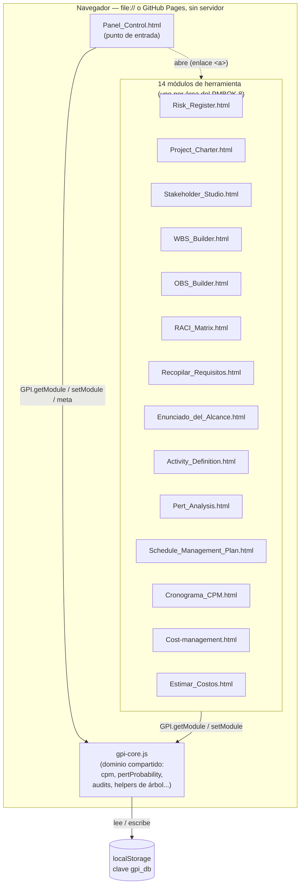

# Arquitectura

Referencia técnica permanente: qué patrón usa cada módulo, por qué varios
se apartan del patrón común, y cómo verificar que un cambio no alteró el
comportamiento observable. Este documento no se organiza cronológicamente
ni se "cierra" — se actualiza cada vez que cambia algo real de cómo está
construido el sistema.

- Reglas operativas del día a día (comandos, qué no tocar, cómo agregar
  un módulo nuevo): [CLAUDE.md](CLAUDE.md).
- Documentación funcional de cara al alumno: [README.md](README.md).
- Crónica histórica de cómo se migró de JS suelto a TypeScript + Vite
  (con fecha y evidencia puntual de cada paso): [MIGRATION.md](MIGRATION.md).

## Modelo general

14 módulos HTML autocontenidos comparten un núcleo de datos
(`gpi-core.js`, compilado desde `src/core/gpi-core.ts`) sobre
`localStorage["gpi_db"]`. Sitio 100% estático: sin backend, sin paso de
build en producción — GitHub Pages sirve la raíz tal cual, y cada HTML
también debe poder abrirse suelto por doble clic (`file://`). Por eso
todo build es IIFE (nunca `type="module"`, que `file://` bloquea por
CORS) y los artefactos compilados se commitean junto a su fuente.



Cada módulo es un HTML independiente: no hay router ni SPA. El Panel
solo enlaza a los demás con `<a href="...html">`; todo el acoplamiento
real entre módulos pasa por `gpi-core.js` y `localStorage`, nunca por
imports directos entre módulos de herramienta.

Cada módulo puede funcionar en dos modos:

- **Modo independiente** ("standalone"): sin proyecto activo en el
  Panel, con datos de ejemplo propios o en blanco. Debe seguir
  funcionando aunque `gpi-core.js` no cargue (de ahí que cada módulo
  mantenga su propio `esc()` local en vez de depender de `GPI.ui.esc`).
- **Modo integrado**: con un proyecto activo, lee/escribe su rebanada de
  `gpi_db.projects.<id>.modules.<clave>` y puede leer en vivo módulos de
  los que depende (p. ej. Definir Actividades lee la EDT).

## Esquema de `localStorage["gpi_db"]`

Referencia de orientación, no la fuente de verdad — los tipos reales
(y los únicos que el compilador valida) viven en
[`src/core/types.ts`](src/core/types.ts). Este apartado documenta la
forma general y las reglas de compatibilidad para no tener que releer
`gpi-core.ts` entero cada vez. **No se toca el esquema sin necesidad
real** (CLAUDE.md, regla #3): hay `.json` exportados por alumnos reales
que deben poder reabrirse.

### Dónde vive y cómo se accede

- Clave: `localStorage["gpi_db"]` (constante `KEY` en `gpi-core.ts`),
  JSON serializado de un único objeto `GpiDb`.
- **Respaldo en memoria**: si `localStorage` no está disponible (vista
  en un iframe, cuota agotada al leer, modo privado restrictivo), el
  núcleo cae a una variable de módulo (`mem`) y sigue funcionando
  dentro de esa misma carga de página — se pierde al recargar, pero no
  rompe la interfaz. Es el mismo mecanismo que ejercita
  `tests/smoke/gpi-core.artifact.smoke.test.ts` bajo un origen `file:`
  simulado (jsdom bloquea `localStorage` ahí, igual que lo haría un
  navegador real en un caso extremo).
- **Cuota llena**: si `localStorage.setItem` falla al guardar
  (`QuotaExceededError` u otro), `gpi-core.ts` muestra un aviso visible
  en pantalla (`showQuotaNotice`) en vez de perder cambios en silencio
  — comportamiento agregado durante la migración, no estaba en el JS
  original. El aviso recomienda exportar el proyecto a `.json` para
  rescatar el trabajo — eso solo es cierto porque `save()` retiene la
  versión que no llegó a disco en una variable de módulo
  (`pendingUnsaved`, distinta de `mem`: esta es específicamente "hay
  localStorage, pero ESTA escritura se rechazó por cuota") y `db()` la
  sirve a toda lectura posterior mientras exista, incluida
  `exportActive()`. Antes de este fix (bug real reportado por el
  usuario, reproducido simulando el error de cuota) esa versión se
  descartaba: `setModule()` devolvía `true` de todas formas, el aviso
  aparecía, pero `exportActive()` volvía a leer de disco y servía la
  ÚLTIMA versión que sí se había guardado — el aviso prometía rescatar
  un cambio que la exportación nunca llegaba a incluir. `setModule()`
  ahora devuelve el resultado real de `save()` en vez de `true`
  incondicional; `GPI.hasUnsavedChanges()` expone si hay una versión
  pendiente sin persistir. Se limpia solo en el próximo guardado
  exitoso (el alumno libera espacio borrando proyectos viejos desde el
  Panel, o el navegador deja de estar lleno). Cubierto en
  `tests/unit/quota-recovery.test.ts`.
  - **Ese primer fix, a su vez, tenía dos huecos reales (reportados
    después) al compartir `localStorage` entre pestañas**: (1) `db()`
    comprobaba `avail()` ANTES que `pendingUnsaved` — si la cuota
    empeoraba tanto que hasta la sonda de 1 byte de `avail()` empezaba a
    fallar, la lectura devolvía un respaldo VACÍO (`fresh()`) en vez del
    cambio pendiente que sí tenía en memoria; corregido invirtiendo el
    orden (`pendingUnsaved` se comprueba primero, sin importar si
    `avail()` sigue funcionando). (2) Al recuperar la capacidad de
    guardar, `save()` escribía `pendingUnsaved` TAL CUAL — un clon
    completo de TODA la base, tomado ANTES de que empezara el fallo. Si
    OTRA pestaña (compartiendo el mismo `localStorage`) sí lograba
    guardar algo mientras esta seguía atascada (p. ej. una actualización
    de costos), esa escritura la pisaba por completo al recuperarse —
    "A recuperó la capacidad de guardar y escribió su copia completa
    anterior: la actualización de costos desapareció". `pendingUnsaved`
    es en sí mismo una variable de módulo por pestaña (no cruza
    pestañas): eso significa que, MIENTRAS una pestaña sigue atascada,
    otra pestaña (p. ej. el Panel) que exporte leerá la última versión
    persistida en disco, sin ese cambio pendiente — limitación inherente
    a no tener ningún canal entre pestañas (`BroadcastChannel` o
    similar) más allá de `localStorage` mismo; lo que SÍ se corrigió es
    que, cuando la pestaña atascada finalmente guarda con éxito, ya no
    destruye lo que las demás lograron guardar en el ínterin.
    `mergeWithDisk()`/`mergeProjectModules()` (nuevas) reconcilian a TRES
    bandas antes de escribir — base/`ours`/`theirs` — contra
    `pendingBase` (una foto de disco capturada en la PRIMERA falla de
    cada racha de cuota agotada, no en cada reintento): por proyecto (un
    proyecto que sólo existe de un lado se conserva tal cual) y, dentro
    de cada proyecto que existe en ambos lados, MÓDULO POR MÓDULO (un
    módulo que cambió de un solo lado respecto de la base se conserva
    del lado que cambió; si ninguno lo tocó, da igual cuál; si AMBOS lo
    cambiaron — conflicto real, poco común — gana `ours`, la pestaña que
    está guardando en ese momento, antes que descartar su trabajo en
    silencio). `activeId` se toma de disco cuando existe, por ser un
    puntero global que otra pestaña pudo haber cambiado mientras tanto.
    Sin `pendingBase` disponible (no debería pasar en el flujo normal),
    cae al criterio más simple de antes: todo el proyecto de quien tenga
    `meta.updatedAt` más reciente. Cubierto con dos casos nuevos en
    `tests/unit/quota-recovery.test.ts`: uno simula dos pestañas
    reales compartiendo `localStorage` (dos instancias de módulo
    independientes vía `vi.resetModules()` + reimport dinámico, cada
    una con su propio `pendingUnsaved`/`pendingBase`) y confirma que ni
    el cambio de A ni el de B se pierden; el otro confirma que, si
    también falla `avail()`, la lectura sigue sirviendo el cambio
    pendiente. Verificado que ambos detectan los bugs reales:
    revertido el fix temporalmente, el primero pierde la actualización
    de costos de B y el segundo devuelve `null` en vez del cambio
    pendiente.

### Forma general

```
GpiDb {
  version: number                    // versión del contenedor, hoy siempre 1
  activeId: string | null            // qué proyecto ve el Panel al abrir
  projects: {
    [id]: GpiProject {
      schema: string                 // "gpi.project/v1" hoy — ver detectTool()
      meta: ProjectMeta              // nombre, cliente, fechas, moneda, CAPEX...
      modules: ProjectModules {      // una rebanada opcional por herramienta
        charter, stakeholders, wbs, activities, pert, obs, raci,
        schedulePlan, cost, requirements, scopeStatement, schedule
      }
    }
  }
}
```

Cada campo de `modules.*` es independiente y puede faltar (`undefined`)
o venir `null` (un módulo "vaciado" explícitamente desde el Panel, ver
`GPI.setModule(key, null)`) — ningún módulo asume que otro ya se llenó.

### Los 14 tipos de módulo, uno por herramienta

(Trece nacieron en la migración; `risks` se agregó después como módulo
**nuevo**, no como port — ver su sección más abajo.)

| Clave en `modules.*` | Tipo (en `core/types.ts`) | Lo escribe |
|---|---|---|
| `risks` | `RisksModule` | Risk_Register.html |
| `charter` | `CharterModule` | Project_Charter.html |
| `stakeholders` | `StakeholdersModule` | Stakeholder_Studio.html |
| `wbs` | `WbsModule` | WBS_Builder.html |
| `activities` | `ActivitiesModule` | Activity_Definition.html |
| `pert` | `PertModule` | Pert_Analysis.html |
| `obs` | `ObsModule` | OBS_Builder.html |
| `raci` | `RaciModule` | RACI_Matrix.html |
| `schedulePlan` | `SchedulePlanModule` | Schedule_Management_Plan.html |
| `cost` | `CostModule` | Cost-management.html |
| `costEstimate` | `CostEstimateModule` | Estimar_Costos.html |
| `requirements` | `RequirementsModule` | Recopilar_Requisitos.html |
| `scopeStatement` | `ScopeStatementModule` | Enunciado_del_Alcance.html |
| `schedule` | `ScheduleModule` | Cronograma_CPM.html |

`SchedulePlanModule` es deliberadamente laxo (varios campos
`Record<string, unknown>`): el dueño real de ese esquema es
`src/modules/schedule-plan/main.ts` (tipado localmente, con su propio
`ScheduleState`), no el núcleo — ver ARCHITECTURE.md, sección de
`Schedule_Management_Plan.html`, para el porqué.

### Compatibilidad con datos antiguos

`gpi-core.ts` tolera datos guardados por versiones anteriores del
esquema en vez de rechazarlos — por diseño, no por descuido (regla #3
de CLAUDE.md). Ejemplos reales en el código, buscar por nombre de
función si hace falta tocar esa zona:

- `normalizeToProject()` / `detectTool()`: reconocen e ingieren
  exportaciones `.json` de versiones o herramientas anteriores.
- `charterRans()`: acepta que `charter.requirements` sea un arreglo de
  strings (esquema viejo) o de objetos `{id, code, text}` (esquema
  actual), sin exigir migrar los datos guardados.
- Los audits (`charterAudit`, `schedulePlanAudit`, etc.) leen cada
  campo con `|| {}` / `|| []` defensivo, nunca asumen que un proyecto
  guardado hace meses tiene todos los campos que el formulario de hoy
  espera.

Si TypeScript marca una de estas ramas como "código muerto" o
"inalcanzable", **no se borra sin más**: casi siempre existe porque un
`.json` real y antiguo todavía la necesita (ver la nota equivalente en
MIGRATION.md, Fase 1).

### Guardar/Abrir `.json` es responsabilidad EXCLUSIVA de Panel de Control

Hasta hace poco, cada uno de los 13 módulos-herramienta tenía su propio
par de botones "⭳ Guardar (.json)" / "⭱ Abrir (.json)" (respaldo de
SOLO la porción de datos de ese módulo). A pedido explícito del
usuario, se retiraron de los 13 módulos por generar confusión: no
quedaba claro si ese `.json` era "el respaldo del proyecto" o algo
aparte, y coexistía con el propio flujo de Panel de Control sin que
ninguno de los dos se explicara — ver el razonamiento completo en la
conversación que originó este cambio. El respaldo/restauración de datos
ahora vive ÚNICAMENTE en `Panel_Control.html`, con dos niveles:

- **"⭳ Exportar proyecto" / "⭱ Importar proyecto"** (`btnExport`/
  `btnImport` + `fileProject`, `_mode = "project"`): el archivo
  completo, TODOS los módulos juntos (`importProject()`/`exportActive()`).
- **"⭱ Importar .json" en cada tarjeta del lanzador** (`data-import`,
  `importToolInto()` → `_mode = "module"` → `GPI.ingestToolExport()`):
  acepta el `.json` de UN SOLO módulo — el mismo formato que cada
  herramienta seguía sabiendo generar únicamente en la mente de quien
  ya tuviera un archivo viejo guardado — y lo enchufa solo en esa
  porción del proyecto activo, vía `detectTool()`. Como esta acción
  vive en el Panel y no en el módulo, **`detectTool()` tiene que
  reconocer la exportación de los 13 módulos sin excepción** — retirar
  el import propio de "Recopilar Requisitos" y "Estimar los Costos"
  expuso que sus formatos (`gpi.requirements/v1`, `gpi.costEstimate/v1`)
  nunca habían tenido caso en `detectTool()`: el botón "Importar .json"
  de esas dos tarjetas existía pero fallaba en silencio
  (`unknown-format`). Se agregaron los dos casos que faltaban al mismo
  tiempo que se retiraban los botones — ver `tests/unit/tool-export-import.test.ts`,
  que fija los 13 formatos reconocidos uno por uno (más los casos
  `unknown-format`/`no-active`).
- **Excepción deliberada, no un descuido**: la matriz RACI
  (`RACI_Matrix.html`) restauraba antes, desde su propio `.json`, no
  solo `assignments` sino también un "congelado" (`rowsSnapshot`/
  `colsSnapshot`) de las filas/columnas tal como estaban al exportar —
  útil para reabrir una matriz vieja aunque el WBS/OBS actual ya haya
  cambiado. `detectTool()` para `gpi.raci/v1` solo extrae
  `assignments`; el congelado NO se replicó al centralizar (reimportar
  vía Panel de Control siempre recalcula filas/columnas contra el
  WBS/OBS VIVOS, igual que el modo "live" normal del módulo) — un
  recorte de alcance consciente, no un bug, documentado aquí para no
  "redescubrirlo" como regresión.

### Validación de estructura al importar: `modules` ausente y ciclos en WBS/OBS

Bug real reportado por el usuario (2026-09), con dos síntomas
distintos: (1) un `.json` con `schema`/`meta` reconocidos pero sin
`modules` se aceptaba tal cual y cada `GPI.getModule(...)` posterior
(~60 sitios en los 13 módulos y en Panel de Control) reventaba con
`TypeError` al leer sobre `modules` undefined; (2) una EDT (o un
organigrama OBS) con un ciclo en `children` (p. ej. A hijo de B y B
hijo de A) se aceptaba intacta, y el primer recorrido recursivo del
núcleo sobre esos datos —`wbsCodes`, `wbsLeaves`, `obsNodes`,
`wbsPhases`, `activitiesStats`, `pertStats`: ninguno lleva control de
visitados— entraba en recursión infinita y desbordaba la pila (`Maximum
call stack size exceeded`) apenas se abría un módulo o el Panel con ese
proyecto activo.

Corrección, en los dos puntos donde datos ajenos entran al núcleo
(`normalizeToProject()`, usada por `importProject()` — un proyecto
completo — y `detectTool()`, usada por `ingestToolExport()` — un solo
módulo vía "Importar .json" de cada tarjeta del Panel):

- `normalizeToProject()` garantiza `modules` como objeto cuando el
  `.json` ya trae `schema`/`meta` reconocidos pero no trae `modules` (o
  lo trae corrupto). `getModule()` gana además una segunda capa de
  defensa (`p && p.modules`) por si un proyecto ya guardado con una
  versión más vieja del núcleo, o tocado a mano en `localStorage`,
  tampoco lo tiene — mismo criterio de dos capas que la guarda de
  identidad de proyecto (ver más abajo).
- `sanitizeTree(rootId, nodes)` (nueva, compartida por `detectTool()`
  y `normalizeToProject()`) recorre el árbol desde `rootId` llevando un
  set de visitados y reescribe el `children` de cada nodo descartando
  cualquier referencia que forme un ciclo, apunte a un id que no existe
  en `nodes`, o le dé un segundo padre a un nodo ya alcanzado — en
  silencio, sin abortar el import completo, igual que el resto de las
  ramas de compatibilidad de este archivo (regla #3 de CLAUDE.md: no se
  rechazan datos viejos/corruptos, se toleran). Se aplica a `wbs` y a
  `obs` (misma forma `{rootId, nodes}`) en ambos puntos de entrada.

Deliberadamente sin tocar (en esta primera pasada): los propios
recorridos recursivos DESCENDENTES (`wbsCodes`/`wbsLeaves`/`obsNodes`/
`wbsPhases`/`activitiesStats`/`pertStats`, que bajan por `children`)
seguían sin control de visitados — no hacía falta agregárselo a los
seis por separado porque WBS Builder ya impide crear un ciclo desde la
UI (`isDescendant()` en `src/modules/wbs/main.ts` bloquea soltar un
nodo dentro de su propia rama al reordenar por arrastre); la única vía
real para que un ciclo llegue a esos datos es un `.json` importado, que
es exactamente donde se corta ahora. Cubierto en
`tests/unit/import-validation.test.ts`: `modules` ausente en las dos
rutas de import, un ciclo WBS de dos pasos vía `importProject()` Y vía
`ingestToolExport()`, un ciclo OBS, y una referencia colgante a un id
inexistente. Verificado que los tests detectan los bugs reales:
revertido el fix temporalmente, fallan con el mismo `TypeError`/
`RangeError: Maximum call stack size exceeded` que reportó el usuario.

### El hueco que dejó esa primera pasada: `parentId` no se saneaba, solo `children`

Bug real reportado por el usuario (severidad media, 2026-09): la poda
de arriba solo reescribía `children` (el sentido DESCENDENTE del
árbol); dejaba intacto `parentId` (el sentido ASCENDENTE, que usan
`obsNodes()`/`code()` en el núcleo y `isDescendant()`/la función de
profundidad en `src/modules/wbs/main.ts` y `src/modules/obs/main.ts`,
todos con un `while (n && n.parentId)` sin control de visitados). Un
OBS importado con un nodo cuyo `parentId` apunta a sí mismo (o a un
ciclo entre varios nodos, independiente de `children`) pasaba intacto:
la importación devolvía éxito y el primer recorrido ascendente —solo
con abrir el módulo— quedaba en loop infinito, sin desbordar la pila
(no es recursión, es un `while`) así que ni siquiera un límite de
profundidad del navegador lo cortaba; hubo que interrumpir la
ejecución con un límite de tiempo externo.

Corrección, siguiendo la propia recomendación del reporte:

- **"Reconstruir padres coherentes con el árbol aceptado"**:
  `sanitizeTree()` ahora TAMBIÉN reescribe `parentId` de cada nodo que
  alcanza, usando la MISMA recorrida que ya arma `children` — cada nodo
  recibe como padre exactamente aquel en cuyo `children` quedó (la
  raíz recibe `parentId: null`), nunca el valor suelto que traía el
  `.json`. Como esa recorrida ya es acíclica por construcción (mismo
  set de visitados de la poda de `children`), el resultado es un árbol
  con `children`/`parentId` mutuamente coherentes: subir por `parentId`
  desde cualquier nodo alcanzado desde `rootId` siempre termina, en como
  mucho la profundidad del árbol. Esto cierra el hueco de raíz para
  cualquier dato que entre por los dos puntos de import ya cubiertos
  (`detectTool()`/`normalizeToProject()`) — WBS también se beneficia,
  aunque el núcleo no use `parentId` en sus propios recorridos, porque
  `wbs/main.ts` sí lo usa en su UI.
- **"Proteger también los recorridos ascendentes"**: defensa en
  profundidad — `obsNodes()`/`code()` (núcleo), e `isDescendant()`/la
  función de profundidad en `wbs/main.ts` y en `obs/main.ts`, ganan un
  `Set` de visitados en su recorrido ascendente. En el flujo normal esto
  nunca debería activarse (ya no puede entrar un `parentId` cíclico por
  import), pero protege igual ante datos de antes de este fix, o
  `localStorage` tocado a mano.

Cubierto en `tests/unit/import-validation.test.ts`: un OBS donde
`children` ya está limpio (sin ciclo ahí) pero `parentId` de un nodo
apunta a sí mismo — confirma que `obsNodes()` termina y que `parentId`
quedó reescrito coherente con `children`. Verificado que el test
detecta el bug real: revertido el fix temporalmente, la llamada a
`obsNodes()` cuelga de verdad (no lanza ni hace timeout de Vitest —
Node se queda bloqueado en el `while`; hubo que terminar el proceso a
mano, igual que describió el usuario). Dos pruebas preexistentes en
`tests/unit/tool-export-import.test.ts` (`obs`/`wbs` con un solo nodo
raíz) se actualizaron para reflejar que la raíz ahora siempre trae
`parentId: null`.

### Un tercer hueco: `typeof [] === "object"` dejaba colar `modules: []`/`nodes: []`

Bug real reportado por el usuario (severidad media, 2026-09): "la
validación acepta cualquier objeto, incluidos arreglos. Importé
`modules: []`: guardar un Acta devolvió `true`, pero leerla
inmediatamente devolvió `null`, porque la serialización del arreglo
descarta esa propiedad." Diagnóstico: en JavaScript `typeof [] ===
"object"`, así que el chequeo original de `normalizeToProject()`
(`!proj.modules || typeof proj.modules !== "object"`) aceptaba un
arreglo vacío tal cual — es objeto Y es *truthy*. `proj.modules`
quedaba siendo un `Array` real. `setModule()` le asigna una propiedad
de texto (`p.modules.charter = datos`) — funciona sin lanzar, porque
un array sigue siendo un objeto JS —, pero `JSON.stringify()` de un
`Array` SOLO serializa sus elementos indexados: cualquier propiedad de
texto colgada ahí (`"charter"`) se descarta en silencio al guardar.
`setModule()` devolvía `true` (la escritura en memoria no falló) pero
`getModule()` inmediatamente después devolvía `null`, porque lo que de
verdad quedó en disco nunca tuvo esa propiedad — pérdida de datos
totalmente silenciosa, sin ningún aviso.

El mismo patrón (`p.modules = p.modules || {}`, un chequeo de
*truthy*, no de "objeto plano") se repetía en `setModule()` e
`ingestToolExport()`, y `sanitizeTree()` tenía el mismo hueco para
`nodes` (un WBS/OBS con `"nodes": []` en vez de `{id: nodo}`).

Corrección, exactamente la recomendada — "exigir un objeto de módulos
válido, excluir arreglos, y verificar los tipos internos antes de
persistir": `isPlainObject()` (nueva, compartida) reemplaza los
chequeos `truthy`/`typeof "object"` sueltos en los CUATRO puntos donde
`modules` o `nodes` se leen o se inicializan antes de escribir
(`normalizeToProject()`, `setModule()`, `ingestToolExport()`,
`sanitizeTree()`), y agrega `!Array.isArray(v)` — la única diferencia
real con el chequeo anterior, pero la que cierra el hueco. `detectTool()`
y `normalizeToProject()` además coaccionan `nodes` a `{}` ANTES de
llamar a `sanitizeTree()` si no es un objeto plano (un array vacío no
se puede "convertir en objeto" mutando sus propiedades desde dentro de
`sanitizeTree()`, hay que reemplazar la referencia completa en el
llamador).

Cubierto en `tests/unit/import-validation.test.ts` (nuevo `describe`):
`modules: []` vía `importProject()` seguido de un `setModule()` real,
confirmando que ni la copia en memoria ni lo que queda en
`localStorage` son arreglos, y que la propiedad persiste; un proyecto
YA guardado con `modules: []` en disco (dato corrupto de antes de este
fix) se corrige también vía `ingestToolExport()`; y `nodes: []` se
trata como un WBS vacío en vez de perder silenciosamente lo que se le
cuelgue. Verificado que los tres detectan el bug real: revertido el
fix temporalmente, los tres fallan exactamente como se esperaba
(el primero con `setModule()` devolviendo `true` mientras
`getModule()` sigue devolviendo `null` tras el viaje por
`localStorage`).

### Un cuarto hueco: `gpi.activities/v1` reconocía el formato pero descartaba los hitos

Bug real reportado por el usuario (2026-09): un `.json` del formato
reconocido `gpi.activities/v1` con `milestones` se importaba con éxito
(`ok: true`) pero conservaba solo `byLeaf` e `idCounter`; los hitos
desaparecían. Es un hallazgo de la importación de UNA herramienta
(`detectTool()`/`ingestToolExport()`, "Importar .json" de la tarjeta
del Panel), no de la exportación/importación del proyecto completo
(`normalizeToProject()`, que ya pasa `modules` verbatim).
`ActivitiesModule.milestones?: MilestoneItem[]` es un campo de primera
clase (hitos sueltos o colgados de un paquete, ver `types.ts`); la rama
de `detectTool()` que construía el objeto solo copiaba dos de las tres
propiedades. Hoy ningún módulo genera ese formato (los botones
"Guardar .json" propios se retiraron, ver más arriba), pero
`detectTool()` sigue aceptándolo por compatibilidad con archivos ya
guardados por alumnos (regla #3 de CLAUDE.md) — y "reconocido" no puede
significar "reconocido pero truncado en silencio".

Corrección: la rama ahora conserva `milestones` cuando es un `Array` y
lo trata como `[]` si viene con otro tipo (mismo criterio ligero que
`links` de `gpi.schedule/v1`; no se valida cada ítem, igual que el
resto de los arreglos importados de este archivo). Sin `milestones`
(formato anterior a los hitos) el módulo queda con `milestones: []`.
Cubierto en `tests/unit/tool-export-import.test.ts`: ida y vuelta con
un hito suelto y uno colgado de un paquete (lo importado se re-envuelve
en el mismo formato y vuelve idéntico), formato viejo sin hitos, y
`milestones` con tipo inválido (string, objeto). Verificado que los
tres fallan sin el fix. La aserción preexistente de `activities`
(`toEqual` estricto) se actualizó para incluir `milestones: []`.

## Ningún módulo guarda sin verificar que el proyecto activo sigue siendo el que cargó

Bug real reportado por un usuario (2026-09): abrir el Acta de
Constitución del proyecto A, activar el proyecto B desde el Panel de
Control (otra pestaña, mismo `localStorage`) y disparar el guardado de
salida del Acta hacía que B terminara con el nombre y el Acta de A. La
causa no era un descuido puntual de `project-charter`: era un hueco de
diseño presente en **los 13 módulos de herramienta y en el núcleo
mismo**. `GPI.setModule()`/`GPI.patchMeta()` escribían siempre sobre
`d.activeId` leído en el momento de la llamada, sin ningún parámetro de
identidad — y el patrón de guardado compartido por los 13 módulos
(`beforeunload` + `visibilitychange`, algunos con auto-guardado por
debounce o inmediato en cada clic) solo comprobaba "¿hay ALGÚN proyecto
activo?", nunca "¿sigue siendo el MISMO proyecto que cargué?".

Auditoría de los 13 módulos encontró tres variantes del mismo hueco:

- **Sin `GPI.onChange()` en absoluto** (`project-charter`, antes de este
  fix): ningún aviso ni protección hasta el guardado de salida.
- **`onChange()` que solo refresca datos de OTROS módulos** (`wbs`,
  `activities`, `pert`, `cost-estimate`, `cronograma-cpm`): la
  suscripción existe (p. ej. Definir Actividades vuelve a leer la EDT),
  pero nunca protege los datos PROPIOS que la función de guardado
  realmente escribe — sincronización de mentira.
- **`onChange()` con la condición al revés** (`raci`, `schedule-plan`,
  `scope-statement`): gateaba en `!document.hidden`, justo lo opuesto de
  lo que hace falta — cambiar de pestaña para activar otro proyecto en
  el Panel vuelve `hidden=true` a la pestaña del módulo, así que la
  condición para refrescar/proteger nunca se cumplía ahí.
  `stakeholder-studio` era el único que por casualidad tenía el sentido
  correcto (`document.hidden`), pero solo protegía ese layout
  (pestañas de la misma ventana), no dos ventanas separadas.

### La corrección: defensa en dos capas

**Capa 1 (núcleo, `src/core/gpi-core.ts`)** — `setModule(name, data,
expectedProjectId?)` y `patchMeta(partial, expectedProjectId?)` ganan un
tercer parámetro opcional: si se pasa y no coincide con `d.activeId`
actual, la función no escribe nada y devuelve `false`/`null`. Sin el
parámetro, el comportamiento no cambia — es lo que sigue usando Panel de
Control, que siempre actúa sobre el proyecto que él mismo acaba de
activar/crear, nunca sobre un snapshot cargado antes.

**Capa 2 (cada uno de los 13 módulos de herramienta)** — mismo parche
mecánico en todos: una variable `loadedProjectId` capturada en el
momento en que el módulo hidrata sus datos (el `init()`/`pull()`/
`tryLoadLive()` de cada uno), y la función de guardado rechaza escribir
si `GPI.activeId() !== loadedProjectId` — **excepto** cuando
`loadedProjectId` es `null` (el módulo arrancó sin proyecto activo, un
flujo legítimo preexistente: p. ej. crear un proyecto nuevo mientras el
módulo está abierto en blanco debe poder sembrarlo). Los 12 módulos que
ya tenían `GPI.onChange()` reciben la misma comprobación ahí también,
para avisar proactivamente en cuanto otra pestaña cambia el proyecto
activo, no solo al intentar guardar/salir; `project-charter` (el
reportado) no tenía ningún `onChange()` y se le agregó uno mínimo solo
para esto. `setModule`/`patchMeta` reciben `loadedProjectId` como tercer
argumento en cada módulo — defensa en profundidad: aunque el chequeo del
módulo se rompiera, el núcleo igual rechaza la escritura.

Repro end-to-end en `tests/smoke/project-charter.smoke.test.ts` (el caso
reportado, guardado solo al salir) y `tests/smoke/cronograma-cpm.smoke.test.ts`
(guardado inmediato en cada edición, la ventana de exposición más
chica); la defensa del núcleo por sí sola en
`tests/unit/project-identity-guard.test.ts`.

**Fuera de alcance, deliberado**: no se corrigió el sentido invertido de
`!document.hidden` en `raci`/`schedule-plan`/`scope-statement`, ni se
hizo que el `onChange()` de los módulos con sincronización "de mentira"
refresque de verdad sus datos propios al detectar el cambio — eso es un
problema real pero distinto (frescura/UX: la pestaña puede seguir
mostrando datos viejos del proyecto anterior hasta que el usuario
recarga). Esta corrección garantiza que, sea cual sea el estado en
pantalla, **nunca se escribe sobre el proyecto equivocado**, que es
exactamente el bug reportado. Tampoco se auditó `panel-control/main.ts`
a fondo: sus escrituras son acciones directas del usuario sobre el
proyecto que el propio Panel acaba de activar/crear, un patrón distinto
al de los 13 módulos de herramienta.

### El hueco que dejó la primera pasada: guardados SECUNDARIOS que llaman al núcleo directo

Bug real reportado por el usuario (2026-09), señalando que la
corrección de arriba estaba incompleta: **"El guardado principal está
protegido, pero estas operaciones llaman directamente al núcleo sin
pasar el identificador esperado."** Reprodujo dos caminos:

- `src/modules/wbs/main.ts`, `seedFromScope()` (botón "Sembrar
  Entregables"): abrir WBS en A, activar B desde otra pestaña y pulsar
  el botón — B recibía la EDT de A (todavía en memoria en esta pestaña)
  mezclada con los entregables de B (leídos frescos en el momento del
  clic). La función llamaba `window.GPI.setModule("wbs", {...})`
  directo, sin `loadedProjectId` ni el chequeo de identidad — un
  camino de escritura totalmente aparte de `push()` (la función
  principal, correctamente protegida desde el fix anterior).
- `src/modules/requirements/main.ts`, `promoteToRan()` (botón
  "Promover a RAN"): iniciar la promoción en A, activar B desde otra
  pestaña MIENTRAS el diálogo de confirmación seguía abierto, y
  confirmar — el requisito de A se agregaba al Acta (`charter`) de B.
  El callback `.then()` del diálogo llamaba
  `GPI.setModule("charter", ch)` directo, sin `loadedProjectId`.

Ambos son **guardados secundarios**: no pasan por la función principal
de guardado del módulo (`push()`/`save()`), sino que llaman al núcleo
por su cuenta — típicamente disparados por un botón de una operación
puntual, a veces detrás de un diálogo de confirmación async (`.then()`)
que deja una ventana de tiempo real para que otra pestaña cambie el
proyecto activo antes de que la escritura ocurra. La auditoría de la
corrección original solo cubrió la función principal de cada módulo;
no buscó sistemáticamente OTRAS llamadas directas a
`setModule`/`patchMeta` fuera de ella. Una auditoría posterior (agente
de exploración, `grep` de todo uso de `.setModule(`/`.patchMeta(` en
los 13 módulos, seguido de lectura manual del contexto de cada una)
confirmó que estos eran los ÚNICOS dos casos — los otros 11 módulos no
tienen ninguna llamada al núcleo fuera de su función principal ya
protegida.

Corrección, con un patrón distinto en cada archivo según su
arquitectura:

- **`wbs.ts`**: `loadedProjectId`/`markProjectStale()`/`push()` viven
  dentro del closure `gpiBridge()` (patrón ya documentado en la sección
  de arriba), inaccesibles desde `seedFromScope()`, que es una función
  de nivel de módulo declarada ANTES de ese closure. En vez de duplicar
  el chequeo de identidad ahí (repetir la lógica en dos sitios, con
  riesgo de que diverjan), `seedFromScope()` ahora llama a
  `markDirty()` — el mecanismo YA existente en este archivo para "avisá
  al Panel de cualquier cambio estructural" (lo usan también "+ Fase"/
  "+ Subtarea"), que dispara `requestGpiPush()` → el `push()` real y ya
  protegido, con el mismo debounce de 800 ms que el resto de las
  ediciones. Además, gana su propia comprobación de identidad
  ANTES de leer los entregables del Enunciado del Alcance (variable
  módulo-nivel nueva `ensureProjectFresh`, asignada por `gpiBridge()`
  igual que `requestGpiPush`) — así evita el trabajo y el mensaje de
  "listo" engañoso cuando el proyecto ya cambió, en vez de descubrirlo
  recién al guardar.
- **`requirements.ts`**: `loadedProjectId`/`markProjectStale()` SÍ son
  variables de nivel de módulo (no hay closure), así que
  `promoteToRan()` gana el mismo chequeo inline que ya usa `save()`,
  justo al entrar al callback `.then()` del diálogo — es decir,
  **se comprueba la identidad al EJECUTAR la operación** (cuando el
  usuario confirma), no al iniciarla (cuando aún no se sabe si va a
  confirmar) — y pasa `loadedProjectId` a `setModule("charter", ch,
  loadedProjectId)`.

Cubierto en `tests/smoke/wbs-builder.smoke.test.ts` y
`tests/smoke/recopilar-requisitos.smoke.test.ts`: reproducen cada
repro exacta (segunda pestaña activa B vía evento `storage`, antes/
durante la confirmación) y confirman que B no recibe los datos de A ni
A se corrompe. Verificado que ambos tests detectan el bug real:
revertido cada fix por separado, "Sembrar Entregables" efectivamente
mezcla la EDT de A con el entregable de B, y "Promover a RAN"
efectivamente agrega el RAN de A al Acta de B (2 requisitos en vez de
1).

## Contrato de escritura: sesiones de edición, revisiones y resultado común

Revisión externa (2026-09) señaló que la guarda por `projectId`
(sección anterior) evita escribir sobre OTRO proyecto pero no detecta
que los datos del MISMO proyecto cambiaron después de abrir la
pestaña, y que el resultado del guardado no gobernaba lo que los
módulos muestran. Reproducido: abrir el Acta, actualizarla desde otra
pestaña y ejecutar el guardado de salida de la primera dejaba la
versión vieja (vacía) sobre la nueva. Causa común: la seguridad de una
escritura dependía de que cada módulo recordara pasar parámetros
opcionales, y "guardar" no tenía un resultado que distinguiera lo que
pasó de verdad. Contrato nuevo, en el núcleo:

- **Revisión por módulo** (`project.revs[módulo]`, opcional; los `.json`
  históricos no la traen y se leen como 0): sube en cada escritura de
  ese módulo. Las escrituras *derivadas* (`writeModule(..., {derived:
  true})`: Matriz RACI reescribiendo los Responsables de la EDT) no la
  suben, para no producir falsos conflictos en la pestaña dueña.
  `ingestToolExport()` y `setModule()` sí la suben.
- **`GPI.openSession(módulo)`** → `EditSession {projectId, rev,
  snapshot, meta}`: el módulo la pide en el mismo instante en que lee
  sus datos ("esta pestaña cargó ESTE proyecto en ESTA versión").
- **`GPI.saveModule(nombre, datos, sesión)`**: (1) proyecto activo
  distinto → `rejected`; (2) datos idénticos a lo que la pestaña cargó
  → `unchanged` (un guardado de salida sin ediciones no escribe, aunque
  otra pestaña ya haya cambiado el dato); (3) la revisión en disco ya no
  es la de la sesión → `conflict`, **no se sobrescribe**; (4) si no,
  escribe, sube la revisión y actualiza la sesión → `saved`/`pending`.
  `GPI.rebaseSession()` fija como "lo cargado" la serialización propia
  del módulo cuando este normaliza (defaults) lo que lee.
- **`GPI.saveMeta(parcial, sesión)`**: metadatos por CAMPO — solo se
  escriben los campos que la pestaña cambió respecto de lo que cargó; un
  campo que no tocó nunca revierte un cambio ajeno (renombrar el
  proyecto desde el Panel ya no se deshace con el guardado de salida de
  un módulo abierto); si otra pestaña cambió el mismo campo a otro
  valor → `conflict` con la lista de campos.
- **Resultado común `WriteResult`** (`saved | unchanged | pending |
  conflict | rejected`, ver `types.ts`) y **`GPI.describeWrite()`**, el
  texto único con que los módulos informan: nunca "Sincronizado" si el
  dato solo quedó en memoria (cuota) o se rechazó por conflicto.
  `setModule()`/`patchMeta()` se conservan como envoltorios (Panel de
  Control, escrituras cruzadas de lectura-modificación-escritura en el
  mismo instante, módulos que arrancaron sin proyecto).

Política explícita de conflicto: **nunca se sustituye en silencio**; la
pestaña que quedó desactualizada no guarda y avisa (recargar para ver la
versión vigente).

### Reconciliación tras cuota agotada: operaciones explícitas, no unión

La reconciliación de `save()` (sección "Cuota llena") combinaba los
proyectos de ambos lados como una UNIÓN sin distinguir crear de
eliminar, y elegía los metadatos como un objeto completo según
`updatedAt` (hallazgo "alta" de la revisión externa, reproducido con dos
contextos: un proyecto eliminado en otra pestaña reaparecía; una
eliminación de la propia copia pendiente se revertía; un cambio de
`client` ajeno desaparecía cuando la copia pendiente guardaba
`location`). Ahora `reconcileWithDisk()` lee cada diferencia contra
`pendingBase` como una operación:

- **crear** (existe en un lado y no en la base) → se conserva;
- **eliminar** (está en la base y falta en un lado) → se elimina si el
  otro lado no lo tocó; si el otro lado lo **modificó**, gana la
  modificación (no se destruye trabajo ajeno) y se informa;
- **modificar** → por proyecto, y dentro de él **por módulo y por campo
  de `meta`** (no como un objeto completo por `updatedAt`); si ambos
  lados cambiaron lo mismo a valores distintos, gana la pestaña que
  guarda ahora, se informa qué se pisó (`GPI.lastReconcile()` y un aviso
  visible) y la revisión del módulo sube para que la otra pestaña vea un
  conflicto en su próximo guardado.

`activeId` sigue la misma regla (si esta pestaña lo cambió respecto de
la base gana el suyo; si no, el de disco), y nunca apunta a un proyecto
que la conciliación eliminó. Cubierto en `tests/unit/quota-recovery.test.ts`
(eliminación ajena, eliminación propia, eliminar-vs-modificar, campo de
meta distinto, mismo campo); verificado que las cinco fallan con la
combinación anterior.

Cubierto en `tests/unit/write-contract.test.ts` (incluye la repro exacta
del Acta).

### Segunda revisión: lo pendiente no es lo confirmado, y módulo + metadatos van juntos

Dos fallos reproducidos sobre la primera versión del contrato:

- **Alta — un reintento decía «Sincronizado» sin guardar.** Tras un
  `pending` (cuota agotada) la sesión adoptaba los datos como si ya
  estuvieran guardados; reintentar los mismos datos daba `unchanged` y no
  se escribía nada. Ahora `EditSession` separa **lo confirmado**
  (`rev`/`snapshot`/`meta`, lo que hay de verdad en disco) de **lo
  pendiente** (`session.pending`: módulo y campos de meta aplicados solo
  en memoria). Un fallo de escritura deja la sesión confirmada intacta y
  registra lo pendiente; el reintento primero intenta persistir la copia
  en memoria (`flushPending()`) y, si lo logra, promueve lo pendiente a
  confirmado (`confirmPending()`) y devuelve `saved`. Mientras siga sin
  poder escribirse, el resultado es `pending`, **nunca** `unchanged`.
- **Media — un conflicto del módulo dejaba pasar sus metadatos.** El
  módulo y sus metadatos comunes se guardaban con dos llamadas
  (`saveModule` + `saveMeta`); si la primera rechazaba por conflicto, la
  segunda igual escribía (el Acta conservaba el patrocinador S0 y el
  proyecto quedaba con S1). Ahora **`GPI.saveState(nombre, datos, parche,
  sesión)`** valida ambos contra la sesión y los aplica como UNA operación
  (`commitState()`, un único `save()`): un conflicto en el módulo o en un
  campo de meta (`meta.<campo>` en `conflicts`) no escribe nada.
  `saveModule` y `saveMeta` son casos particulares de `saveState`.

`pushWithSession()` y el `gpiPush()` del Acta llaman a `saveState`.
Cubierto en `tests/unit/write-contract.test.ts` (seis pruebas nuevas, las
seis fallan contra el núcleo anterior) y en `project-charter.smoke.test.ts`
(las dos repros, verificadas contra el código anterior).

**Orden dentro de `commitState()` (tercera revisión, P1):** primero se
recupera lo pendiente (`flushPending()`) y **después** se lee la base
(`db()`) y el proyecto. `flushPending()` → `save()` →
`reconcileWithDisk()` escribe una copia *conciliada* con lo que otra
pestaña cambió durante la racha pendiente; leer la base antes y escribir
la edición nueva sobre ella sobrescribía esa conciliación (la operación
devolvía `saved`, pero un Costos que otra pestaña había subido de 100 a
200 volvía a 100). Tras la recuperación se revalida que el proyecto siga
existiendo y activo (la conciliación pudo eliminarlo o cambiar el
activo) antes de validar conflictos y aplicar la edición. Regla general
para cualquier función nueva que combine "recuperar pendiente" con
"escribir": la base se lee después de la recuperación, nunca antes.
Cubierto por dos pruebas de `write-contract.test.ts` (módulo ajeno y
campo de meta ajeno, en el mismo reintento), verificadas contra el orden
anterior.

**Almacenamiento lleno ≠ sin almacenamiento (cuarta revisión, P1):**
`save()` y `db()` trataban el fallo de la sonda de disponibilidad
(`avail()`, un `setItem` de 1 byte) como "no hay `localStorage`" y
pasaban a modo memoria. Con la cuota completamente agotada esa sonda
también falla, aunque `getItem` siga funcionando: `save()` devolvía éxito
sin persistir (incluso con un guardado pendiente, y la sesión lo
confirmaba; al recuperarse el almacenamiento el reintento daba
`unchanged` con el disco en la versión vieja y `hasUnsavedChanges()` en
`true`), y `db()` servía una base vacía a las lecturas. Ahora el modo
memoria exige además que el almacenamiento no se pueda **leer**
(`memoryMode()` = `!avail() && !readable()`) y nunca aplica mientras haya
un guardado pendiente: el respaldo en memoria no confirma nada, se sigue
por el intento real de escritura y, si falla, queda `pending`. El modo
memoria genuino (bloqueado, iframe sin permiso, `file://` opaco) no
cambia. Cubierto por dos pruebas de `write-contract.test.ts` (la
secuencia completa del reporte y "lleno desde el inicio"), verificadas
contra el código anterior.

### Cómo lo usan los 13 módulos

Cada módulo pide `GPI.openSession("<módulo>")` en el mismo instante en
que lee sus datos (`init()`/`pull()`/`tryLoadLive()`, donde ya capturaba
`loadedProjectId`) y, si normaliza lo que lee, llama a
`GPI.rebaseSession(session, <su serialización>)`. Al guardar usa
`pushWithSession()` de `src/shared/write-session.ts` — lógica técnica
compartida **en tiempo de compilación** (Vite la inlinea en cada IIFE;
ningún script extra, `file://` y GitHub Pages no cambian) — que llama a
`saveState` (módulo + metadatos en una sola operación), y según el resultado: `conflict`/`pending` →
estado + `<div id="banner">` con `describeWrite()`; `rejected` por
proyecto distinto → el `markProjectStale()` que cada módulo ya tenía. Las
funciones de guardado devuelven `boolean` y el botón "☁ Sincronizar" solo
dice "✓ Sincronizado" si se guardó de verdad ("⚠ Sin sincronizar" si no).
Casos particulares:

- **Acta** (`project-charter`): `gpiPush()` con el mismo contrato y
  `rebaseSession()` tras `normalizeState()`, de modo que el guardado de
  salida sin ediciones es un `unchanged` real.
- **Costos y Requisitos** (`cost`, `requirements`): además de la sesión,
  el texto "Sincronizado con el Panel" solo aparece si el resultado fue
  `saved`/`unchanged`; con cuota agotada muestra "⚠ Cambios SIN guardar…"
  y NO cae al respaldo `localStorage` propio (que también mentiría).
  "Promover a RAN" (Requisitos → Acta) usa `writeModule()` (lectura-
  modificación-escritura en el mismo instante, sube la revisión del Acta:
  una pestaña con el Acta abierta verá un conflicto en vez de pisar el
  RAN).
- **Matriz RACI**: su escritura de la EDT (Responsables) es *derivada*
  (`derived: true`), y si el guardado de la propia matriz falla no se
  reescribe la EDT.
- **Panel de Control** conserva `setModule`/`patchMeta` sin sesión: sus
  escrituras son acciones directas sobre el proyecto que él mismo activó;
  igualmente suben la revisión, así que un módulo abierto con ese dato
  verá el conflicto.

Limitaciones deliberadas: (1) ante un `conflict` la pestaña desactualizada
no guarda y pide recargar — no hay fusión automática de un mismo módulo
editado en dos pestañas (política explícita > adivinar); (2) los tests de
humo no cubren cada módulo por separado (sí Acta, Costos, EDT); el resto
comparte el mismo helper.

## Las tres formas de referenciar el núcleo

Cada módulo referencia `GPI` de una de tres formas — no asumir que es
uniforme antes de tocar un archivo:

1. **`window.GPI` explícito** en cada llamada, con
   `interface Window { GPI?: GpiApi }` — la mayoría de los módulos
   (OBS, RACI, WBS, Activity Definition, PERT, Schedule Plan, Enunciado
   del Alcance, Stakeholder Studio, Project Charter).
2. **`GPI` como identificador global *ambiental* bare** (sin prefijo
   `window.`), vía `declare global { var GPI: GpiApi | undefined }` —
   `cost` y `requirements`. El script original ya lo escribía así.
3. **`GPI` como variable de módulo local** que hace *shadow* del
   global, capturada una vez de `window.GPI` — `cronograma-cpm` (`let
   GPI`, reasignada dentro de `init()`) y `panel-control` (`const GPI`,
   porque es el único módulo sin ningún modo "funciona sin el núcleo":
   depende incondicionalmente de `gpi-core.js`, así que no necesita
   `GPI?`/`GPI!` en cada uno de sus ~90 sitios de uso).

## El "Id." de Definir las Actividades, Estimar los Costos, Análisis PERT y Cronograma/CPM

Los cuatro módulos del cronograma leen la MISMA EDT (`wbs`) y las MISMAS
actividades (`activities.byLeaf`) en vivo desde gpi-core, y cada uno
arma su propia `fullRows()`/`fullRowsSnapshot()` recorriendo esa EDT con
el mismo algoritmo MS Project: fila 0 = proyecto, luego cada fase,
paquete y actividad en orden jerárquico, con un correlativo (`n`/`netId`)
que antes se llamaba "N.º" y ahora se muestra como **"Id."** en la
cabecera de las cuatro tablas.

**Regla de oro (corregida a pedido explícito del usuario, ver historial
de commits): el Id. es SIEMPRE consecutivo y SIN SALTOS, exactamente
como el Task ID que MS Project asigna a cada fila de un cronograma —
incluidos los hitos.** Un alumno pega o exporta estas tablas contra un
cronograma real de MS Project, donde una fila (tarea o hito) siempre
tiene un ID entero consecutivo; si esta tabla dejara un hueco (p. ej.
"—") en la fila de un hito, esa correspondencia 1:1 con MS Project se
rompería. Por eso **ninguna fila deja de incrementar el contador de
Id.** — ni siquiera un elemento que solo existe en un módulo. La primera
versión de este diseño hacía lo contrario (los hitos no consumían Id.,
para que el número coincidiera entre los cuatro módulos); se revirtió
porque romper la correlación con MS Project es más grave que perder esa
coincidencia entre módulos.

Consecuencia directa: dentro de un mismo proyecto, el Id. de **Definir
las Actividades**, **Estimar los Costos** y **Cronograma/CPM** siempre
coincide entre los tres (los tres muestran hitos, cada uno con su propia
copia local de `fullRows()`/`fullRowsSnapshot()`+`placeLooseMilestones()`
— ver el detalle de Cronograma/CPM más abajo). **Análisis PERT queda como
la única excepción**: no lee `activities.milestones` en absoluto, así que
su Id. solo coincide con el de los otros tres **hasta el primer hito** del
proyecto — a partir de ahí PERT va "un número atrás" para el mismo
paquete/actividad. Esto sigue siendo así porque PERT no fue tocado (fuera
de alcance explícito, ver historial de conversación); si en algún momento
se decide extenderlo, el patrón a portar es exactamente el mismo que ya
usan los otros tres.

**Historia**: Cronograma/CPM tardó en alinearse con esta regla —
originalmente (igual que PERT hoy) no leía `activities.milestones` en
absoluto, así que su Id. divergía de Definir las Actividades/Estimar los
Costos apenas había un hito de por medio, y los hitos eran invisibles en
su tabla/Red/Gantt. Esto además era un bug funcional real, no solo
cosmético: al pegar un cronograma REAL de MS Project (que sí numera los
hitos como cualquier tarea) contra un snapshot sin hitos, la verificación
de nombre por Id. quedaba mal alineada para toda actividad posterior a un
hito. Corregido a pedido explícito del usuario: cada hito ahora entra al
snapshot como una fila más con `kind:"activity"` (su propio id como
`activityId`, duración 0) — así atraviesa gratis todo el camino que ya
existía para actividades reales (CPM, Red, Gantt, plantilla, pegado,
enlace manual) sin tocar `gpi-core.ts`: `GPI.util.cpm()` ya calculaba
ES=EF/LS=LF correctamente para duración 0 sin ningún caso especial (ver
`tests/unit/cpm.test.ts`).

Los hitos ya siguen esta regla: en `fullRows()`/`fullRowsSnapshot()` de
`activities/main.ts`, `cost-estimate/main.ts` y `cronograma-cpm/main.ts`,
las líneas `milestones.filter(...)` / `placeLooseMilestones(...)` pasan
`n: n++`/`netId: n++` igual que cualquier otra fila (nunca un valor
especial) — ver el detalle en la sección de Activity_Definition.html más
abajo. Cualquier elemento futuro que solo exista en un módulo debe seguir
el mismo patrón: consumir su número como cualquier fila, nunca dejar un
hueco.

Cubierto por tests: `tests/smoke/activity-definition.smoke.test.ts`,
`cost-estimate.smoke.test.ts` y `cronograma-cpm.smoke.test.ts` siembran un
proyecto con un hito de por medio y verifican la MISMA secuencia sin
saltos `0,1,2,3,4,5,6,7` (el hito ocupa el 5); `cronograma-cpm.smoke.test.ts`
agrega además un caso que enlaza el hito como nodo CPM real (predecesor Y
sucesor de actividades reales) y confirma ES/EF/LS/LF; `pert-analysis.smoke.test.ts`
sigue sembrando el MISMO proyecto y verificando que su propia secuencia
`0,1,2,3,4,5,6` no se ve afectada por el hito (PERT nunca lo ve, fuera de
alcance).

## Patrones y particularidades por módulo

Convenciones que comparten los 14 (no se repiten abajo salvo que un
módulo se aparte): `addEventListener` para cablear la UI (no atributos
`onclick` inline, salvo las dos excepciones marcadas abajo), IIFE
propio, `<script src="gpi-core.js">` en la cabecera, CSS de modal
basada en `gpi-shared.css` con overrides puntuales de ancho.

**Panel_Control.html** — punto de entrada del ecosistema.
- `MODULES`, `GROUPS`, `MODULOS_ENTREGADOS`, `MODULOS_EXTRA` y
  `probeModules` son la única zona que edita el profesorado para
  entregar módulos a los alumnos (ver CLAUDE.md, regla #4).
- Único módulo sin modo "funciona sin el núcleo" — de ahí el patrón 3
  de referenciar `GPI` (arriba).
- El módulo con más lecturas cruzadas de todo el ecosistema:
  `renderDashboard` combina `wbsRollup`, `requirementsAudit`,
  `scopeAudit`, `activitiesStats`, `pertStats`, `obsNodes`,
  `raciCoverage`, `charterAudit`, `schedulePlanAudit` y `scheduleStats`
  en una sola vista — los 10 cálculos de auditoría/agregación del
  núcleo, todos cubiertos por Vitest.
- **"⇩ Plantilla combinada (.xlsx)"** (a pedido explícito del usuario):
  genera un libro con una hoja por cada módulo que importa desde Excel
  (hoy: "WBS" de WBS Builder, "Actividades" de Definir las Actividades,
  "Estimado" de Estimar los Costos, "Cronograma" de Cronograma/CPM, más
  una hoja "Instrucciones"), cada una con el nombre EXACTO y los
  encabezados EXACTOS que ese módulo exige al importar — así el alumno
  completa todo en un solo libro y, al subirlo por separado en cada
  módulo, ese módulo encuentra su hoja por nombre sin ambigüedad (mismo
  mecanismo `resolveDataSheetPath()` ya implementado en los cuatro).
  Este es el ÚNICO módulo, aparte de esos cuatro, que carga
  `window.JSZip` — con la MISMA interfaz mínima
  (`JSZipInstance`/`JSZipCtor`) copiada literal, a propósito: `declare
  global` fusiona la declaración de `Window.JSZip` de los cinco
  archivos en una sola pasada de `tsc`, así que una interfaz distinta
  en cualquiera de ellos (por chica que sea la diferencia, p. ej.
  omitir `loadAsync` porque este módulo solo ESCRIBE el .xlsx, nunca lo
  lee) rompe la fusión con un error de tipos — ver el comentario en el
  código. Los arreglos `WBS_HEADERS`/`ACTIVITIES_HEADERS`/
  `COST_ESTIMATE_HEADERS`/`CRONOGRAMA_HEADERS` son una copia literal de
  `TEMPLATE_HEADERS` de cada módulo (Panel de Control no importa el
  `.ts` de ningún módulo, mismo criterio de "cada módulo funciona sin
  depender de otro" del resto de la suite) — si algún módulo cambia su
  plantilla, hay que actualizar la copia aquí también. La hoja
  "Instrucciones" (`templateInstructionsXml()`) no es solo texto: trae,
  para cada una de las cuatro hojas de datos, un bloque con el
  encabezado real y 1-2 filas de ejemplo ya completadas (p. ej. una
  fase + un paquete en "WBS", una actividad + un hito en "Actividades",
  una predecesora con adelanto en "Cronograma") — a pedido explícito
  del usuario, para que el alumno vea el formato esperado sin tener que
  adivinarlo. Probado en
  `tests/e2e/panel-control-template.spec.ts`: verifica hojas/
  encabezados exactos, y además completa las hojas "WBS"/"Actividades"/
  "Cronograma" descargadas con una fila real y las reimporta tal cual
  en su módulo — prueba de que el encabezado generado aquí es aceptado
  de verdad por ese módulo, no solo "se parece".

**Project_Charter.html**
- Único módulo con **binding genérico por ruta de puntos**: los campos
  usan `data-bind="identification.sponsor"` resuelto en runtime vía
  `getPath`/`setPath` sobre el estado completo (tipadas con `any` a
  propósito en el cruce dinámico — no hay forma limpia de tipar un
  accesor de ruta arbitraria sin maquinaria de tipos condicional que no
  se justifica aquí).
- Relación bidireccional con los metadatos comunes del proyecto: el
  acta escribe sponsor/director/cliente/CAPEX en `GPI.patchMeta()` al
  guardar, pero si el acta está vacía se precarga desde esos mismos
  metadatos.
- Lee `GPI.util.wbsPhases` (EDT) y `GPI.getModule("stakeholders")`
  (filtrando el cuadrante "gestionar de cerca", poder e interés ≥ 50).

**Stakeholder_Studio.html**
- Escrito en JavaScript moderno (`const`/`let`, arrow functions,
  template literals) a diferencia del resto (ES5, `var`/`function`).
- **No espera `DOMContentLoaded`**: el `<script>` está al final de
  `<body>`, así que ejecuta `loadSample(); wireToolbar(); render();` a
  nivel de módulo apenas carga. No "corregir" a un listener explícito.
- Poder e Interés son **campos derivados** de 5 criterios ponderados
  cada uno (nunca editables directamente) — patrón de cálculo
  multicriterio único en la suite.
- **Vista «Compromiso» — matriz de evaluación del compromiso** (auditoría
  metodológica PMI; lógica pura en `src/shared/stakeholder-engagement.ts`,
  inlineada en `stakeholder-studio.js`). El Panel anunciaba una «matriz
  de compromiso» que no existía. Compara, por interesado, el compromiso
  **actual (C)** con el **deseado (D)** en los 5 niveles de PMI
  (Desconocedor · Reticente · Neutral · Partidario · Líder); la **brecha**
  D − C justifica el plan de involucramiento. Complementa a Mendelow y
  Mitchell: esos dicen *a quién* atender; esta dice *en qué postura está y
  cuál hace falta*.
  - **Datos del alumno, nunca inferidos**: campos opcionales
    `engCurrent`, `engDesired`, `engStrategy`, `engOwner`, `engAssessedOn`
    (fecha en que se evaluó el nivel actual). Un interesado nuevo o de un
    proyecto guardado antes de esta vista queda «Sin evaluar»; valores
    fuera de 1..5 se leen como sin evaluar.
  - **Prioridad = brecha × poder / 100** (alta ≥ 1,5 · media ≥ 0,75): una
    brecha grande en quien no tiene poder pesa menos que una menor en quien
    puede frenar el proyecto. Solo hay prioridad con brecha positiva.
  - **Hallazgos de coherencia** (`engagementFindings`, orientan, no
    bloquean): E1 sin evaluar (aviso si el poder es alto), E2 deseado menor
    que actual, E3 brecha sin estrategia (riesgo si la brecha ≥ 2), E4 brecha
    sin responsable, E5 «gestionar de cerca» con deseado < Partidario, E6
    poder alto con postura Reticente/Desconocedor (riesgo), E7 evaluación
    de más de 90 días.
  - Marcadores con **letra y forma** (C relleno, D con borde discontinuo,
    C=D), no solo color. El `placeholder` de la estrategia orienta según la
    postura y el cuadrante (`approachHint`). El CSV y el reporte imprimible
    incluyen la evaluación (resumen, brecha, prioridad, estrategia,
    responsable).
  - **Ejemplo DISTRIB+ ampliado, mismo caso**: los 12 interesados (`s1`…
    `s12`) ganan compromiso actual/deseado, estrategia y responsable
    (roles del OBS: Director de Proyecto, Asesoría Legal, Residente de
    Obra, Jefe de Logística). Ilustra los casos: brechas de 1 (sponsor,
    banco, municipalidad), de 2 con poder alto en riesgo (sindicato, la
    mayor prioridad, 1,3), de 3 (futuros operarios) y sin brecha
    (Constructora, OEFA, SUNAFIL). No se fija `engAssessedOn` en el
    ejemplo para que no envejezca.
- **Todo campo de `Stakeholder` que se interpola en HTML pasa por
  `escapeHtml()`, sin excepción — incluido `id`** (bug de seguridad real
  reportado por el usuario, 2026-09: un `.json` de interesados
  manipulado con un `id` o un valor de Legitimidad/Urgencia que contenía
  marcado HTML ejecutaba código en el navegador al abrir el módulo,
  porque `data-id="${s.id}"` y `${s[key]}` (legitimidad/urgencia, las
  dos únicas propiedades numéricas que NO se recalculan al cargar — a
  diferencia de `power`/`interest`, siempre derivados por aritmética de
  `recomputePower()`/`recomputeInterest()`, que produce `NaN` de forma
  segura ante datos corruptos, nunca una cadena) se insertaban SIN
  escapar en `main.innerHTML`/`sb.innerHTML`. `id` no es un valor
  interno confiable: viaja tal cual desde cualquier `.json` importado
  (`detectTool()` en `gpi-core.ts` copia `obj.stakeholders` verbatim, sin
  sanear ningún campo) hasta el render, así que un archivo de interesados
  malicioso podía inyectar HTML/JS que corre en el origen del sitio —con
  acceso de lectura/escritura a TODOS los proyectos de ese
  `localStorage`, no solo el importado. Corregido escapando `s.id` en
  los 13 sitios donde se interpola en un atributo (`renderDetailEditor`,
  `powerPanelHtml`, `interestPanelHtml`, `renderRegister`, `bubbleNode`)
  y `s[key]` (legitimidad/urgencia) en los 2 sitios donde se interpola
  como texto/valor sin pasar por aritmética (`renderDetailEditor`,
  `selectedBlock` del sidebar). Los usos de `s.id` dentro de
  `document.querySelector('[data-id="${s.id}"]')` (selector CSS vía API
  del DOM, no HTML insertado con `innerHTML`) se dejan sin escapar a
  propósito: ahí se compara contra el valor YA decodificado del
  atributo, así que escaparlo con `escapeHtml()` (pensado para contexto
  HTML, no CSS) rompería la coincidencia. Cubierto por el nuevo caso
  "SEGURIDAD" en `tests/smoke/stakeholder-studio.smoke.test.ts`, que
  reproduce el ataque con un `id` y una Legitimidad con marcado HTML y
  confirma que ningún elemento/atributo inyectado llega al DOM.

**Cronograma_CPM.html** — algorítmicamente el más crítico.
- **Salud de la red y línea base (auditoría metodológica PMI / AACE: «el CPM
  sirve para planificar, no para controlar»)**. Pestaña «✚ Salud y línea base»
  (lógica pura en `src/shared/schedule-control.ts`, inlineada en
  `cronograma-cpm.js` y en `gpi-core.js`):
  - **Salud de la red**: verificaciones tipo **DCMA 14-Point Assessment**
    (umbrales de *referencia* de la industria, confirmados: lógica faltante ≤ 5 %,
    adelantos 0, desfases ≤ 5 % de los enlaces, FS ≥ 90 %, holgura alta > 44 d ≤ 5 %,
    holgura negativa 0, duración alta > 44 d ≤ 5 %), más sin duración, ruta casi
    crítica y peso de la ruta crítica (informativas). Orientan, no bloquean. No se
    evalúan restricciones duras, recursos ni avance real (la suite no los modela). En
    la lógica faltante se admite UN inicio y UN fin del proyecto (de preferencia
    hitos). Con el ejemplo DISTRIB+ completo enseña dos cosas reales: 4 desfases SS
    (7,8 % > 5 %) y holguras enormes (informes y Procura, 8 actividades > 44 d).
  - **Línea base** `schedule.baseline`: `{frozen, version LB-n, date, snapshot, log}`
    con instantánea (duración, fechas y, por actividad, ES/EF/holgura/criticidad) y un
    historial de versiones con **motivo y aprobador**. Nada la creaba antes (siempre
    `null`). Lo guardado antes sin instantánea se lee como «sin línea base»
    (`normalizeBaseline`). Se fija con «Fijar la línea base»; cambiarla es una **nueva
    versión**, y si la desviación de la duración supera el **umbral de rebaselinado**
    del plan (`changeControl.baselineChangeThresholdPct`) exige la autorización del
    sponsor.
  - **Variación** contra la línea base: desplazamiento del fin (d y %), **reserva de
    cronograma** del plan (`scheduleReserve.pct` × duración) consumida, actividades
    que cambiaron y **consumo de holgura de la ruta casi crítica** contra el umbral
    verde/rojo del plan (`controlThresholds` «HOLGURA», 40/70 por omisión), con la
    ruta casi crítica definida por `criticalPath.nearCriticalThresholdDays` (10 d por
    omisión si el plan no lo define, y se dice). Así el Plan del Cronograma deja de
    ser un formulario que nadie lee. El Gantt marca la línea base bajo cada barra y el
    Panel muestra «Línea base LB-n: ±X d». SV/SPI requieren avance real (EVM) y quedan
    para ese módulo.
  - Cubierto por `tests/unit/schedule-control.test.ts` (14), smoke de Cronograma y el
    e2e `schedule-baseline.spec.ts` (Chrome real, proyecto completo).
- Único módulo que **depende duro de `gpi-core.js`** incluso para su
  lógica local (no solo para sincronizar con el Panel): el cálculo CPM
  vive únicamente en `GPI.util.cpm`, sin copia local. Si el núcleo no
  carga, la herramienta queda inoperante más allá del cableado de
  botones (comportamiento preexistente, no introducido por la
  migración).
- CSS del modal con más variaciones locales que el resto: ancho 420px,
  `max-height:90vh`, variante `.wide` (760px) para el editor de enlaces
  y la previsualización del import.
- **"📋 Pegar cronograma" reemplazado por "⇩ Exportar a Excel" / "⇧
  Importar desde Excel" (a pedido explícito del usuario, "uniforme como
  el resto de los módulos")**: hasta este cambio, este era el único
  módulo de los que dependen de `activities` que no seguía el patrón
  `DATA_SHEET_NAME`/`TEMPLATE_HEADERS`/`resolveDataSheetPath()` ya
  establecido por `activities`/`cost-estimate`/`wbs` — en su lugar,
  copiaba/pegaba texto TSV por POSICIÓN fija de columna (`c[0]`, `c[1]`…),
  intolerante a reordenar columnas. Ahora usa exactamente el mismo
  mecanismo `.xlsx` que esos tres módulos: hoja de datos llamada
  "Cronograma" (`DATA_SHEET_NAME`), columnas `Id./Nombre/Duración (d)/
  Comienzo/Fin/Predecesoras` (`TEMPLATE_HEADERS`) emparejadas por TEXTO
  exacto del encabezado (`mapHeaderColumns()`), y las mismas interfaces
  `JSZipFileEntry`/`JSZipInstance`/`JSZipCtor` copiadas literal (con su
  propio `<script>` de JSZip agregado a `Cronograma_CPM.html`, que antes
  no lo necesitaba). **La reconciliación en sí no cambió**:
  `GPI.util.buildScheduleLinks()` (validación de ciclos, cruce de nombre
  por Id., sintaxis de predecesoras) es la MISMA función que ya usaba el
  pegado — solo cambió cómo llegan las filas hasta ahí
  (`rowsToPasted()` arma el mismo `PastedRowLocal[]` a partir de las
  celdas del `.xlsx` en vez de líneas TSV); no se tocó `gpi-core.ts` en
  absoluto. Único caso nuevo que ningún otro módulo había tenido: una
  celda de "Comienzo"/"Fin" autoformateada por Excel como Fecha guarda
  un número de serie (no el texto "2026-01-05") — `excelSerialToISODate()`
  lo convierte (época 1899-12-30, con el bug de año bisiesto de Excel ya
  incorporado) antes de caer al parser de texto existente. `Link.source`
  pasa de `"paste"` a `"import"` (`ScheduleLink.source` en `core/types.ts`
  se AMPLÍA, nunca se angosta, para que `.json` viejos con `source:"paste"`
  sigan cargando: el campo es solo descriptivo, no se usa para ninguna
  decisión de lógica). Probado en `tests/e2e/cronograma-cpm-import.spec.ts`
  (export con encabezados exactos, import con columnas reordenadas,
  encabezado renombrado rechazado, hoja con nombre distinto rechazada,
  celda de fecha nativa de Excel, e Id. desactualizado vía
  "nombre-no-coincide") y un caso nuevo en `tests/unit/cpm.test.ts`. La
  hoja "Cronograma" también se agregó a la "⇩ Plantilla combinada" de
  Panel de Control — ver esa sección más abajo.
- **"⇩ Cargar ejemplo en el proyecto" (`loadSampleIntoProject`) — distinto
  de "Modo ejemplo"**: "Modo ejemplo" es un sandbox aislado y congelado
  (12 actividades / 13 enlaces, usado como regresión dorada de
  `GPI.util.cpm()` — ver "Dataset de referencia (DISTRIB+)" más abajo) que
  nunca toca el proyecto activo. Pero eso dejaba un hueco de coherencia:
  si el alumno ya cargó el ejemplo DISTRIB+ real en WBS Builder +
  "Definir las Actividades" (18 paquetes, 43 actividades), este módulo en
  modo "live" leía esas actividades reales sin problema (`treeRows()`/
  `actsData()` ya apuntan al proyecto activo), pero `schedule.links` nunca
  se sembraba — la tabla y la Red/Gantt aparecían sin predecesoras.
  `loadSampleIntoProject()` resuelve esto con la misma idea que
  `activities`/`cost-estimate` usan para su propio botón, pero sin poder
  reusar `reconcileImportRows()` (esa función reconcilia FILAS de
  actividades, no pares de enlace): `SAMPLE_LINK_PLAN` (constante local,
  ~48 entradas) describe cada enlace por **(Código EDT, nombre exacto de
  la actividad) en ambos extremos** — nunca por id, porque
  `reconcileImportRows()` asigna ids NUEVOS a cada actividad al sembrar el
  proyecto real, sin passthrough del `"a1".."a43"` del sandbox de
  `activities/main.ts`. `findRealActivityId(code, name)` resuelve cada
  extremo contra el proyecto real: ubica el paquete por Código EDT vía
  `treeRows()` y busca en `actsData().byLeaf[paqueteId]` la actividad cuyo
  nombre normalizado (mayúsculas/acentos/espacios ignorados) coincida —
  mismo criterio de emparejamiento por nombre que ya usa
  `cost-estimate/main.ts` en su propia `reconcileImportRows()`. Enlaces
  cuyo código o nombre no se encuentran quedan fuera (avisados en el
  diálogo de confirmación, no bloquean el resto). Es un **reemplazo
  total** de `stateLive.links` (igual que "Limpiar enlaces" o "⇧ Importar
  desde Excel → Reemplazar todo"), nunca un merge, y limpia `import`/
  `baseline` a `null` (es un cronograma de referencia nuevo, no una
  auditoría). `SAMPLE_LINK_PLAN` también agenda los 3 hitos del catálogo
  (H1 antes de la primera actividad, H2 entre Cimentaciones y Estructura,
  H3 después de la última actividad) — `findRealActivityId()` resuelve un
  extremo como hito (contra `actsData().milestones`, por su propio código
  H1/H2/H3 + nombre) cuando no encuentra un paquete con ese Código EDT.
  Probado end-to-end en Chrome real: con el proyecto DISTRIB+ completo
  (WBS + 43 actividades + 3 hitos) los 51 enlaces resuelven 100% — ver el
  resultado exacto en "Dataset de referencia (DISTRIB+)".
- **Los hitos son nodos CPM reales, no solo filas de referencia**: a
  pedido explícito del usuario ("no toma el criterio del Id... está
  dejando fuera los hitos"), `fullRowsSnapshot()` ahora interca
  `activities.milestones` en la numeración exactamente como Definir las
  Actividades/Estimar los Costos (mismo `placeLooseMilestones()`, copia
  local deliberada) — ver el detalle completo y el porqué en
  ARCHITECTURE.md, "El 'Id.' de Definir las Actividades...". Cada hito
  entra como una fila `kind:"activity"` de duración 0 (su propio id como
  `activityId`), así que atraviesa gratis toda la maquinaria existente
  (CPM, Red, Gantt, plantilla, importación desde Excel, enlace manual,
  `openAddLink()`) sin ningún cambio en `gpi-core.ts` ni en esas
  funciones — solo
  retoques cosméticos (ícono ◆, clase `milestone-row`, badge "Hito",
  mismo lenguaje visual que Definir las Actividades). Único ajuste de
  lógica real: `criticalPertSums()` (probabilidad PERT de la ruta
  crítica) ahora trata un hito en la ruta crítica como contribución
  exacta de 0 en vez de "dato PERT faltante" — un hito nunca tiene terna
  O/M/P por definición, así que antes ocultaba la probabilidad aunque
  todas las actividades sí tuvieran PERT completo. `GPI.util.cpm()` no
  necesitó ningún cambio: ya calculaba ES=EF/LS=LF correctamente para
  duración 0 (ver `tests/unit/cpm.test.ts`). El dataset congelado de
  "Modo ejemplo" (más arriba) no gana hitos porque no tiene ninguno
  definido en su propio `SAMPLE.acts` — su regresión dorada (53 días, 9
  críticas) no se toca.

**Probabilidad de plazo PERT: solo sobre una ruta crítica única**
(`GPI.util.pertCriticalChain`, usada por Cronograma/CPM y por PERT).
Revisión externa (severidad alta): `criticalPertSums()` /
`criticalPathStats()` sumaban ΣTE y Σσ² de **todas** las actividades con
holgura cero, y omitían los desfases. Con dos actividades paralelas de
10 d (σ² = 1) hacia un hito el CPM daba 10 d, pero la media usada era 20 d
y la probabilidad de terminar en 10 d salía ≈ 0 % (bajo dos duraciones
normales independientes sería 25 %). "Holgura cero" no implica "misma
ruta". Ahora:
- Se aísla el subgrafo de enlaces que **fijan** la fecha del sucesor
  (FS `ES(j)=EF(i)+lag`, SS `ES(j)=ES(i)+lag`, FF `EF(j)=EF(i)+lag`, SF
  `EF(j)=ES(i)+lag`) entre actividades críticas. Es una **cadena** si
  tiene una sola fuente y cada actividad un único enlace entrante y
  saliente; si no, el resultado es `reason:"parallel"` y la pantalla dice
  "no aplicable" (ramas paralelas o convergentes: haría falta simular la
  red completa, PMBOK «análisis de riesgos del cronograma») en vez de
  inventar un número.
- En una cadena el fin del proyecto es lineal en las duraciones,
  `T = k + Σ cᵢ·dᵢ`, que se sigue enlace por enlace: **media** = duración
  del proyecto (ya incluye desfases y calendario, con la misma conversión
  de unidades que `cpm()` — `lagToWorkDays()`) y **varianza** = Σ cᵢ²·σᵢ².
  En FS cᵢ = 1; en SS la duración del predecesor no decide el fin
  (cᵢ = 0) y en FF la del sucesor tampoco, así que su σ² no cuenta ni
  necesita terna.
- El CPM de la probabilidad se calcula **siempre con las duraciones
  esperadas (TE)**; el selector Determinística/PERT de Cronograma/CPM ya
  no la cambia (antes se sumaban TE sobre la ruta de las duraciones
  determinísticas, que puede ser otra).
- Sigue siendo la aproximación PERT clásica: ignora las rutas casi
  críticas y que la ruta pueda cambiar al variar las duraciones (lo
  habitual del método), pero ya no es un cálculo matemáticamente erróneo
  sobre una red compatible. Cubierto por
  `tests/unit/pert-critical-chain.test.ts` y los smoke de ambos módulos
  (la repro exacta del reporte y una cadena con desfase), verificados
  contra el código anterior.

**Desfases en días transcurridos (`ed`) del CPM: sobre fechas reales**
(`cpm()` + `makeRealTimeAxis()` en `gpi-core.ts`). Revisión externa
(severidad alta): `cpm()` convertía un desfase `ed` a días laborables con
una proporción constante, `lag × (laborables/7)`. Un hito el viernes
10/07/2026 con 3 días transcurridos corresponde al lunes 13/07 (sábado,
domingo, lunes), pero se fechaba la sucesora el martes 14/07 (3 × 5/7 =
2,14 → 2 días laborables); con un feriado el lunes salía el miércoles. Un
desfase transcurrido es tiempo de **reloj**, no una fracción de días
laborables: la proporción no representa fines de semana ni feriados.
- El CPM sigue trabajando en *offsets* de días laborables (cada día
  laborable ocupa `[n, n+1)`, los no laborables no ocupan nada). Con fecha
  de inicio, para un enlace `ed` se pasa el offset del predecesor a un
  **instante real** (`realEnd`: el fin de un viernes es el sábado 0:00;
  `realStart`: el inicio del día), se le suma el desfase en días de
  calendario y se vuelve al **primer tiempo laborable** del calendario
  (`ceilWork`), que salta fines de semana y feriados. La pasada hacia
  atrás y la holgura libre usan la inversa (`floorEnd`/`floorStart` vía
  `edMax`), así que ida y vuelta son coherentes: tras un fin de semana
  hay holgura real (una actividad que termina el jueves con un desfase
  de 2 días transcurridos puede acabar el viernes sin mover a la sucesora
  del lunes).
- Los desfases en días laborables (`d`), horas (`h`) y semanas (`w`) no
  cambian: siguen siendo una constante en días laborables.
- **Sin fecha de inicio no hay fechas reales**: se conserva la proporción
  semanal como aproximación y el resultado lo avisa
  (`elapsedApprox`; Cronograma/CPM lo muestra en Validación, PERT en el
  detalle de la ruta crítica). `elapsedReal` indica lo contrario. El
  módulo PERT ahora pasa a `cpm()` la fecha de inicio del proyecto para
  no divergir de Cronograma/CPM.
- La probabilidad de plazo PERT (sección anterior) **no aplica** si la
  ruta crítica tiene un desfase `ed` calculado sobre fechas reales
  (`reason:"elapsed"`): su efecto depende de la fecha, no es una constante
  que sumar a la media; se dice en pantalla en vez de inventar un número.
- Cubierto por `tests/unit/cpm-elapsed-lag.test.ts` (la repro exacta,
  feriado, SS, FF, holgura de fin de semana, coherencia de la pasada
  atrás y 300 redes aleatorias con los 4 tipos de enlace) y por el smoke
  de Cronograma/CPM. Observación previa e independiente: con enlaces SF
  cuyo nodo final tiene sucesoras, `cpm()` puede dejar redes sin ninguna
  actividad crítica (ocurre igual con desfases en días laborables); no se
  tocó aquí.

**Valor_Ganado.html** (módulo `evm`, PMBOK Practice Standard for EVM + AACE) —
cierra el ciclo planificar → controlar de la auditoría metodológica. Lógica pura en
`src/shared/evm.ts` (inlineada en `evm.js`); el módulo es solo interfaz. Patrón del
Registro de Riesgos (`window.GPI` explícito, sesión de edición con `pushWithSession`,
todo texto interpolado escapado). Con un proyecto activo arranca **en blanco**
(regla de oro); en modo independiente muestra el ejemplo.
- **Qué mide y de dónde sale cada dato.** **BAC** = el costo del **trabajo** por
  paquete (Estimar los Costos; si no, el costo de la EDT): sin contingencia ni reserva
  de gestión, que se comparan con el sobrecosto pronosticado. **PV** = ese costo
  repartido **linealmente** entre el inicio más temprano y el fin más tardío de las
  actividades de cada paquete, en la **línea base del cronograma** (LB-n de
  Cronograma/CPM; si no existe usa el cronograma vigente y lo avisa). **EV** = según la
  **técnica por paquete**: 0/100, 50/50, % físico o LOE (EV = PV: no mide desempeño y se
  avisa su peso); por omisión la del Plan de Costos (`plan.evMethod`; «hitos ponderados» y
  «apportioned effort» se aplican como % físico y se avisa). **AC** y el **% de avance**
  los reporta el equipo por paquete en cada corte (módulo `evm`, campo nuevo; «Traer
  avance de la EDT» copia el % de WBS Builder).
- **Índices y pronósticos**: CV, SV, CPI, SPI; **EAC** típico (BAC/CPI), atípico
  (AC + BAC − EV) y combinado (AC + (BAC − EV)/(CPI × SPI)); ETC, VAC y TCPI (a BAC y a
  EAC). Sin costo real registrado no hay CPI (null, no infinito).
- **Cronograma ganado (Earned Schedule, Lipke)**: el SPI en dinero tiende a 1 al final
  aunque el proyecto termine tarde; ES/AT, SV(t) y la duración pronosticada (PD/SPI(t),
  con su fecha de fin) no. Probado: con todo el trabajo hecho a los 25 d de 20
  planificados, SPI $ = 1 pero SPI(t) = 0,8.
- **Umbrales de los planes**: CPI/CV del Plan de Costos (desfavorable por debajo; ≤ alerta
  = ámbar, ≤ escalamiento = rojo) y SPI/SV % del Plan del Cronograma (verde ≥ …, rojo < …);
  el estado es el peor indicador. La sobrecosto pronosticado (VAC típico) se compara con la
  contingencia disponible de Costos. Una variación fuera de umbral dispara análisis,
  pronóstico y decisión de respuesta: no obliga a un cambio de línea base.
- **Historial de cortes** (`reports`, uno por fecha) y curva S (PV, EV, AC). Avisos de
  calidad de datos: sin línea base, paquetes sin actividades, avance sin reportar,
  LOE alto, EV ≫ PV (avance de otra fecha), EV > BAC.
- **Ejemplo DISTRIB+ ampliado, mismo caso** (`src/shared/evm-sample.ts`): 18 paquetes de
  WBS Builder (Σ 7.100.000), red de 273 d; corte **2026-10-30 (día 85)**: PV 3.439.533 ·
  EV 3.182.500 · AC 3.253.500 → **SPI 0,925 (ámbar), CPI 0,978 (verde), CV −71.000
  (ámbar)**, EAC típico 7.258.397, fin pronosticado ≈ 2027-08-16 (plan 2027-07-21). La
  historia cuadra con los riesgos: 2.4 Permisos (licencia retrasada, R-01) con 0/100 no
  gana hasta emitirse; 3.1 Estructuras (R-08 fabricación y R-02 acero) al 90 % y sobre el
  presupuesto; 1.3 Informes es LOE. Prueba de oro `evm-sample.test.ts`; smoke (12) y e2e en
  Chrome real: el proyecto armado con los botones reales, con línea base, da exactamente las
  mismas cifras que el ejemplo independiente.
- **Límites declarados**: no hay recursos ni compromisos (el costo real es el reportado); el
  PV es lineal por paquete; el seguimiento no reemplaza el análisis de causa raíz.

**Control_Cambios.html** (módulo `changes`, PMBOK «Realizar el control integrado de
cambios») — auditoría metodológica B4. El registro de cambios vivía solo en Costos y solo
medía Δ costo. Lógica pura en `src/shared/change-control.ts` (inlineada en `changes.js`, con
19 pruebas unitarias); el módulo es solo interfaz (patrón del Registro de Riesgos:
`window.GPI` explícito, `pushWithSession`, todo texto escapado). Con un proyecto activo
arranca **en blanco**; en modo independiente muestra el ejemplo.
- **Una solicitud (SC) se evalúa a la vez en seis áreas** (alcance, cronograma, costo, riesgo,
  calidad, recursos), cada una `sin_evaluar` / `sin_impacto` / `con_impacto` con nota: no se
  puede aprobar con áreas sin evaluar, ni con «con impacto» sin describirlo (alcance, calidad y
  recursos con nota; costo, plazo y riesgo con su cuantificación o vínculos). Cuantifica el plazo con el
  **CPM real** (paquetes/actividades afectados × días → se vuelve a correr la red: la holgura
  puede absorber el cambio; el resultado es el efecto en el fin del proyecto) y el costo (Δ costo
  + fuente de fondos).
- **Decisión con la autoridad que corresponde** (`requiredAuthorityOf`): un cambio que toca una
  línea base pasa por el **CCB**; reserva de gestión o fondos adicionales, por el **sponsor**; la
  contingencia, por los escalones de la **política de reservas** del Plan de Riesgos (mismo
  `reserve-policy.ts` que Costos). Rechazar o diferir exige quién decide y el motivo.
- **Implementada solo con las líneas base al día** (`implementationProblems`): la modificación
  de alcance (MOD) de Recopilar Requisitos, la orden de cambio de Costos (existe, monto
  coincide con el Δ costo, aprobada e incorporada a la línea base) y la versión **LB-n** del
  cronograma (existe y no es anterior a la decisión). Cuáles hacen falta lo dice `summarize`:
  alcance si cambia el alcance; cronograma si el fin se mueve (|retraso| > 0,05 d); costos si
  la fuente no es contingencia (la contingencia ya está dentro de la línea base).
- **Enlaza, no duplica**: lee (solo lectura) las órdenes de `cost.changeOrders`, las
  modificaciones de `requirements.changes`, los riesgos y la política de `risks` y la bitácora
  de `schedule.baseline`; escribe únicamente su propia rama `changes`. Como Costos no tiene
  «Cargar ejemplo» con proyecto conectado, al cargar el ejemplo en un proyecto se avisa qué
  órdenes OC-001…003 aún no existen en Costos (las referencia igual).
- **Hallazgos C1–C6**: C1 pendiente con más de 14 días sin decisión; C2 evaluación incompleta;
  C3 aprobada pero sin implementar (qué línea base falta; más severo pasados 14 d); C4 orden de
  cambio vinculada que ya no existe en Costos; C5 origen «riesgo materializado» sin riesgo
  vinculado; C6 declara «sin impacto» en el plazo pero el CPM mueve el fin. Y KPIs de cartera
  (pendientes, aprobadas sin implementar, Δ costo y plazo aprobados).
- **Ejemplo DISTRIB+ ampliado, mismo caso** (`src/shared/change-sample.ts`): CR-001 (refuerzo
  de cimentación, R-03, OC-001, aprobada por el CCB, +8 d en 4.2 crítica, línea base del
  cronograma sin actualizar → no puede implementarse); CR-002 (sala eléctrica, OC-002, +10 d
  absorbidos por la holgura de 4.5, riesgo y calidad sin evaluar → no se puede decidir); CR-003
  (losa no identificada, OC-003, reserva de gestión → sponsor, +5 d). Un test unitario verifica
  que las órdenes coinciden con `SAMPLE_CO` de Costos. Smoke (12) y e2e en Chrome real: el
  proyecto armado con los botones reales da los mismos efectos en el plazo que el ejemplo
  independiente.
- **Límites declarados**: no crea ni edita las órdenes de Costos, las MOD ni la LB-n (eso lo
  hace cada módulo); solo verifica que existan y sean coherentes.

**Plan_Direccion.html** (módulo `pmplan`, PMBOK «Desarrollar el plan para la dirección del
proyecto») — auditoría metodológica: el Panel tenía la tarjeta «Plan para la Dirección» sin
archivo y nada integraba las líneas base. Lógica pura en `src/shared/pm-plan.ts` (inlineada en
`plan-direccion.js`, con 15 pruebas unitarias); el módulo es solo interfaz (patrón de Control de
Cambios: `window.GPI` explícito, `pushWithSession`, todo texto escapado). Es el **integrador**:
NO captura datos propios ni tiene «Cargar ejemplo» (regla #6: no hay un ejemplo aparte que
mantener coherente; refleja el caso que ya cargaron los demás módulos) y sin proyecto activo solo
avisa, sin inventar nada (regla #5).
- **Estado por área** (`areaRows`): Acta, Requisitos, Alcance, EDT, Cronograma, Costos y BOE,
  Riesgos, Interesados, Equipo/RACI, Cambios y Valor Ganado, cada una con el estado que ya
  calculan las auditorías del núcleo (`charterAudit`, `requirementsAudit`, `scopeAudit`,
  `analyzeWbs`, `scheduleStats`, `costSummary`, `portfolio` de riesgos y de cambios…). Los planes
  de **Calidad, Comunicaciones y Adquisiciones** aún no tienen módulo: se listan como «sin módulo
  en la suite», no se inventa su contenido.
- **Hallazgos de integración P1–P14** (`integrationFindings`), lo que ningún módulo ve solo:
  falta de Acta, líneas base de alcance/requisitos/cronograma ausentes, BOE sin aprobar, **alcance
  cambiado después de las líneas base del cronograma y del costo**, cambios aprobados sin
  implementar, **cronograma que termina después de la fecha contractual/del proyecto**,
  **presupuesto sobre el CAPEX**, cambios pendientes más de 14 d, sin Registro de Riesgos,
  pronóstico desviado más del 10 %, y los del plan aprobado (P12 desactualizado, P13 listo para
  aprobar, P14 aprobado sin quién ni cuándo). Los umbrales (14 d, 10 %) son criterio didáctico
  declarado.
- **Aprobación como conjunto**: se aprueba con las tres líneas base (alcance, cronograma,
  presupuesto: `approvalBlockers`) y con quién aprueba. Al aprobar se guarda una **instantánea**
  (`snapshotOf`: versiones de línea base, fin del cronograma, BAC vigente, estado de la BOE); si
  algo cambia después, `snapshotDiff` dice qué y el plan aprobado queda **desactualizado** hasta
  crear una «Nueva versión» (versión mayor +1, historial conservado): PMBOK, un plan aprobado
  solo cambia por control integrado de cambios.
- **Rama propia `pmplan`** (opcional, aditiva; ProjectModules tiene firma de índice): `{version,
  status, preparedBy, approvedBy, approvedOn, notes, snapshot, history[]}`. Solo esto se escribe;
  el resto son lecturas.
- **Documento** siguiendo el formato del PDF de la cátedra: portada, contenido con anclas y diez
  secciones (descripción del proyecto del Acta; alcance con **matriz de trazabilidad** de
  requisitos —identificación, requisito, fuente, prioridad, categoría, objetivo de negocio,
  entregable, verificación, validación—, Enunciado con entregables y sus responsables de
  elaboración (R) y aceptación (A) tomados de la RACI de los paquetes que los componen, EDT con
  diccionario; cronograma, costos con BOE, riesgos top 10, interesados, equipo, cambios, valor
  ganado, líneas base y firmas). Se exporta por **Imprimir/PDF** (CSS de impresión que oculta todo
  salvo el documento) y a **Word (.doc)** (HTML con `application/msword`: Word lo abre y lo
  conserva editable, sin dependencias). Sin datos en una sección se escribe «sin datos» en vez de
  omitirla.
- **Límites declarados**: no sustituye el contenido de los planes subsidiarios (los muestra
  resumidos); el «Objetivo de negocio» de la matriz es el RAN del Acta al que responde el
  requisito. Smoke (6) y e2e (2) en Chrome real: sobre el proyecto armado con los botones reales lee
  la misma red que Cronograma/CPM (273 d, fin 2027-07-21).

**Risk_Register.html** (módulo `risks`, PMBOK + AACE) — primer módulo
**nuevo** posterior a la migración (no es un port): patrón de Stakeholder
Studio (`addEventListener` exclusivo, `window.GPI` explícito, sesión de
edición con `pushWithSession`, todo texto interpolado escapado, blanco si el
proyecto no tiene riesgos). Toda la lógica es **pura** y vive en
`src/shared/risk-analysis.ts` (inlineada en `risks.js`; el núcleo la usa para
`GPI.util.riskPortfolio()`, el indicador del Panel). Primera entrega:
registro + matriz + análisis + plan. Segunda (entregada): enlace con la
contingencia de Costos (los riesgos abiertos entran a la simulación como
eventos, `riskEventsOf`) y con las órdenes de cambio (vínculo orden ↔ riesgo,
consumo de contingencia por riesgo, hallazgos R17/R18); ver la sección de
`Cost-management.html`. El ejemplo vive en `src/shared/risk-sample.ts`,
compartido por Riesgos y Costos. Tercera (entregada): **riesgo de plazo** con
el CPM real (ver abajo).
- **Clase del estimado y rango de exactitud aplicado (auditoría metodológica AACE
  17R-97 / 56R-08; lógica pura en `src/shared/estimate-class.ts`).** La clase se
  elegía a mano y su rango no se aplicaba al presupuesto. En AACE la clase **resulta
  de la madurez de la definición del proyecto** y el rango de exactitud presupone
  contingencia aplicada (y depende del proyecto: el análisis de riesgo lo determina).
  Ahora, con un proyecto conectado, la pestaña Base de estimación **estima la
  madurez** con lo que la suite conoce (acta 15 · alcance descompuesto 15 · requisitos
  trazados y con línea base 10 · EDT 5 · actividades 15 · precios unitarios 30 ·
  cronograma integrado 10 = 100; una red solo «de abajo hacia arriba» llega a 60 %, clase
  2) y la **contrasta con la clase declarada**: avisa cuando la clase elegida es más
  madura que la que respaldan los datos (rango de exactitud sin respaldo). Es
  **orientativo** (pesos didácticos; la clase real depende de entregables que la suite ve
  en parte) y en modo independiente no se inventa una madurez: se explica. El rango
  típico de la clase se **aplica al estimado con contingencia** (mínimo y máximo, junto
  al P10–P90 simulado si hay análisis por rangos) y aparece en el BOE. **Pendiente de
  verificar**: los porcentajes de madurez por clase (0–2/1–15/10–40/30–75/65–100 %,
  17R-97 genérica) coinciden con los que la suite ya traía, pero los PDF de AACE son de
  pago y no se contrastaron en línea (la 18R-97 de proceso usa 30–70 y 50–100); y los
  rangos típicos son un valor único dentro de rangos publicados más amplios por clase.
- **Política de reservas (PMBOK: contingencia dentro de la línea base, reserva de
  gestión fuera; niveles de autoridad y monitoreo del consumo).** Antes era solo
  texto libre. Ahora `plan.reserves` (`src/shared/reserve-policy.ts`, campo nuevo
  opcional: los planes guardados antes lo leen como «sin límites») define **quién
  libera la contingencia según el monto de cada orden**: hasta `pmLimit` el
  Director de Proyecto, hasta `ccbLimit` el CCB, por encima el sponsor (un límite
  vacío = ese nivel no tiene autoridad propia y se pasa al siguiente), y
  `contAlertPct`, el umbral de alerta de agotamiento. La reserva de gestión y el
  financiamiento adicional **siempre** los autoriza el sponsor. Se edita en la
  vista Plan del Registro de Riesgos (con `validatePlan`: no negativos, PM ≤ CCB,
  alerta entre 0 y 100 %) y **la aplica Costos**: `validateApproval(…, policy)`
  impide aprobar una orden a contingencia si su nivel de autoridad no cubre el
  que exige el monto (`requiredLevel`, `levelCovers`). Cada orden lleva su
  `authLevel` (Director de Proyecto / CCB / Sponsor; campo nuevo opcional: en las
  órdenes anteriores se deduce de `sponsorAuth` o del texto del aprobador,
  `authLevelOf`); solo se pide cuando la política define límites. Al registrar una
  orden se muestra qué instancia la autoriza, y si la contingencia disponible
  baja del umbral (`contingencyAlert`) se avisa en la traza de contingencia. El
  BOE incluye la política. Las órdenes ya aprobadas no se vuelven a juzgar.
- **Riesgo de plazo (AACE 40R-08 / 65R-11 + PMBOK).** El impacto en plazo de un
  riesgo (`timeImpact`, días) se traduce al **fin del proyecto** volviendo a
  correr el CPM con la duración afectada (`src/shared/schedule-risk.ts`): una
  actividad crítica traslada el retraso íntegro, una con holgura lo absorbe
  hasta agotarla y traslada el exceso. No se usa «días − holgura total»:
  con enlaces SS/FF esa fórmula es inexacta y el CPM recalculado no.
  - **Ubicación en el cronograma**: `wbsIds` (paquetes) y el nuevo `actIds`
    (actividades, opcional, campo nuevo que los `.json` viejos no traen y se lee
    como `[]`). Con actividades elegidas el retraso se aplica a **cada una**;
    solo con paquetes, **una vez** a la actividad de **menor holgura** de esos
    paquetes (criterio conservador: el máximo efecto de un solo retraso allí).
    Sin ninguno no se ubica y se dice (no se inventa un efecto).
  - **Red**: `GPI.util.scheduleNetwork(wbs, activities, pert, schedule, plan,
    inicio)` (núcleo) arma nodos (actividades + hitos de duración 0, en el
    orden de la EDT), enlaces y calendario con el mismo criterio que
    Cronograma/CPM; `activeScheduleNetwork()` lee el proyecto activo. En modo
    independiente los módulos le pasan la **red DISTRIB+ completa** de
    `src/shared/schedule-sample.ts` (43 actividades, 3 hitos, 51 enlaces), copia de la
    que siembran «Definir las Actividades» y Cronograma/CPM; la **prueba de oro**
    `tests/unit/schedule-sample.test.ts` (273 d, 34 críticos, fin 2027-07-21) impide
    que se desalinee, y el e2e `risk-schedule-integration.spec.ts` la contrasta en
    Chrome real con el proyecto armado con los botones reales.
  - **Hallazgos** R19 (impacto en plazo que no se puede ubicar), R20 (la holgura
    absorbe el impacto más probable) y R21 (el nivel de plazo declarado no
    concuerda con el efecto real sobre el fin: contraste cualitativo ↔ CPM).
  - **Vista Análisis**: por riesgo, actividad afectada, holgura, efecto en el fin
    y valor esperado en días (antes/residual); y la **simulación de plazo** de los
    eventos abiertos (residual): P50–P90, **reserva de plazo** (P − plan, nunca
    negativa) y fechas de fin. Es la misma simulación que usa Costos.
  - **Límites declarados**: solo eventos de riesgo sobre duraciones
    determinísticas (no incluye la incertidumbre PERT de las duraciones); sin
    fecha de inicio real el CPM aproxima los desfases en días transcurridos
    (`hasElapsedLags` lo avisa).
- **Base metodológica.** PMI/PMBOK: enunciado **causa → evento → efecto**;
  RBS (categorías del plan); matriz probabilidad × impacto con **umbrales del
  plan** (medio desde 6, alto desde 15 por omisión); puntaje = probabilidad ×
  **mayor** impacto entre costo, plazo y alcance/calidad; proximidad;
  propietario; **estrategias distintas** para amenazas (escalar, evitar,
  transferir, mitigar, aceptar) y oportunidades (escalar, explotar,
  compartir, mejorar, aceptar); disparador de la respuesta contingente;
  riesgo **residual** y secundario; revisión periódica. AACE: **valor
  esperado** (RP 44R-08) = probabilidad × media de la triangular
  (mín + más probable + máx)/3 del impacto; la exposición que interesa a la
  contingencia es la **residual**; separa el **riesgo** (eventos discretos,
  aquí) de la **incertidumbre** (variabilidad del estimado, análisis de
  rangos de Costos). Números de RP verificados contra AACE (sept. 2026): 40R-08
(principios generales de contingencia), 41R-08 (estimación por rangos; desde
2021 se titula «Understanding Estimate Ranging», antes «…Using Range
Estimating»; la RP 118R-21 cubre rangos + Monte Carlo de riesgos inherentes) y
44R-08 (valor esperado, sobre riesgos **residuales** tras la mitigación).
- **El plan gobierna el análisis**: escalas de probabilidad (% por nivel),
  de impacto en costo (% del costo base, traducido a moneda con el costo base
  de Costos) y en plazo (días), descriptores de alcance/calidad, umbrales,
  frecuencia de revisión, RBS, metodología, roles y política de reservas.
  `validatePlan()` exige escalas crecientes y `1 ≤ medio < alto ≤ 25`.
- **Residual**: con la estrategia *aceptar* el residual **es** el inherente;
  con otra estrategia se evalúa aparte (nivel y rangos). Una respuesta sin
  residual evaluado no cuenta en la matriz residual ni en la exposición
  residual (se avisa).
- **Hallazgos de coherencia** (`riskFindings`, orientan, no bloquean): R0/R1
  título y enunciado incompletos; R2 sin propietario (riesgo si es alto); R3
  sin analizar; R4 medio/alto sin estrategia; R5 amenaza alta aceptada sin
  aceptación activa; R6 estrategia que no corresponde al tipo; R7 residual
  mayor que inherente (solo amenazas: en una oportunidad es lo deseado); R8
  respuesta sin residual evaluado; R9 sin paquetes de la EDT o con
  referencias huérfanas; R17/R18 (materializado: costo real ≠ órdenes de
  cambio vinculadas / sin orden vinculada); R10 impacto en costo ≥ 3 sin cuantificar; R11 nivel
  declarado que discrepa ≥ 2 niveles del valor cuantificado (contraste
  cualitativo ↔ cuantitativo según las escalas del plan); R12 revisión
  vencida; R13 materializado sin impacto real; R14 respuesta sin responsable;
  R15 rangos incoherentes; R16 probabilidad cuantificada fuera de su nivel.
- **Vínculos**: `wbsIds` referencia paquetes de la EDT (multi-selección);
  los propietarios se sugieren desde el OBS. En modo independiente usa la
  EDT y los roles del caso DISTRIB+; con proyecto conectado, «Cargar ejemplo»
  empareja los paquetes **por Código EDT** con la EDT real (lo que no existe
  se omite), como el resto del ecosistema.
- **Ejemplo DISTRIB+ ampliado, mismo caso**: 10 riesgos (9 amenazas + 1
  oportunidad) sobre paquetes y roles ya existentes. **R-03 «Suelo»** está
  materializado con costo real 180.000 = la orden **OC-001** de Costos
  (cuya causa ya citaba «R-03 Suelo»); R-01 (licencia, paquete 2.4) y R-07
  (vecinos) enlazan con las estrategias de la Municipalidad y la Junta de
  vecinos de Stakeholder Studio; R-04 (tipo de cambio) con el 30 % en moneda
  extranjera de Costos; R-09 es una **aceptación activa** (rendimientos de
  cuadrilla) cubierta por la contingencia; R-10 es la oportunidad
  (descuento por volumen en 3.2/3.3). Exposición esperada de las amenazas
  abiertas **$ 734.833** (residual **$ 342.333**), oportunidad **$ 46.667**;
  el ejemplo no tiene hallazgos. El costo base del plan es el de Costos
  (7.100.000).
- **Límites declarados**: el valor esperado es una media, no una
  contingencia (percentil); aún no se suma al análisis Monte Carlo de Costos
  ni hay correlación entre riesgos ni análisis integrado con el cronograma.

**Schedule_Management_Plan.html**
- Es un **documento vivo** de 15 secciones (checklist AACE RP 38R-06),
  no un módulo de cálculo con "modo ejemplo" separado: `init()` carga
  el ejemplo DISTRIB+ incondicionalmente, y un segundo listener
  (`gpiBridge`) lo sobrescribe con un estado en blanco si hay un
  proyecto activo sin plan guardado — así nunca graba el ejemplo encima
  de un proyecto real por accidente al salir de la página.
- El esquema completo (`ScheduleState`) se tipa **localmente en el
  módulo**, no en `SchedulePlanModule` de `core/types.ts` (deliberadamente
  laxo — varios campos `Record<string, unknown>` — porque el núcleo
  solo necesita leer un puñado de sub-campos para `schedulePlanAudit`).
  Este módulo es el dueño real del esquema completo.

**Pert_Analysis.html**
- Calcula la ruta crítica **probabilística**: recalcula el CPM con
  duraciones esperadas (TE) de cada actividad — el "CPM sobre TE"
  clásico del método PERT — a diferencia de Cronograma/CPM
  (determinístico). La probabilidad de plazo sigue la regla de
  "Probabilidad de plazo PERT: solo sobre una ruta crítica única" (más
  abajo): con ramas paralelas o convergentes no da número.
- La M (más probable) tiene un modo "automático" que sigue en vivo la
  duración `Dur = Met/(#Eq×R)` de Definir Actividades; escribir un
  valor la fija manualmente, borrarlo la regresa a automático.
- Grilla estilo Excel (pegado TSV, navegación de teclado, menú
  contextual), compartida en espíritu con Cronograma/CPM.

**Activity_Definition.html**
- Único módulo que depende de una librería externa vía CDN
  (`window.JSZip`, para exportar/importar `.xlsx`), tipada con una
  interfaz mínima local (`JSZipInstance`/`JSZipCtor`) en vez de
  `@types/jszip`. Si `JSZip` no carga, la exportación cae a un CSV
  equivalente (`buildTemplateCsv()`).
- Lee la EDT en vivo desde `GPI.getModule("wbs")` (nunca la duplica);
  las actividades viven en un módulo propio, `GPI.getModule("activities")`,
  indexado por el id de cada paquete de trabajo. Numeración de filas al
  estilo MS Project (`fullRows()`): fila 0 es siempre el proyecto.
- **Rediseñado de grilla interactiva a import/export de plantilla
  Excel** (el cronograma real del curso se trabaja en MS Project, no en
  el simulador): la tabla es de solo lectura; "⇩ Descargar plantilla
  EDT" genera un `.xlsx` con una fila por paquete de trabajo (código +
  nombre pre-llenados), y "⇧ Importar actividades desde Excel" lee el
  archivo completado afuera y **reemplaza** `byLeaf` entero (no hace
  merge — la plantilla no lleva id de actividad estable, así que un
  merge sería ambiguo). El emparejamiento de filas importadas usa el
  código EDT (vía `leafRows()`) y el de columnas usa el TEXTO EXACTO del
  encabezado normalizado (mayúsculas/acentos/espacios ignorados, pero NO
  substrings ni sinónimos) contra `TEMPLATE_HEADERS`, así que reordenar
  columnas en Excel no rompe el import pero renombrarlas o abreviarlas
  ("EDT" en vez de "Código EDT") sí se rechaza — antes bastaba una
  coincidencia parcial, lo que podía colar una columna ajena por error.
  El parser de `.xlsx` es hand-rolled: resuelve la hoja de datos vía
  `xl/workbook.xml` + sus `_rels`, pero **buscando por NOMBRE** entre
  TODAS las hojas del libro (`resolveDataSheetPath()`, nunca
  `getElementsByTagName("sheet")[0]`) — necesario para que un alumno
  pueda juntar en un solo `.xlsx` las hojas de varios módulos (p. ej.
  "Actividades" + "Estimado") sin que este módulo tome por error la hoja de
  otro; se rechaza con un aviso (listando qué hojas sí tiene el
  archivo) si ninguna hoja se llama exactamente "Actividades"
  (`DATA_SHEET_NAME`, el mismo nombre que ya escribe
  `buildTemplateXlsxBlob()`). Soporta
  tanto `xl/sharedStrings.xml` (formato real de Excel) como
  `t="inlineStr"` (el propio formato de exportación de este proyecto).
  La duración sigue sin persistirse: se recalcula en pantalla igual que
  en `pert`/`cronograma-cpm`.
- **La EDT (WBS Builder) es la capa que manda sobre este módulo, nunca al
  revés** (a pedido explícito del usuario): la tabla es de solo lectura
  para nombres/códigos de fase/paquete (no hay forma de editarlos desde
  aquí, siempre vienen de `GPI.getModule("wbs")`), y al importar,
  además de resolver el paquete por Código EDT (`codeToId`), si la
  columna "Paquete de trabajo" está presente su texto debe coincidir
  (case/trim-insensible, `pkgName` en `ColumnMap`) con el nombre REAL
  de ese paquete en la EDT actual — si no coincide, esa fila se
  rechaza (`packageMismatches` en `ReconcileResult`), mismo criterio
  que ya usaba Estimar los Costos desde antes. Antes esta columna
  existía en la plantilla pero se ignoraba por completo al reconciliar
  (`TEMPLATE_HEADER_FIELDS` la mapeaba a `null` a propósito) — quedaba
  un hueco real: un archivo con un Código EDT correcto pero un "Paquete
  de trabajo" desactualizado (por ejemplo, el paquete se renombró en
  WBS Builder después de descargar la plantilla) se reconciliaba igual,
  sin avisar.
- **Hoja de datos renombrada de "EDT" a "Actividades" y columna "Id."
  agregada a la plantilla** (a pedido explícito del usuario, "para que
  sea compatible" con el resto de la suite): `DATA_SHEET_NAME` pasa de
  `"EDT"` a `"Actividades"` (sincronizado también en
  `ACTIVITIES_SHEET_NAME` de `panel-control/main.ts`, la plantilla
  combinada). `TEMPLATE_HEADERS` gana `"Id."` como primera columna —
  `templateRowModel()`/`buildTemplateCsv()` ya no derivan de
  `leafRows()` sino de `fullRows().filter(r => r.kind === "package")`,
  para poder incluir el `.n` (mismo correlativo que ya se ve en
  pantalla) de cada fila de paquete.
  **Semántica deliberadamente distinta a la de Estimar los Costos**: ahí
  cada fila del archivo tiene un Id. propio y único (una por actividad
  real existente); aquí, en cambio, la plantilla invita a **duplicar**
  la fila de un paquete para agregar más de una actividad (Ctrl+D, ver
  `templateInstructions()`), así que varias filas del archivo pueden
  compartir legítimamente el mismo Id. — el Id. de la plantilla
  identifica al PAQUETE, no a la actividad. Por eso
  `reconcileImportRows()` contrasta el Id. contra `Código EDT` (nunca
  contra `Nombre de la actividad`, que sí varía entre las copias de una
  misma fila): construye `currentPkgById` desde `fullRows()` COMPLETO
  (todas las filas, no solo paquetes) a propósito — si, por ejemplo, se
  insertó un hito antes de un paquete, ese paquete corre de Id. sin que
  su propio Código EDT cambie, y la posición vieja queda ocupada por el
  hito (con un código H1/H2… que nunca va a coincidir) — filtrar solo a
  paquetes habría dejado ese caso sin detectar. Aviso, no bloqueo
  (`idMismatches` en `ReconcileResult`), mismo criterio ya establecido
  para Estimar los Costos. Probado en
  `tests/e2e/activity-definition-import.spec.ts` con un archivo que
  representa el estado ANTES de que existiera un hito insertado más
  tarde (corre el Id. de un paquete posterior sin tocar su Código EDT).
- **`GPI.onChange()` + `gpiPullWbs()` mantienen la EDT sincronizada en
  vivo**: no solo al cargar la página o al pulsar "Recargar EDT" — cada
  vez que otra pestaña cambia el proyecto activo (p. ej. un rename en
  WBS Builder) y `mode === "live"`, este módulo vuelve a leer la EDT y
  re-renderiza sin acción del alumno. Esto ya funcionaba así antes de
  este cambio; lo nuevo es que WBS Builder ahora también EMPUJA sus
  cambios con la misma rapidez (ver su propia sección, "guardado con
  debounce") — antes de eso, un rename en WBS Builder podía tardar en
  llegar aquí hasta que esa pestaña se ocultara o cerrara.
- **"⇩ Cargar ejemplo en el proyecto" (`loadSampleIntoProject`) — distinto
  de "Modo ejemplo"**: "Modo ejemplo" es un sandbox que nunca toca el
  proyecto activo (documentado desde su rediseño). Pero eso dejaba un
  hueco de coherencia: si el alumno ya cargó el ejemplo DISTRIB+ en WBS
  Builder (que SÍ reemplaza el proyecto real, igual que este botón),
  "Definir las Actividades" sobre ESE MISMO proyecto seguía viéndose sin
  ninguna actividad — el ejemplo rico de actividades (`sampleActivities()`)
  quedaba atrapado en el sandbox. Este botón reconcilia
  `sampleActivities()` contra la EDT REAL del proyecto activo
  reutilizando **la misma `reconcileImportRows()`** que usa el import de
  Excel real (construye "filas virtuales" con `sampleVirtualRows()` y las
  pasa por el mismo camino que un archivo importado) — mismo
  emparejamiento por Código EDT, mismos avisos de códigos no encontrados.
  Requiere confirmación explícita antes de reemplazar (mismo texto que
  WBS Builder), y deja `mode` en `"live"` (nunca cambia a `"sample"`).
- **Hitos** (`MilestoneItem` en `types.ts`, `milestones?: MilestoneItem[]`
  en `ActivitiesModule`): duración cero por definición, con un **código
  propio** asignado por el alumno (convención "H1", "H2"... no se valida
  el prefijo) en vez de la numeración automática `4.2.1` del paquete.
  Viven en un array SEPARADO de `byLeaf` porque, a diferencia de una
  actividad, un hito puede ir **suelto** (`leafId: null`, hito del
  proyecto en general) o **atado** a un paquete de trabajo (`leafId` =
  id del paquete). Se marcan en el `.xlsx` con el mismo mecanismo que
  Primavera P6 usa para su "Activity Type": una columna **"Tipo"**
  (vacío = actividad normal, "Hito" = hito) + una columna **"Código de
  hito"** para el código libre — ambas se detectan de forma tolerante
  (`isMilestone` = Tipo contiene "hito" **o** hay Código de hito, así
  alcanza con completar uno de los dos). Un hito con Código EDT
  coincide con ese paquete; vacío = suelto; un código que no coincide
  con ningún paquete real se reporta como huérfano y NO se importa
  (igual criterio que una actividad con EDT inexistente).
  - **Un hito suelto puede ir en CUALQUIER posición del listado — nunca
    se agrupa en un capítulo aparte tipo "Hitos del proyecto"** (diseño
    corregido: la primera versión sí los agrupaba al final, y eso
    impedía representar, por ejemplo, un hito de inicio de proyecto).
    `afterLeafId` (junto a `leafId`, ambos en `MilestoneItem`) dice
    después de qué paquete se posiciona un hito suelto: `null`/vacío =
    al principio de todo (antes de la fase 1, p. ej. un hito de inicio
    de proyecto); el id de un paquete real = justo después de ese
    paquete (el id del ÚLTIMO paquete produce un hito de fin de
    proyecto); un id que ya no existe = huérfano, se muestra al final
    para no perder el dato. `afterLeafId` nunca cuenta para la
    numeración EDT. Al importar un `.xlsx`, `afterLeafId` se deriva de
    dónde el alumno insertó la fila del hito respecto de las filas de
    paquete: `reconcileImportRows` rastrea `lastLeafId` (el último
    paquete reconocido, en el orden de las filas del archivo) — una
    fila de hito suelto ANTES de la primera fila de paquete queda sin
    ancla (al principio); DESPUÉS de la última fila de paquete queda
    anclada a ese último paquete (al final). `fullRows()` usa
    `placeLooseMilestones()` (helper compartido, misma copia local en
    `activities/main.ts` y `cost-estimate/main.ts`) para intercalar
    cada hito suelto en su posición exacta.
  - `fullRows()` lista los hitos atados después de las actividades de
    su paquete; siempre con Duración "0" (valor por definición, nunca
    "—" de dato faltante) e ícono ◆ distintivo
    (`.milestone-row`/`.milestone-code`).
  - **Un hito SÍ consume un Id. real, consecutivo, sin saltos** (ver la
    sección general más arriba): su fila pasa `n: n++` igual que
    cualquier otra, nunca un valor especial ni "—" — porque esta tabla
    se pega/exporta contra MS Project, donde un hito también es una fila
    con su propio Task ID. Consecuencia: el paquete/actividad que viene
    después de un hito queda con un Id. distinto al que le asignan PERT
    y Cronograma-CPM para ese mismo paquete (que nunca ven hitos) — es
    un trade-off aceptado, no un bug (la correlación con MS Project pesa
    más que la coincidencia exacta entre las cuatro tablas).
  - El modo ejemplo trae tres hitos ilustrativos: "H1 Inicio del
    Proyecto" (suelto, `afterLeafId: null`, al principio de todo), "H2
    Fin de Cimentaciones" (atado a 4.2), "H3 Cierre del Proyecto"
    (suelto, `afterLeafId` = el id del último paquete, 5.3, al final de
    todo) — cubren los tres casos que soporta el modelo.
  - **Fuera de alcance deliberado**: PERT y Cronograma CPM no leen
    `milestones` (piden explícitamente solo `byLeaf`) — un hito no
    aparece en la red ni en el Gantt de esos dos módulos.

**WBS_Builder.html** — el de mayor fan-out.
- **Es la capa que MANDA sobre Definir las Actividades y Estimar los
  Costos, nunca al revés** (a pedido explícito del usuario, "capas de
  información" — el superior modifica a los inferiores pero no al
  revés): fases y paquetes de trabajo (nombre + Código EDT) se definen
  ÚNICAMENTE aquí; los otros dos módulos los leen en vivo y no ofrecen
  ninguna forma de editarlos desde su propia UI.
- **Guardado con debounce (`markDirty()`)**: hasta hace poco este
  módulo era el único de los 14 que NO seguía el patrón "onDirty" del
  resto (guardar en GPI ~800ms después del último cambio) — solo
  escribía a `GPI.setModule("wbs", ...)` al ocultar la pestaña o al
  salir (`push()`, cableado a `visibilitychange`/`beforeunload` dentro
  de `gpiBridge()`). Eso dejaba una ventana real de datos
  desactualizados: si el alumno renombraba una fase/paquete y pasaba a
  otro módulo sin que esta pestaña llegara a "esconderse" (p. ej. abrir
  una pestaña nueva sin quitarle el foco a esta), Definir las
  Actividades/Estimar los Costos podían seguir mostrando el nombre
  viejo un rato — justo lo que la EDT como capa "que manda" no debería
  permitir. `markDirty()` (con el mismo debounce de 800ms que ya usan
  los demás módulos) se dispara ahora desde cada punto donde `nodes`
  cambia: el `bind()`/`bindDate()` genérico del panel de propiedades
  (nombre, fechas, costo, responsable, notas, avance, duración),
  agregar/eliminar un nodo, reasignar de padre (`reparent()`, drag &
  drop), Cargar ejemplo/Nuevo proyecto, e importar un `.xlsx` — nunca
  desde cambios puramente de vista (zoom, orientación, colapsar/
  expandir), que ningún otro módulo lee. `requestGpiPush` es la
  referencia a `push()` que `gpiBridge()` deja asignada para que
  `markDirty()` (definida arriba en el archivo, antes de que
  `gpiBridge()` exista) pueda invocarla sin acoplarse a su clausura.
  Probado en `tests/e2e/wbs-authority-propagation.spec.ts`: renombra un
  paquete con las pestañas de Definir las Actividades y Estimar los
  Costos YA abiertas (sin recargarlas ni tocar la de WBS Builder) y
  verifica que ambas reflejan el nombre nuevo solas, vía el mismo
  `storage`/`GPI.onChange()` que ya prueba
  `tests/e2e/http-cross-module.spec.ts`.
- Lee `raci` (bloquea "Responsable" si la RACI ya asignó un "R" —
  `raciLocksResource`), `obs` y `scopeStatement` (siembra de entregables
  como ramas de nivel 1, `seedFromScope`).
- **Import/export `.xlsx`** (a pedido explícito del usuario, "misma lógica"
  que Definir las Actividades/Estimar los Costos): mismo mecanismo
  hand-rolled vía `window.JSZip`, hoja de datos llamada exactamente "WBS"
  (distinta de "Actividades"/"Estimado" de esos dos módulos, para que un
  libro con las tres hojas no sea ambiguo) y emparejamiento de columnas por texto
  EXACTO contra `TEMPLATE_HEADERS`. Columnas: Código EDT | Paquete de
  trabajo | Nivel | Duración | Inicio | Fin | Costo | Responsable | Avance
  — el mismo modelo que ya muestra la vista "Tabla / Diccionario"
  (`renderTable()`), del que `exportRowModel()` deriva directamente (mismos
  valores YA CONSOLIDADOS por `computeRollup()`). **Diferencia de fondo con
  Actividades/Estimar los Costos**: esos dos IMPORTAN filas sobre una EDT
  ya existente (reconcilian por Código EDT contra algo real); WBS Builder
  ES la fuente de la EDT, así que el import RECONSTRUYE el árbol completo
  a partir de la columna "Código EDT" (`1`, `1.1`, `1.1.1`…, sin ninguna
  columna de "padre" — `analyzeWbsRows()` ordena las filas por segmento
  numérico y resuelve el padre de cada una quitándole su último segmento).
  "Nivel" es puramente de referencia (se recalcula del propio código,
  nunca se lee). "Duración"/"Inicio"/"Fin"/"Costo"/"Avance" solo se
  aplican en las filas que resultan ser PAQUETES (sin ninguna fila hija en
  el archivo); en una FASE esas mismas columnas son el resumen `rollup`
  -- lo que traiga el archivo ahí se ignora y se recalcula.
  **Preservación de id por Código EDT** (`applyWbsRows()`): dado que RACI,
  Definir las Actividades (y en cascada Estimar los Costos/PERT/
  Cronograma) referencian un paquete por su id de nodo, reconstruir el
  árbol siempre con ids nuevos habría desenlazado esos módulos en CADA
  reimportación. En cambio, un Código EDT que ya existía en el árbol antes
  de importar RECICLA su mismo id (y sus `notes`/`acceptance`/`loe`/
  `orientation`/`delId`, ninguno de los cuales viaja en el archivo) — solo un Código EDT
  genuinamente nuevo recibe un id nuevo (`uid()`, mismo contador
  compartido de toda la sesión); si el archivo mueve un nodo a otro
  Código EDT, ese nodo pierde el id anterior, mismo efecto que borrarlo y
  crear uno nuevo a mano. Cubierto por un test E2E dedicado que verifica,
  tras un round-trip exportar→reimportar sin tocar el archivo, que un
  paquete con un "R" de RACI sigue apareciendo bloqueado (prueba indirecta
  de que conservó su id — si no lo hubiera hecho, `raciLocksResource` ya
  no encontraría el assignment).
- **Calidad de la EDT y Diccionario (auditoría metodológica PMBOK, ítem D;
  lógica pura en `src/shared/wbs-quality.ts`, inlineada en `wbs.js`)**. La
  EDT solo se validaba al importar un `.xlsx`; nada avisaba de una
  descomposición mal hecha ni de paquetes sin describir. `analyzeWbs()` revisa
  tres cosas (criterios habituales del PMI Practice Standard for WBS; los
  UMBRALES son heurísticas didácticas, declaradas en `LIMITS`, no normas):
  · **Estructura**: E1 nombres vacíos o de plantilla («Nuevo paquete»); E2
  nombres repetidos entre hermanos (riesgo) y E3 en ramas distintas
  (sugerencia); **E4 un solo hijo** (no es una descomposición; también una
  raíz con una sola fase); E5 fase sin descomponer (solo cuando hay otras
  fases descompuestas: una EDT plana no es un error); E6 más de 5 niveles; E7
  más de 9 hijos; E8 nombres que empiezan con un verbo en infinitivo
  (heurística con lista de excepciones: «Alquiler», «Dossier», «Taller»…; la
  EDT nombra resultados, las acciones son actividades).
  · **Diccionario** (por paquete de trabajo = hoja): D1 descripción del
  trabajo (campo `notes` de siempre, ahora rotulado así), D2 **criterio de
  aceptación** (campo nuevo `acceptance`), D3 responsable, D4 costo, D5
  duración o fechas, D6 fechas incompletas o invertidas (riesgo). El
  «diccionario completo» de un paquete = descripción + criterio +
  responsable; el panel muestra el avance (18/18).
  · **Tamaño**: S1 paquete de más de 60 d (días de calendario entre sus fechas,
  o la duración numérica si no hay fechas) y S2 paquete que concentra más del
  20 % del costo total (solo con 5 paquetes o más). Ambas eximen al **esfuerzo
  continuo** (`loe`, casilla nueva en el paquete: gestión, seguimiento), que
  por naturaleza dura lo que dura el proyecto.
  Severidad: **riesgo** (E2, E1 con nombre vacío, D6) → estado rojo;
  **aviso** → ámbar; **sugerencia** (E3, E7, E8) informa sin cambiar el estado.
  No revisa la trazabilidad hacia requisitos y entregables (ya la cubre
  `traceMatrix`/`scopeAudit` en el Enunciado del Alcance): evita duplicar.
  Interfaz: sección «Calidad de la EDT» en la barra lateral (estado, avance del
  diccionario y un grupo desplegable por regla con su explicación; cada
  hallazgo lleva al elemento, abre las ramas colapsadas y lo centra), marca
  con el conteo en cada nodo, hallazgos del elemento bajo sus propiedades,
  columnas de descripción/criterio/calidad en la vista «Tabla / Diccionario» y
  una sección «3. Calidad de la EDT» (más el criterio de aceptación) en el
  reporte imprimible. Los grupos abiertos se conservan entre refrescos (el panel
  se vuelve a pintar con cada tecla). **Compatibilidad**: `acceptance` y `loe`
  son campos opcionales del nodo (el esquema ya admite claves extra y las
  sincronizaciones con RACI/CPM/Costos clonan el nodo completo); un proyecto
  guardado antes lee «sin criterio» y sigue abriendo igual. El `.xlsx` no los
  transporta (se conservan por Código EDT al reimportar).
  **Ejemplo DISTRIB+ ampliado** (`src/shared/wbs-sample.ts`, única fuente): los
  18 paquetes traen descripción y criterio (reutilizan los riesgos R-01/R-02/
  R-03/R-08 y los criterios del Enunciado y de Requisitos) y 1.3 «Informes de
  seguimiento y control» es LOE. Con las fechas manuales del ejemplo el único
  aviso es **S2** (Estructuras metálicas, 25,6 % del costo); con el proyecto
  completo (fechas del CPM) aparece además **S1**: «Acabados y cerramientos»
  dura 106 d porque sus tres actividades van en serie (hallazgo real de la red).
  Pruebas: `wbs-quality.test.ts` (15), `wbs-sample.test.ts` (2), smoke
  `wbs-quality.smoke.test.ts` (10) y e2e en Chrome real (`wbs-quality.spec.ts`:
  el diccionario sobrevive a las sincronizaciones con Actividades/CPM y se
  edita y guarda).
- **Coherencia de Costo/Fechas/Responsable**: al definir la EDT es
  imposible conocer el costo, la duración o las fechas reales de un
  paquete — son estimaciones. El WBS deja explícito cuándo un valor es
  estimado y cuándo viene de otro módulo:
  - **Responsable**: nunca texto libre. Si la RACI ya asignó un "R" para
    el paquete, el campo es de solo lectura (`raciLocksResource`). Si no,
    es una lista desplegable (`resourceFieldHtml`) restringida a los
    cargos del OBS ("Cargo — Persona"); si el proyecto todavía no tiene
    OBS, el campo queda deshabilitado con el aviso de crearla primero —
    nunca permite escribir un nombre arbitrario. Un valor previo que ya
    no coincide con ningún cargo actual del OBS se conserva como opción
    "(valor anterior)" en vez de perderse.
  - **Fechas/Duración**: si el paquete ya tiene actividades definidas
    (`activities`) y una ruta crítica calculable (sin ciclos, con fecha
    de inicio de proyecto en Metadatos), `GPI.util.applyScheduleToWbs`
    (gpi-core.ts) recalcula el CPM con la misma duración determinística
    (Metrado/Rendimiento) que usa Cronograma_CPM.html en su modo por
    defecto, y fija start/end del paquete a esas fechas reales —
    `cpmLocksDates` bloquea entonces los campos de fecha y duración en
    la UI ("🔗 Tomado del Cronograma"). Sin esa ruta crítica calculable,
    los campos siguen editables a mano y se etiquetan "📐 Estimado".
    Mismo patrón que RACI→Responsable, pero para fechas.
  - **Costo**: el costo vive a nivel de ACTIVIDAD, no de paquete — un
    paquete no tiene Unidad/Cantidad propias. Si el paquete tiene
    actividades definidas (`activities`) y TODAS ellas tienen un
    Subtotal válido en `costEstimate` (Estimar_Costos.html),
    `GPI.util.applyCostEstimateToWbs` fija `cost` = suma de esos
    Subtotales y `costEstimateLocksCost` bloquea el campo ("🔗 Tomado de
    Estimar los Costos") — mismo patrón que Fechas↔Cronograma CPM. Un
    estimado parcial (alguna actividad sin precio) NO bloquea el campo,
    para no aparentar un costo real que está incompleto. Sin ese
    estimado completo, el campo sigue editable a mano y se etiqueta
    "📐 Estimado" (estimación bottom-up ingresada en la propia EDT). El
    módulo `cost` (Planificar la Gestión Financiera) puede a su vez
    traer su "costo base" del rollup del WBS **o** directamente del
    total de
    `costEstimate` (`costEstimateTotal`) — ver su propia sección más
    abajo.

**Enunciado_del_Alcance.html**
- El módulo de solo-lectura más complejo: su pestaña "Consistencia"
  consume `GPI.util.traceMatrix` (RAN→REQ→DEL→WP), la función de
  integración vertical más elaborada del núcleo.

**Recopilar_Requisitos.html**
- Una de las dos excepciones que usan atributos `onclick`/`onchange`
  inline (11 funciones expuestas vía `Object.assign(window, {...})` --
  bajó de 13 al retirar `exportJSON`/`importJSON`, ver la sección
  "Guardar/Abrir .json es responsabilidad EXCLUSIVA de Panel de Control")
  en vez de `addEventListener`, porque el HTML original ya estaba así y
  reescribirlo habría sido un cambio de alcance mayor a "portar a
  TypeScript".
- Usa su propio modal (`.ov`/`.modal`), no `.modal-overlay`/`.modal-card`.
- El módulo con más lecturas cruzadas: `charter` (RAN), `stakeholders`
  (origen del requisito) y `wbs` (trazabilidad), con datos de
  demostración propios (`DEMO`) para el modo suelto.
- **El `id` de un requisito/modificación importado se valida y se
  escapa en DOS capas — bug de seguridad real reportado por el usuario
  (2026-09), extensión del mismo tipo de XSS ya corregido en
  Stakeholder Studio**: al usar `onclick`/`onchange` inline (a
  diferencia de casi todos los demás módulos, que usan `data-*` +
  `addEventListener`), el `id` no vive en un atributo plano sino DENTRO
  de un literal de cadena JS que a su vez vive dentro del atributo HTML
  (`onclick="openItemEditor('${id}')"`) — escapar solo para HTML
  (como alcanza en Stakeholder Studio) NO es suficiente aquí: el
  navegador decodifica las entidades del atributo ANTES de compilar el
  manejador como JS, así que un `id` con una comilla simple seguiría
  pudiendo cerrar el literal de cadena y ejecutar JS arbitrario al
  hacer clic, aunque estuviera escapado para HTML. Y con una comilla
  DOBLE sin escapar (el bug real, antes de este fix), ni siquiera hacía
  falta el clic: rompía el atributo `onclick="..."` mismo e inyectaba
  marcado que se ejecuta al renderizar. Corrección en dos capas: (1)
  `isSafeId()` — todo `id` que entra por `normalizeItem()`/
  `normalizeMod()` (de un `.json` importado o de datos ya guardados) se
  valida contra `/^[A-Za-z0-9_-]{1,64}$/` y se regenera si no lo
  cumple, así un `id` malicioso nunca llega a guardarse ni a
  renderizarse — mismo criterio de "validar antes de guardar" que la
  poda de ciclos de WBS/OBS; (2) `escJsAttr()` — cada uno de los 8
  sitios que igual interpola un `id` dentro de un `onclick`/`onchange`
  inline lo escapa PRIMERO para el literal de cadena JS (comilla
  simple, backslash) y RECIÉN DESPUÉS para el atributo HTML (`esc()`)
  — defensa en profundidad, por si algún `id` llegara a `state` sin
  pasar por `normalizeItem`/`normalizeMod`. Auditado el resto de la
  suite (`Grep` de `onclick=.*\+.*\.id` y variantes en los 13 módulos):
  ningún otro módulo interpola un identificador crudo dentro de un
  manejador inline — `cost.ts` (la otra excepción con `onclick` inline)
  solo interpola un índice de arreglo interno (`${i}`, nunca
  atacante-controlable), y los módulos con `data-id="${x.id}"` ya
  escapan correctamente desde la corrección de Stakeholder Studio.
  Cubierto en `tests/smoke/recopilar-requisitos.smoke.test.ts`: importa
  un `id` con un payload de ruptura de atributo + elemento inyectado
  (``) para un requisito Y una modificación (con la línea
  base congelada, para ejercer también esa vista), confirma que no se
  ejecuta ningún marcador ni se crea ningún elemento inyectado, y que
  los botones siguen funcionando con un `id` regenerado y seguro.
  Verificado que el test detecta el bug real: revertido el fix
  temporalmente, el mismo payload crea 7 elementos `` en
  el DOM (uno por cada sitio de interpolación que toca esa fila).

**Cost-management.html** (módulo "Planificar la Gestión Financiera")
- La otra excepción con atributos `onclick`/`onchange`/`oninput`
  inline (`Object.assign(window, { exportJSON, importJSON, save,
  recalcCont, onBaseInput, pullFromWBS, pullFromCostEstimate, addCO,
  coStatus, delCO, buildDoc, coEdit, coBaseline, coKindHint, evalVariance,
  onContMethod, addRange, delRange, rangeEdit, pullRangesFromEstimate,
  pullRangesFromWbs, applyClassRange })`).
- Referencia `GPI` como identificador global bare (patrón 2 de la
  sección anterior).
- No usa modales — usa un toast propio. No carga `gpi-shared.css`.
- Regla de oro propia: no crea `modules.cost` hasta la primera edición
  real del alumno (`save()` sin editar nada no persiste nada).
- **Escalación por índices (auditoría metodológica AACE RP 58R-10 y 68R-11;
  lógica pura en `src/shared/escalation.ts`, ejemplo en
  `src/shared/escalation-sample.ts`, ambas inlineadas en `cost.js`)**. La
  escalación era `base × ((1 + i)ⁿ − 1)`: UNA tasa, UN punto de gasto, sin
  cuentas de costo, sin mirar cuándo se gasta cada paquete y con el tipo de
  cambio mezclado en la misma línea («Escalation / FX»). **Fuentes**: se leyeron
  las páginas públicas de muestra de AACE (los textos completos son de pago) y
  lo verificado ahí es lo que se sigue: la relación básica `$Escalación =
  $base · [Índice(fecha objetivo) / Índice(fecha base) − 1]`; que la
  escalación **incluye la inflación y excluye la contingencia y el tipo de
  cambio** (se estiman y gestionan aparte; la BOE documenta qué cubre cada
  cuenta); índices apropiados a **cada cuenta de costo** con su mezcla ponderada;
  el costo repartido **en el tiempo** (período a período); el pronóstico como
  dato de un economista o fuente reconocida, no extrapolación de tendencias; y
  en 68R-11 que la incertidumbre se cuantifica con distribuciones (P10/P90,
  P80…), con dependencias/correlación, y que la escalación depende del
  cronograma. **Lo que NO se pudo verificar y queda declarado**: el
  tratamiento exacto de «Escalation on Contingency» (58R-10; se escala por
  omisión, con casilla para apagarlo), las distribuciones concretas de 68R-11
  (las de este módulo son una elección propia, visible) y cualquier valor de
  índice: **las tasas del ejemplo DISTRIB+ son ILUSTRATIVAS** y así lo dice la
  «fuente del pronóstico» de cada cuenta.
  - **Modelo**: cuatro cuentas fijas (mano de obra, materiales, equipos,
    subcontratos), cada una con tasa anual por año calendario (se mantiene la
    última más allá del pronóstico) y crecimiento compuesto continuo
    `(1 + r)^(días/año)`. Cada paquete (18 en el ejemplo) tiene una composición
    por cuenta (la del plan por omisión o la propia) y se gasta **linealmente** a
    lo largo de SUS fechas del cronograma (línea base LB-n si existe, como el
    EVM); el costo se parte en **períodos mensuales** y cada uno se escala desde
    la fecha base de precios (la de la BOE, `boeDate`) hasta su fecha media de
    gasto. Un paquete con **precio fijado por contrato** (`lock`) deja de
    escalar desde esa fecha. Un paquete sin fechas se ubica en la fecha media del
    gasto y se avisa (X6). La escalación se aplica a costo base **más**
    contingencia (casilla `onContingency`).
  - **Simulación (68R-11)**: Monte Carlo determinista (semilla fija, 10.000
    iteraciones) con dos variables — el **índice** (un desplazamiento de las
    tasas de cada cuenta, en puntos porcentuales, triangular mín/0/máx,
    correlacionado entre cuentas con un factor común, ρ 50 % por omisión) y el
    **cronograma**: cada iteración del análisis integrado de riesgo (los MISMOS
    eventos y semilla del Registro de Riesgos y de la contingencia) aporta su
    extensión del plazo, que se convierte a calendario (× 7/5) y desplaza el gasto
    de forma progresiva. **No se simulan** la incertidumbre del costo (ya está en
    la contingencia, que se escala) ni la forma de la curva de gasto. El
    presupuesto financia el pronóstico central o un percentil (P50–P90) de la
    distribución del factor.
  - **Tipo de cambio aparte**: `fxExposure` es su propia línea (KPI «+ Tipo de
    cambio»); `budget.computed` guarda `escIdx` y `fx` además de `esc` (= suma,
    compatibilidad). BAC = base + contingencia + escalación + tipo de cambio.
  - **Compatibilidad (regla #3)**: `budget.escalation` conserva sus campos de
    siempre (`inflation`, `years`, `fxShare`, `fxMode`, `fxBand`) y suma
    `method`, `accounts`, `defaultMix`, `packages`, `onContingency`, `provision`,
    `correlation` y `results`. **Un proyecto guardado sin `method` se lee como
    «simple»** y sus cifras no cambian (el método simple sigue disponible, con
    aviso X13 si el estimado es de clase 1–3). Un proyecto conectado nuevo
    arranca por índices **en blanco** (sin fecha base ni pronósticos calcula 0 y
    dice qué falta: regla de oro #5).
  - **Avisos** (X1…X15): sin fecha base o sin pronósticos (riesgo); cuentas con
    peso pero sin pronóstico (esa parte NO se escala); pronóstico que no llega al
    último año de gasto; sin fuente del pronóstico; paquetes sin fechas; gasto
    anterior a la fecha base; sin incertidumbre definida; sin variable de plazo;
    contingencia sin escalar; **riesgos del registro que podrían solaparse con la
    escalación** (p. ej. R-02 «alza del precio del acero»: la contingencia excluye
    la escalación, la BOE debe definir la frontera).
  - **Ejemplo DISTRIB+ ampliado** (mismos 18 paquetes y la red de 273 d): base de
    precios 2026-07-01; composición por paquete (Dirección e Ingeniería: mano de
    obra; Procura: materiales/equipos; MEP: subcontrato…); precios fijados en 3.1
    Estructuras metálicas (2026-09-15) y 3.3 Equipos eléctricos (2026-09-28).
    Cifras de oro (`escalation-sample.test.ts`): escalación central sobre el costo
    base **81.463** (1,15 %; fecha media del gasto 2026-12-19; por año 22.819 en
    2026 y 58.644 en 2027); con el retraso del cronograma y la contingencia
    escalada, central 91.239, **P70 = 127.601** (financiado), P50 115.270, P80
    135.352, P90 146.622 — el central equivale al P12: con el retraso probable del
    caso, escalar más que el central es lo esperable. El BAC del ejemplo pasa de
    8.075.181 (método simple) a **8.079.601** y el presupuesto total (con la
    reserva de gestión) a **8.483.582**. **Las tasas ilustrativas se calibraron para
    que el caso siga coherente**: con tasas mayores el total superaba el CAPEX de
    USD 8,5 M que fijan el Acta y el Enunciado (la BOE lo concilia y lo avisa, B6).
  - Pruebas: `escalation.test.ts` (28, fórmulas analíticas), `escalation-sample
    .test.ts` (6, oro), smoke `cost-escalation.smoke.test.ts` (10, incluye un
    proyecto con red propia contra el cálculo analítico) y e2e en Chrome real
    (`cost-escalation.spec.ts`: el proyecto armado con los botones reales tiene la
    misma distribución del gasto que el ejemplo, se guarda tras una recarga y usa
    el retraso del Registro de Riesgos).
- **Basis of Estimate (AACE RP 34R-05; lógica pura en `src/shared/boe.ts`,
  ejemplo en `src/shared/boe-sample.ts`, ambas inlineadas en `cost.js`)**. La BOE
  tenía cinco campos (fecha, fuente, supuestos, exclusiones, productividad). 34R-05
  (rev. 5-oct-2021; páginas públicas de muestra) la define como el **entregable que
  define el alcance del proyecto y es la base del control de cambios**: debe
  bastar para entender y evaluar el estimado sin otros documentos, comunicar su
  incertidumbre y sus riesgos y oportunidades, registrar documentos y equipo
  estimador, y prepararse **en paralelo** con el estimado (borrador → revisión →
  aprobación → cambios y actualizaciones). **Estructura** = el índice público de la
  práctica: 3.1 generalidades (propósito, objetivos, alcance, plan de ejecución,
  parámetros, clasificación), 3.2 metodología, 3.3 base de diseño (unidades, moneda
  y tipo de cambio, redondeo), 3.4 cantidades, 3.5 costos, 3.6 planificación, 3.7
  materiales a granel, 3.8 mano de obra, 3.9 demolición, 3.10 asignaciones, 3.11
  supuestos, 3.12 exclusiones, 3.13 excepciones, 3.14 riesgos y oportunidades, 3.16
  contingencias, 3.17 reserva de gestión, 3.18 conciliación, 3.19 benchmarking, 3.20
  aseguramiento de la calidad, 3.21 equipo estimador y 3.22 anexos (A: entregables
  del estimado; B: documentos de referencia): **32 campos en 8 grupos**. La 3.15 del
  índice público («Containments») **no se pudo verificar y se omite**; la lista del
  Anexo A es propia (la de 34R-05 no se pudo verificar).
  - **Qué es criterio didáctico y no de la práctica**: *qué secciones se exigen
    según la clase del estimado*. §4 dice que el detalle depende del nivel de
    definición, del valor y del tipo de proyecto, pero no fija una lista por clase;
    aquí cada sección tiene la clase desde la que se exige (`from`: 5 = menos madura …
    1 = más madura), así que a mayor madurez más secciones (clase 5: propósito, alcance,
    clasificación, base de costos, supuestos, exclusiones, contingencia, moneda;
    clase 3 suma ejecución, cantidades, conciliación, equipo…; clase 1, todas). Se
    rotula así en pantalla.
  - **Lo que cita del proyecto** (solo lectura, `boeAutoHtml`): el alcance del
    Enunciado, el cronograma (duración, inicio, fin, críticas, fecha media del
    gasto), la clase y su madurez, la EDT (paquetes con costo y cuentas de
    escalación), la moneda y el tipo de cambio, los riesgos del registro, la
    contingencia y la reserva de gestión con su monto, la escalación y el CAPEX del
    Acta. Una sección con dato del proyecto cuenta como **respaldada** aunque su
    texto esté vacío (excepto la 3.5.2, que hay que escribir).
  - **Frontera de la escalación (3.5.2, 58R-10)**: 58R-10 pide que cada organización
    defina qué es escalación, asignación, contingencia y tipo de cambio y lo
    documente en la BOE; se exige cuando el presupuesto tiene escalación o tipo de
    cambio y NO la respalda el proyecto.
  - **Proceso y hallazgos**: versión, estado (Borrador / En revisión / Aprobada),
    quién prepara, revisa y aprueba y cuándo. B1 aprobada con secciones exigidas
    sin completar (riesgo); B2 aprobada sin quién ni cuándo (riesgo) o en revisión
    sin revisor; **B3 hay línea base de costos (LB-n) y la BOE sigue en borrador; B4
    la BOE se aprobó antes de la última línea base** (la BOE es la base del control
    de cambios: debe actualizarse y volver a aprobarse cuando la línea base cambia);
    **B5 hay escalación y la BOE no define la frontera**; **B6 el presupuesto total
    supera el CAPEX del Acta** (conciliación, 3.18); B7 sin preparador; B8 lista de
    lo que falta.
  - **Regla de oro (#5) y compatibilidad (#3)**: los textos por omisión del HTML
    (supuestos, exclusiones, «factor 1,15 por altitud») se quitaron: un proyecto
    nuevo arranca con la BOE **en blanco**; el caso DISTRIB+ solo se carga en modo
    independiente. `estimate.boe` conserva `date`, `source`, `assumptions`,
    `exclusions` y `productivity` con su nombre y suma el resto; un proyecto
    guardado antes se lee con esos cinco campos, el resto vacío y estado en
    borrador (sus escalaciones y BAC no cambian).
  - **Ejemplo DISTRIB+ ampliado** (una sola fuente, `boe-sample.ts`): BOE de clase 3
    aprobada por el sponsor el 2026-07-03, con las 32 secciones escritas (reutiliza
    el CAPEX de USD 8,5 M, los supuestos y exclusiones del Enunciado, OC-001 y
    OC-003, los riesgos R-01…R-10, la fecha base 2026-07-01 y las personas del OBS) y
    la frontera de la escalación (R-02 acero solo por el exceso sobre la tendencia).
    Se corrigió un dato: el «factor de productividad 1,15 por altitud» del texto
    antiguo no aplica a Lurín (nivel del mar).
  - Interfaz: barra de completitud según la clase, lista de secciones que faltan
    (cada una lleva al campo), insignia por sección (Completa / Respaldada por el
    proyecto / Falta / Opcional / No aplica), grupos plegables con «Abrir todas»,
    equipo, documentos y anexo A editables, y la BOE completa en el documento de la
    pestaña 05 en el orden de 34R-05.
  - Pruebas: `boe.test.ts` (17), `boe-sample.test.ts` (4), smoke
    `cost-boe.smoke.test.ts` (11) y e2e en Chrome real (`cost-boe.spec.ts`: cita el
    Acta, el Enunciado, el cronograma y la EDT del proyecto real, arranca en blanco,
    se guarda tras una recarga y detecta el presupuesto que supera el CAPEX).
- Dos fuentes para el "costo base" de la estimación, ambas manuales
  (el alumno decide cuál traer, no hay auto-sincronización): "↧ Traer
  de la EDT" (`pullFromWBS`, rollup de costo del WBS — mezcla estimados
  manuales y costos reales que `costEstimate` ya bloqueó ahí) y "↧ Traer
  de Estimar los Costos" (`pullFromCostEstimate`,
  `GPI.util.costEstimateTotal(estimate, activities, wbs)` — suma de
  Subtotal de TODAS las actividades con precio, completas o no, ignora
  estimados manuales del WBS).
- **Órdenes de cambio: naturaleza, financiación, aprobación y línea
  base** (lógica pura en `src/shared/change-orders.ts`, inlineada en
  `cost.js` y `gpi-core.js`; `costSummary()` del Panel usa la misma).
  Revisión externa (severidad alta, PMI: reservas y alcance / presupuesto
  y línea base): los textos enseñaban que "un cambio de alcance requiere
  reserva de gestión" y aprobar una orden solo actualizaba totales — sin
  transferencia presupuestaria ni línea base nueva. Ahora son **tres ejes
  que no se deducen unos de otros**:
  - **Naturaleza** (`kind`): `riesgo` (riesgo materializado: uno ya
    identificado que ocurrió), `imprevisto` (trabajo imprevisto **dentro
    del alcance**: necesario y no identificado, pero del alcance ya
    aprobado — no es cambio de alcance) o `alcance` (trabajo nuevo o
    distinto, p. ej. ampliación pedida por el cliente). Obligatoria al
    registrar la orden.
  - **Fondeo** (`fund`): Contingencia (dentro de la línea base), Reserva
    de gestión (fuera de ella, la autoriza el sponsor) o **Financiamiento
    adicional** (fondos nuevos). Ninguna naturaleza fuerza una fuente; solo
    se rechazan combinaciones inválidas al aprobar (un cambio de alcance no
    se financia con contingencia).
  - **Aprobación**: `validateApproval()` exige naturaleza, Δ costo ≠ 0,
    quién aprueba (`approver`), autorización expresa del sponsor
    (`sponsorAuth`) si usa reserva de gestión o fondos adicionales, y que no
    supere la contingencia/reserva **disponibles** (descuenta lo ya
    aprobado). Las órdenes de un `.json` antiguo (sin `kind`) siguen
    abriendo con los mismos totales, pero no pueden aprobarse hasta
    clasificarse.
- **Efecto presupuestario** (`orderEffect()`), visible por orden:
  contingencia → BAC sin cambio, baja la contingencia disponible;
  reserva de gestión → transferencia a la línea base (BAC +Δ, reserva −Δ,
  total sin cambio); financiamiento adicional → BAC +Δ y total +Δ.
- **Línea base controlada**: **aprobar no cambia el BAC**, solo compromete
  los fondos (baja la reserva disponible; el monto queda "pendiente de
  incorporar"). El BAC vigente (`bacCurrent`) solo cambia con la acción
  explícita **Incorporar a la línea base** (`planBaselining()`), que
  registra una versión `LB-n` en `cost.baselineLog` (fecha, órdenes, BAC
  anterior → nuevo, quién aprobó). Una orden incorporada no puede
  cambiar de estado ni eliminarse; una aprobada no se elimina sin
  devolverla antes a Pendiente. Las de contingencia no se incorporan (ya
  están dentro de la línea base). `state._budget.bac` sigue siendo el BAC
  **inicial** calculado; el Panel muestra el vigente.
- Los campos nuevos son todos **opcionales** en `CostModule`
  (`changeOrders[].kind/approver/sponsorAuth/approvedOn/baselined`,
  `baselineLog`): el esquema de `gpi_db` y los `.json` de alumnos no se
  rompen (regla #3). El caso de ejemplo del modo independiente cubre las
  tres naturalezas (OC-001 riesgo/contingencia, OC-002 ampliación del
  cliente/fondos adicionales, OC-003 imprevisto/reserva de gestión).
- **Contingencia: rangos + Monte Carlo, y una tabla rotulada como lo que
  es** (auditoría metodológica AACE; lógica pura en
  `src/shared/range-estimating.ts`, inlineada en `cost.js`). El módulo
  ofrecía «Simulación Monte Carlo», «Análisis paramétrico», «Rangos por
  porcentaje» y «Árbol de decisión», pero **todos** calculaban lo mismo:
  una tabla fija de % por clase y percentil cuyos valores no provienen de
  AACE (y la pantalla citaba la 18R-97, que clasifica estimados de industria
  de proceso, no da una metodología de contingencia). Ahora hay tres
  métodos (`budget.contingency.method` guarda el código):
  - **`rangos_mc`** — Estimación por rangos + simulación Monte Carlo
    (RP 41R-08). Por partida: costo más probable, mínimo y máximo (% sobre
    el más probable) y **fundamento del rango**. Distribución
    **triangular**; **correlación** entre partidas con un modelo de un factor
    (cópula gaussiana, 30 % por defecto y editable: con 0 % se subestima la
    dispersión, y la pantalla lo avisa y muestra la sensibilidad a 0/30/60/
    100 %); 10.000 iteraciones con **semilla fija** (`20260713`): el mismo
    análisis da siempre el mismo resultado. **Contingencia = P(x) − Σ costo
    más probable**, nunca negativa (`covered` si el base ya supera el
    percentil). Resultados: tabla de percentiles, curva S con lectura por
    hover y avisos (cobertura del costo base, partidas sin fundamento o sin
    incertidumbre, ρ = 0, y rango P90 mucho más estrecho que el típico de la
    clase). La lógica se verifica contra resultados **analíticos** (media y
    varianza de la triangular, suma de independientes, suma de perfectamente
    correlacionadas: `tests/unit/range-estimating.test.ts`).
  - **`clase_tabla`** — «Referencia por clase y percentil (tabla didáctica,
    no normativa)»: la tabla anterior, ahora con su nombre real y con la
    advertencia en pantalla y en el BOE. Sigue siendo el valor por defecto
    para no cambiar en silencio el BAC de referencia (S/ 7.100.000 → BAC
    8.075.181 en el ejemplo) ni dejar la contingencia en 0 en un proyecto
    nuevo sin partidas.
  - **`manual`** — % del estimado base definido por el equipo, con campo de
    fundamento (documentado en el BOE).
  - **Compatibilidad**: un proyecto guardado con la etiqueta antigua («Simulación
    Monte Carlo», etc.) abre en `clase_tabla` **con los mismos montos** y un
    aviso («declaraba X, pero lo que se calculaba era esta referencia»).
    Campos nuevos, todos opcionales: `budget.rangeAnalysis` (`lines`,
    `correlation`, `iterations`, `seed`, `results`) y
    `contingency.manualPct/manualBasis/methodLabel`; `rate` sigue siendo lo
    realmente aplicado.
  - **Partidas**: se traen **por paquete de trabajo** de «Estimar los
    Costos» o de la EDT con el rango inicial de la clase (editable); al
    volver a traer se conservan el rango y el fundamento ya trabajados y las
    partidas escritas a mano no se tocan. Un proyecto real arranca sin
    partidas (regla de oro).
  - **Eventos de riesgo del Registro (AACE 40R-08: contingencia = incertidumbre
    + eventos de riesgo)**. Los riesgos abiertos del módulo Riesgos entran a la
    misma simulación como **eventos discretos**: cada iteración, un evento
    ocurre con su probabilidad y, si ocurre, suma un impacto triangular
    (mín/más probable/máx del impacto en costo); una **oportunidad resta**
    (signo −1). Se simula la exposición **residual** (con la respuesta
    aplicada) cuando está evaluada. Lógica pura en
    `riskEventsOf()` (`risk-analysis.ts`) + `RangeOptions.events`
    (`range-estimating.ts`); el módulo Costos solo la conecta. Un riesgo sin
    impacto en costo cuantificado queda **excluido con motivo visible** (no se
    inventa un número). La casilla «Incluir los riesgos del registro» se
    persiste (`rangeAnalysis.includeRisks`). Paneles: los eventos incluidos,
    los excluidos y el **valor esperado neto** (amenazas − oportunidades). Se
    avisa el **doble conteo**: si un rango de partida ya incorpora un riesgo
    que también está en el Registro, se cuenta dos veces. Por eso los rangos
    del ejemplo expresan **solo** incertidumbre del estimado y los riesgos
    discretos entran como eventos. La comparación con el rango típico de la
    clase usa la incertidumbre **total** (partidas + eventos).
  - **Órdenes de cambio ↔ riesgo (trazabilidad y validación)**.
    `changeOrders[].riskId/riskCode` (opcionales) vinculan una orden con el
    riesgo del Registro que la originó. **«Riesgo materializado» exige un
    riesgo del registro en estado *Materializado*** (`riskLinkProblems`, dentro
    de `validateApproval`, que ahora recibe los riesgos): si el evento no
    estaba registrado, no fue un riesgo identificado sino **trabajo
    imprevisto** y se clasifica como tal (reserva de gestión). Las órdenes ya
    aprobadas antes de esta regla siguen aprobadas y muestran «⚠ sin riesgo
    vinculado» (compatibilidad, regla #3). Tabla **«Consumo de contingencia
    por riesgo»** (`contingencyByRisk`): por cada riesgo, lo aprobado con cargo
    a contingencia frente a su exposición residual esperada; el saldo alimenta
    la contingencia disponible. En el Registro, un riesgo materializado
    muestra sus órdenes vinculadas (solo lectura, leídas de `cost`) y los
    hallazgos **R17** (costo real ≠ lo aprobado en las órdenes) y **R18** (sin
    orden vinculada). Sin proyecto conectado, ambos módulos usan
    `src/shared/risk-sample.ts` (`SAMPLE_PLAN`, `SAMPLE_RISKS`,
    `SAMPLE_LINKED_ORDERS`), la **única fuente** del ejemplo de riesgos, y una
    prueba de humo verifica que `SAMPLE_LINKED_ORDERS` coincida con la OC-001
    de Costos.
  - **Análisis integrado con el cronograma (AACE 40R-08 / 65R-11).** Un
    evento con impacto en plazo y ubicado en actividades (ver «Riesgo de
    plazo» en Risk_Register) produce, con el **mismo sorteo**, su costo directo
    y su retraso; el efecto sobre el fin lo da el CPM real
    (`ScheduleSim.duration`) y **cada día de extensión cuesta el «costo por día
    de extensión del plazo»** (gastos generales, dirección, alquileres; campo
    `budget.rangeAnalysis.timeCostPerDay` + `timeCostBasis`, vacío = el retraso
    no se traduce a costo y se avisa). Tabla de contingencia en cuatro filas:
    partidas · + eventos (costo directo) · + costo de la extensión del plazo ·
    total; y tabla «Plazo con los riesgos» (P50–P90, reserva de plazo, fechas de
    fin). **Los rangos de costo de los riesgos deben ser DIRECTOS**: lo que
    depende del tiempo ya lo calcula la simulación (se avisa el doble conteo).
    Los eventos tienen su **propio flujo aleatorio** (`simulateEvents`): su
    resultado no depende de las partidas, de la correlación ni del costo por día,
    se calcula una vez (el CPM es lo caro) y se reutiliza (`EventOutcomes`), y
    Costos y el Registro de Riesgos obtienen **exactamente el mismo plazo**
    (probado: smoke y e2e en Chrome real).
  - **Política de reservas del ejemplo DISTRIB+**: el Director de Proyecto libera
    hasta 50.000 por orden, el CCB hasta 250.000 y el sponsor lo demás; alerta si
    la contingencia disponible baja del 25 % de la inicial (hoy 78,9 %: 672.000 de
    852.000 con la tabla por clase). OC-001 (180.000, contingencia) la aprobó el CCB,
    que es el nivel que le corresponde.
  - **Límites declarados** (también en pantalla y en el BOE): la simulación
    cubre la incertidumbre de los **rangos** y los **eventos** del Registro,
    con su efecto en el plazo y su costo, pero no incluye la incertidumbre de las
    duraciones (PERT).
  - **Ejemplo DISTRIB+ ampliado, mismo caso**: 5 partidas = las 5 fases de la
    EDT (1 Dirección 195.000 · 2 Ingeniería 355.000 · 3 Procura 2.950.000 ·
    4 Construcción 3.315.000 · 5 Pruebas 285.000 = **S/ 7.100.000**, el 100 %
    del costo base), con rangos y fundamento que expresan solo incertidumbre
    del estimado. Con P70: solo partidas ≈ 4,5 % (321.876); + eventos del
    Registro (costo directo) 317.911; + costo de la extensión del plazo
    (1.500 por día × el retraso simulado) 54.356; **total ≈ 9,8 % (694.143)**,
    frente al 12 % de la tabla didáctica (corrige el «≈ 9,3 % (≈ 661.000)»
    anterior, que mezclaba riesgos dentro de los rangos). Plazo con los
    riesgos: plan 273 d; **P80 325,1 d (reserva 52,1 d, fin 2027-10-04)**,
    probabilidad de terminar tarde 91,7 %. El costo por día del ejemplo es
    1.500 (Dirección y gastos generales ≈ 410.000, 5,8 % del costo base, sobre
    273 d). Valor esperado neto de los eventos $ 277.000; contingencia
    disponible tras el consumo de OC-001 $ 672.000 con la tabla por clase (la
    de referencia) y 514.143 con el análisis de rangos.
- **Una variación no es una orden de cambio** (auditoría metodológica
  PMI; lógica pura en `src/shared/cost-variance.ts`, inlineada en
  `cost.js`). El flujo enseñaba «rojo = orden de cambio obligatoria» y los
  umbrales de CPI/CV se rotulaban «Escalamiento · orden de cambio». Una
  variación fuera de umbral dispara análisis de causa, **actualización del
  pronóstico (ETC/EAC)** y una **decisión de respuesta** con tres caminos:
  acción correctiva o preventiva dentro del plan (la línea base no
  cambia); uso de la contingencia (riesgo identificado dentro del alcance:
  baja la contingencia disponible, el BAC no cambia); o solicitud de
  cambio, **solo** si la respuesta modifica la línea base o compromete la
  reserva de gestión. El flujo de la pestaña 04 pasó de 5 a 7 pasos
  (detectar → analizar y pronosticar → **decidir la respuesta** →
  clasificar → registrar → evaluar → actualizar), y los umbrales pasan a
  llamarse «Escalamiento · decisión del sponsor / CCB». Novedades
  funcionales: `classifyVariance()` (tarjeta «Evaluar una variación»:
  ámbar/rojo con la respuesta que corresponde; el nivel global es el peor
  de CPI y CV) y `validateThresholds()` (aviso si el umbral de
  escalamiento es menos grave que el de alerta, o si una alerta se
  dispararía con el proyecto por debajo del costo previsto). Los umbrales
  siguen siendo «desfavorables por debajo» (≤). Esta tarjeta le da al
  plan de costos un primer consumidor real de sus umbrales; medir CPI/CV
  automáticamente sigue dependiendo del módulo EVM, aún no construido.
- Limitación conocida: las versiones `LB-n` guardan BAC anterior/nuevo
  como historia; si el alumno cambia después el estimado base o los
  porcentajes, el BAC inicial se recalcula pero esas fotos no. No se
  bloquea la edición de las pestañas de estimación.

**Estimar_Costos.html** (módulo `costEstimate`, proceso PMBOK "Estimate
Costs")
- **El costo vive a nivel de ACTIVIDAD, no de paquete de trabajo**
  (corregido tras la primera versión de este módulo, que costeaba
  paquetes directamente — un paquete de trabajo no tiene Unidad ni
  Cantidad propias en PMBOK, esos datos son de sus actividades). Este
  módulo REUTILIZA las actividades ya definidas en
  `Activity_Definition.html` (`activities.byLeaf`, mismo id/nombre/
  unidad/metrado) y solo agrega el **Precio Unitario** por actividad;
  `CostEstimateModule` es `{ byActivity: Record<activityId, precio> }`
  — no vuelve a pedir Unidad/Cantidad/Nombre. El costo de un paquete es
  la SUMA del Subtotal de sus actividades (`GPI.util.costEstimateRows`
  en `gpi-core.ts` une `wbs` + `activities` + `costEstimate`).
- Mismo flujo de `.xlsx` que Activity_Definition.html (construido
  primero en la misma sesión): mismo mecanismo hand-rolled de lectura/
  escritura OOXML vía `window.JSZip`
  (`xlsxStylesXml`/`xlsxSheetXml`/parseo de `sharedStrings.xml` e
  `inlineStr`/emparejamiento de columnas por TEXTO EXACTO de encabezado
  contra `TEMPLATE_HEADERS`, tolerante a reordenar columnas pero no a
  renombrarlas/abreviarlas, y resolución de la hoja de datos por NOMBRE
  entre TODAS las del libro — mismo mecanismo que Activity_Definition.html,
  ver esa sección para el porqué: un alumno puede juntar varias hojas de
  varios módulos en un solo `.xlsx`, y "Estimado" es el nombre esperado
  aquí (`DATA_SHEET_NAME`) frente a "Actividades" en Definir las Actividades).
  Columnas: Id. | Código EDT | Paquete de trabajo | Nombre de la
  actividad | Tipo | Unidad | Cantidad | Precio unitario | Subtotal —
  Id./Código EDT/Paquete/Nombre/Unidad/Cantidad son de referencia
  (vienen de `wbs`/`activities`, no se editan aquí); Precio unitario es
  el único dato nuevo; Subtotal nunca se persiste — se recalcula
  siempre (Cantidad × Precio unitario), mismo principio que la Duración
  en Actividades/PERT. Un paquete sin actividades definidas aparece
  como una fila de solo referencia (Código EDT + nombre, sin actividad)
  — recordatorio de que hace falta completarlo primero en Definir las
  Actividades, no un dato a precificar.
- **`exportRowModel()`/`buildEstimateCsv()` (el `.xlsx` y su CSV de
  reserva sin `window.JSZip`) derivan de `fullRows()`** — la MISMA
  fuente que la tabla en pantalla y el reporte impreso — en vez de
  reconstruir las filas por su cuenta, y listan TODO lo que esa tabla
  muestra: proyecto, fases, paquetes (con o sin actividades) y
  actividades e hitos, no solo estos dos últimos. Tres bugs corregidos
  en la misma causa raíz (a pedido explícito del usuario, en dos
  correcciones sucesivas): (1) **no traía ninguna columna "Id."** (se
  agregó a las otras tres vistas en un cambio anterior, pero nunca a la
  exportación); (2) el "Código EDT" de cada ACTIVIDAD repetía el código
  del PAQUETE ("1.1" en las dos filas de un paquete con dos
  actividades) en vez del código propio de cada una ("1.1.1"/"1.1.2",
  el que sí muestra la tabla en pantalla); (3) **el archivo omitía
  proyecto/fases/paquetes por completo** — un paquete CON actividades
  nunca tenía su propia fila (quedaba implícito, repetido en cada una
  de sus actividades), así que el export era solo un listado de
  actividades, no un reflejo fiel de la tabla. Las filas de
  proyecto/fase/paquete son de solo referencia (columna "Tipo" =
  "Proyecto"/"Fase"/"Paquete") y **repiten su propio nombre también en
  "Nombre de la actividad"** (a pedido explícito del usuario: la
  columna nunca queda vacía, para que el archivo funcione bien como
  tabla dinámica en Excel — antes de esta corrección esa celda salía
  vacía en esas filas) — `reconcileImportRows()` las descarta solas al
  reimportar por su columna "Tipo" (constante `NON_ACTIVITY_TYPES` =
  `["hito","proyecto","fase","paquete"]`), **nunca** porque "Nombre de
  la actividad" esté vacío (ya no es un indicador confiable de eso); la
  fila de un paquete SÍ trae su Subtotal acumulado (`pkgSubtotal`,
  igual que en pantalla, incluso en `0` cuando está "parcial").
  Consecuencia en el import: `reconcileImportRows()` resuelve el
  paquete de una fila de actividad con `resolveLeaf()`, que acepta
  tanto el código del paquete
  ("1.1", archivos viejos) como el de una actividad ("1.1.1", el que
  genera el export de hoy) — quita el último segmento `.N` si el código
  exacto no es un paquete.
- La exportación **no** es una plantilla siempre en blanco sino una
  "foto" del estado actual (`exportRowModel`) — en un proyecto sin
  precios sale en blanco y sirve de plantilla; con datos, reimportarla
  sin tocarla reproduce exactamente lo mismo (round-trip, probado en
  `tests/e2e/cost-estimate-import.spec.ts` capturando la descarga real
  con Playwright y volviendo a subirla — incluye un test que
  descomprime el `.xlsx` real y compara celda por celda, y otro que
  bloquea la carga de `window.JSZip` para probar el CSV de reserva).
- **Import más estricto que Actividades (a pedido explícito): cada fila
  se valida en TRES niveles contra el proyecto activo REAL, nunca
  contra lo que el archivo dice ser.** (1) Código EDT debe resolver a
  un paquete real de la EDT actual (`resolveLeaf()`, vía `leafRows()`
  — nunca se asume un paquete que no exista); (2) si la columna
  "Paquete de trabajo" está presente, su texto debe coincidir
  (case/trim-insensible) con el nombre REAL de ese paquete — detecta
  una fila donde alguien cambió el Código EDT a mano sin actualizar el
  nombre, o pegó filas de otro proyecto con códigos que coinciden por
  casualidad (`packageMismatches` en `ReconcileResult`); (3) Nombre de
  la actividad debe coincidir (case/trim-insensible) con una actividad
  real de ESE paquete (`activitiesOf(leaf.id)`, de "Definir las
  Actividades") — un código existente con un nombre que no corresponde
  a ninguna actividad ahí se descarta como "no reconocida". Una fila
  que falle cualquiera de las tres queda fuera de `byActivity` sin
  excepción. **Si NINGUNA fila del archivo pasa las tres validaciones,
  el import se RECHAZA por completo** (alerta, sin ofrecer reemplazar
  nada) en vez de mostrar el modal de "reemplazar el estimado actual"
  con un resultado vacío — bug corregido a pedido explícito del
  usuario: antes ese modal SÍ aparecía cuando había filas con datos
  pero ninguna reconciliaba (archivo de otro proyecto, por ejemplo), y
  un clic distraído en "Continuar" borraba precios reales ya cargados
  reemplazándolos por nada; el mismo criterio (bloquear cuando
  `matched === 0`, sin mirar si hay huérfanas/no-reconocidas) ya lo
  usaba `Activity_Definition.html` desde su propio import, así que esto
  además cierra una asimetría entre los dos módulos. Además valida
  cobertura: toda actividad real que no quede con precio tras el import
  (por fila ausente, código/nombre/paquete erróneo o precio en blanco)
  se lista como "sin precio" en el resumen de confirmación (aviso, no
  bloqueo — el import PARCIAL sigue permitido cuando al menos una fila
  sí reconcilió). Probado en `tests/e2e/cost-estimate-import.spec.ts`
  con un archivo completamente ajeno (ninguna fila corresponde al
  proyecto activo) y con una fila de Código EDT/Nombre correctos pero
  Paquete de trabajo equivocado.
- **Cuarta capa, de AVISO (no bloquea): si el archivo trae la columna
  "Id.", cada fila se contrasta por ese mismo Id. contra lo que
  `fullRows()` calcula AHORA MISMO para esa posición** (a pedido
  explícito del usuario: verificar que Código EDT y "Paquete de trabajo
  / Actividad" coincidan, a través del Id., con lo cargado en Definir
  las Actividades). Detecta un archivo desactualizado -- exportado
  antes de un cambio posterior en Definir las Actividades que corrió la
  numeración (una actividad nueva, un hito agregado, etc.) -- aunque el
  Código EDT/Nombre de esa fila, tomados por sí solos, sigan siendo
  válidos en OTRA posición del proyecto actual (por eso es un aviso y
  no un bloqueo: la actividad se sigue reconciliando bien por Código
  EDT + Nombre, que no dependen del orden). `idMismatches` en
  `ReconcileResult` registra, por fila, si el Código EDT, el nombre, o
  ambos dejaron de corresponder; el mensaje de confirmación indica
  cuántas filas y cuál(es) columna(s). `exportNameOf()` reconstruye el
  mismo texto que `exportRowModel()`/`buildEstimateCsv()` escriben en
  "Nombre de la actividad" para cada tipo de fila (un hito incluye su
  código, "H1 — nombre") para comparar contra exactamente lo mismo que
  pudo haber quedado en el archivo. Probado insertando un hito ATADO a
  un paquete después de exportar (corre el Id. del paquete siguiente y
  su actividad, sin tocar el de las actividades anteriores) y
  reimportando el archivo ya desactualizado.
- Un paquete queda "completo" (candidato a bloquear el Costo del WBS)
  únicamente cuando **todas** sus actividades tienen un Subtotal válido
  — un paquete con actividades parcialmente precificadas se muestra con
  su suma parcial marcada ⚠ y NO bloquea el WBS (`pkgComplete` en
  `fullRows()`, y el mismo criterio en `applyCostEstimateToWbs`).
- Escribe `modules.costEstimate`; lo leen `WBS_Builder.html`
  (`applyCostEstimateToWbs`, bloquea el Costo del paquete solo si está
  completo) y `Cost-management.html` (`pullFromCostEstimate`, botón
  "Traer de Estimar los Costos").
- Modo ejemplo: copia literal de `SAMPLE_WBS`+`sampleActivities()` de
  `activities/main.ts` (mismos 18 paquetes DISTRIB+, LOS 18 con
  actividades definidas) — ver el catálogo canónico más abajo para los
  precios de ejemplo y el total resultante.
- **"⇩ Cargar ejemplo en el proyecto"**: mismo mecanismo que
  `Activity_Definition.html` (ver esa sección) — reconcilia los precios
  de ejemplo (`samplePriceByName()`, por NOMBRE de actividad, no por id:
  los ids reales del proyecto activo son distintos a los de
  `SAMPLE_ACTIVITIES`) contra las actividades REALES vía la misma
  `reconcileImportRows()` que usa el import de Excel. Exige, en orden,
  que el proyecto activo ya tenga la EDT (WBS Builder) y las actividades
  (Definir las Actividades → "⇩ Cargar ejemplo en el proyecto") cargadas
  — sin actividades reales no hay nada que precificar.
- **Hitos**: de solo lectura aquí (nunca se les asigna precio, vienen de
  `activities.milestones`) — se listan para trazabilidad, después de las
  actividades de su paquete si están atados, o intercalados en su
  posición exacta si van sueltos (misma `placeLooseMilestones()` que
  `activities/main.ts`, nunca agrupados en un bloque aparte — ver esa
  sección), con Unidad/Cantidad/Precio unitario/Subtotal siempre "—" y
  **sin contribuir** a `pkgSubtotal`/`pkgComplete`/
  `stats().totalCost`. El archivo exportado los incluye como referencia
  (columna "Tipo"="Hito", precios en blanco) para que el reporte y el
  round-trip los muestren; al reimportar, `reconcileImportRows` detecta
  esa misma columna "Tipo" y los **omite silenciosamente** — nunca se
  intenta emparejar un hito por nombre contra `activitiesOf()`, así el
  round-trip de un archivo con hitos no los reporta como "no
  reconocidos". No hizo falta tocar `gpi-core.ts`
  (`applyCostEstimateToWbs`/`costEstimateRows` leen `activities.byLeaf`,
  nunca `.milestones`): los hitos ya quedan fuera del costo del WBS sin
  ningún cambio ahí.

**RACI_Matrix.html**
- Depende de `window.GPI.util` para su propia lógica en modo "live"
  (`wbsLeaves`, `obsNodes`, `raciAudit`, `applyRaciToWbs`), no solo para
  sincronizar con el Panel. El modo "sample" sigue funcionando sin GPI.
- `GPI.util.raciAudit` espera filas completas (`resource`/`email`); el
  estado local no los necesita, así que se adaptan solo en la frontera
  de esa llamada (`rows.map(r => ({...r, resource: ""}))`).
- El ejemplo DISTRIB+ trae 7 errores deliberados: el Velocímetro de
  Gobernanza debe marcar "🔴 RECHAZADO" — si algún día pasa a "🟢
  CERTIFICADO", es señal de que `raciAudit` o el dataset se rompieron.

**OBS_Builder.html**
- Piloto de la migración: valida de punta a punta el patrón que
  siguieron los demás (`addEventListener`, `window.GPI`, `esc()` local,
  `gpi-shared.css` para el modal).

## JSZip vendorizado en el repo, no cargado desde un CDN

Bug real reportado por el usuario: `Activity_Definition.html`,
`Cronograma_CPM.html`, `Estimar_Costos.html`, `Panel_Control.html` y
`WBS_Builder.html` cargaban JSZip desde `cdnjs.cloudflare.com` (con hash
SRI fijado a la versión exacta). Con el CDN bloqueado (red del aula,
firewall corporativo, sin conexión), un `.xlsx` completamente válido
producía el mensaje "El archivo no parece ser un .xlsx válido" al
importarlo en `activities`/`cost-estimate`/`cronograma-cpm`/`wbs` — el
mismo mensaje que un archivo corrupto. Causa: `window.JSZip` quedaba
`undefined`, `(window.JSZip as JSZipCtor).loadAsync(buf)` lanzaba un
`TypeError` inmediato, y el `try/catch` genérico alrededor de
`parseXxxXlsx()` no distinguía "la librería no cargó" de "el archivo
está mal". La exportación tiene un CSV de reserva cuando JSZip no está
(documentado desde antes en cada módulo), pero eso no resuelve la
IMPORTACIÓN de `.xlsx`, que sí necesita JSZip sí o sí.

Corrección en dos partes:

1. **Vendorizado, no CDN**: `npm run build:jszip`
   (`scripts/sync-jszip.mjs` + `scripts/sync-artifact.mjs`) copia
   `node_modules/jszip/dist/jszip.min.js` — un bundle UMD clásico, sin
   sintaxis ESM, que cuelga `window.JSZip` igual que la copia de CDN, y
   es la MISMA versión que ya usan los fixtures de
   `tests/e2e/*-import.spec.ts` (paquete `jszip` de npm) — a la raíz del
   repo, tratado como cualquier otro artefacto (`npm run build:all` lo
   reconstruye y verifica su frescura contra `node_modules/jszip` igual
   que a los `.js` compilados por Vite, ver Regla #2 de CLAUDE.md). Los
   5 HTML cargan `<script src="jszip.min.js">` en vez de la URL del
   CDN. Esto elimina la dependencia de Internet para el uso normal
   (`file://`, GitHub Pages, `npm run dev`) — la misma filosofía que ya
   aplicaba a todo el resto de la suite.
2. **Distinguir "librería ausente" de "archivo inválido"**: los 4
   módulos que importan `.xlsx` (`activities`, `cost-estimate`,
   `cronograma-cpm`, `wbs`) comprueban `!window.JSZip` como PRIMER paso
   de su función de import, antes del `try/catch` que parsea el
   archivo, y muestran un aviso distinto ("No se pudo cargar la
   librería para leer archivos .xlsx (JSZip)...") si la librería no
   está. Con JSZip vendorizado esto ya no puede pasar por falta de
   Internet, pero sigue siendo la comprobación correcta si el script no
   carga por cualquier otro motivo (caché corrupta, bloqueo del
   navegador) — defensa en profundidad, mismo criterio que otras
   correcciones de esta sesión.

Cubierto en `tests/smoke/activity-definition.smoke.test.ts` (nuevo
caso, representativo de los 4 módulos con el mismo parche mecánico):
borra `window.JSZip` después de que la página cargó (simula "CDN
bloqueado"/"script no disponible" desde el punto de vista del código
que importa) y confirma que el aviso distingue "librería ausente" de
"archivo inválido". Verificado que el test detecta el bug real:
revertidos temporalmente el HTML y el `.ts` de `activities` (y
reconstruido su artefacto), el mismo intento de import muestra el
mensaje engañoso de "archivo inválido" que reportó el usuario. Como
efecto colateral positivo: antes, los propios smoke tests (jsdom con
`resources:"usable"`) dependían silenciosamente de que
`cdnjs.cloudflare.com` fuera alcanzable desde el entorno de test para
que `window.JSZip` cargara — con el vendorizado local, esa dependencia
de red también desaparece de la suite de tests.

## `scripts/static-server.mjs` — la ruta pedida se resuelve DENTRO de la raíz del repo

Bug real reportado por el usuario: el servidor mínimo que usan `npm run
dev` y `tests/e2e` (vía `playwright.config.ts`, `webServer.command`)
resolvía la ruta pedida con `path.join(ROOT, urlPath)`. `join` normaliza
segmentos `..`, pero NO impide que suficientes `../` (o su versión
codificada, `%2e%2e`) terminen apuntando fuera de `ROOT` — una ruta con
`..` codificados recibió HTTP 200 y devolvió el contenido de un archivo
fuera del proyecto. El servidor solo escucha en `127.0.0.1` (menos
exposición que un bind a `0.0.0.0`, y el problema es específico de este
servidor local — GitHub Pages no lo hereda: sirve archivos estáticos
directamente, sin este código), pero eso no evita que otro proceso
local, o el propio navegador desde otra pestaña, lea archivos
arbitrarios del disco con los permisos del usuario mientras `npm run
dev` sigue corriendo.

Corrección: la ruta se resuelve con `path.resolve(ROOT, "." + urlPath)`
(el `"."` inicial evita que `resolve` descarte a `ROOT` si Node
interpretara `urlPath` como absoluto — a diferencia de `join`,
`resolve` sí prioriza el último argumento absoluto) y se rechaza con
403 toda ruta resuelta que no quede dentro de `ROOT` (comparando con el
prefijo `ROOT + path.sep`, no un `startsWith(ROOT)` a secas, para que
un directorio hermano con el mismo prefijo de nombre no cuele). Cubierto
en `tests/unit/static-server-traversal.test.ts`: arranca el script REAL
como subproceso (igual que `playwright.config.ts`) y confirma en HTTP
real, contra un archivo "canario" propio creado en el directorio
temporal del sistema (para no depender de qué archivos existan en las
carpetas superiores de cada máquina/CI), que una ruta con `..` — literal
o codificada — nunca devuelve su contenido, sin dejar de servir
archivos normales del repo. Verificado que el test detecta el bug real:
revertido el fix temporalmente, la petición con `..` codificados
efectivamente devuelve 200 y el contenido del canario.

No se tocó el mismo patrón `createServer`/`join(ROOT, ...)` duplicado en
el `beforeAll` de cada `tests/smoke/*.smoke.test.ts` (14 archivos): esos
servidores son infraestructura de test efímera — arrancan y mueren
dentro del propio proceso de Vitest, en un puerto aleatorio, y las
únicas rutas que reciben son las que el propio test (o la carga interna
de recursos de jsdom) construye — no hay ningún actor externo que pueda
mandarles una ruta arbitraria, a diferencia de `static-server.mjs`, que
queda escuchando mientras un alumno tiene `npm run dev` abierto.

## Cómo verificar equivalencia de comportamiento (metodología A/B)

Técnica reutilizable para comprobar que un cambio (una migración, una
subida de versión de Vite/TypeScript, un refactor grande) no alteró el
comportamiento observable de la suite, comparando contra cualquier
commit/tag de referencia:

1. **Montar la versión de referencia en un `git worktree` aparte**
   (p. ej. `git worktree add ../ref-check baseline-pre-migracion`), sin
   tocar el checkout de trabajo.
2. **Generar un fixture real**: recorrer la versión de referencia
   cargando el ejemplo DISTRIB+ en cadena por las herramientas
   relevantes, arrastrando el `localStorage` de una página a la
   siguiente como haría un navegador (un script jsdom-sobre-HTTP-local,
   no `file://` directo — ver la nota de jsdom en CLAUDE.md).
3. **Servir ambas versiones por HTTP local** (nunca `file://` en el
   harness: jsdom trata ese origen como opaco y bloquea `localStorage`,
   cosa que los navegadores reales no hacen) y abrir cada página
   relevante en ambas con el mismo `gpi_db` de partida.
4. **Comparar dos cosas por página**: el texto renderizado del
   `<body>` (excluyendo `<script>`/`<style>`) y el `gpi_db` resultante
   tras disparar el guardado (`beforeunload`). Normalizar únicamente
   las marcas de tiempo escritas en el momento de la corrida.
5. Repetir el mismo recorrido abriendo cada página por `file://` en
   ambas versiones, para validar el caso de uso de doble clic aparte
   del servido por HTTP.

Cualquier diferencia debe explicarse una por una (ruido temporal,
cambio de configuración deliberado, etc.) antes de dar el cambio por
equivalente — nunca descartarla sin más. El registro de la última
corrida completa de esta metodología (13 módulos contra
`baseline-pre-migracion`) vive en [MIGRATION.md](MIGRATION.md).

## Dataset de referencia (DISTRIB+)

El caso de ejemplo "DISTRIB+" es el dataset dorado de la suite: los
tests unitarios de `GPI.util.cpm` y los smoke tests lo usan como
regresión end-to-end. Resultado esperado del cronograma (12
actividades, 13 enlaces): **53 días laborables, fin 2026-09-16, ruta
crítica `a1-a2-a3-a4-a8-a9-a10-a11-a12`**. Si este número cambia sin un
cambio deliberado en `cpm()` o en el dataset, algo se rompió.

### Regla: UN SOLO proyecto ejemplo coherente en los 13 módulos

Cada módulo (excepto `panel-control`) genera su propio "Cargar ejemplo"
/ "Modo ejemplo" de forma **independiente en su propio código** — no
hay un proyecto DISTRIB+ único guardado una vez en `localStorage` que
todos lean; cada `main.ts` tiene su propia función (`loadSample()`,
`SAMPLE`, `sampleState()`, `buildSample()`...). Por diseño, **todas
deben describir el MISMO proyecto ficticio** ("DISTRIB+ S.A. — Almacén
Lurín"), con los mismos códigos, nombres, personas y fechas — auditado
end-to-end el 2026-09-13 (12/12 módulos existentes en ese momento eran
coherentes; ver detalle de la corrida en el historial de conversación
si hace falta el detalle completo). `costEstimate` (Estimar_Costos.html)
se agregó después extendiendo el mismo catálogo (ver más abajo). Este
es el catálogo canónico para no tener que releer los 13 archivos cada
vez que se agrega o toca un módulo:

- **Proyecto**: "DISTRIB+ S.A. — Almacén Lurín" (Lima), 12.000 m² en
  Lurín. Código de manager `DPLU-2026`. Inicio **2026-07-06**, cierre
  **2027-07-21** (fin de la ruta crítica del CPM: 273 días laborables). CAPEX **USD 8.500.000** (moneda del proyecto: USD en
  todos los módulos que la mencionan — `cost` debe arrancar en USD por
  defecto también, no en PEN, aunque su monto base 7.100.000 numérico
  coincida con el total del WBS).
- **EDT** (`wbs`/`activities`/`pert`/`cronograma-cpm`/`raci`/`costEstimate` la
  replican tal cual): 1 Dirección de Proyecto (1.1–1.3) · 2 Ingeniería
  y Diseño (2.1 Estudio de suelos, 2.2 Diseño estructural, 2.3 Diseño
  eléctrico y sanitario, **2.4 Permisos y licencias municipales**) · 3
  Procura (3.1 Estructuras metálicas, 3.2 Materiales de construcción,
  3.3 Equipos eléctricos e instalaciones) · 4 Construcción (4.1–4.5) ·
  5 Pruebas y Puesta en Marcha (5.1–5.3). Costo total del WBS: **S/
  7.100.000** (18 paquetes).
- **Actividades** (`activities`, `sampleActivities()` en
  `src/modules/activities/main.ts`): LOS 18 paquetes de trabajo quedan
  con una o más actividades reales que los desagregan (ningún paquete
  se deja "tal cual", copiando el WBS sin descomponer — corregido tras
  detectar que 10 de los 18 quedaban sin actividades "a propósito, como
  ejercicio"). 43 actividades en total, 1 a 5 por paquete según su
  complejidad (p. ej. 4.2 Cimentaciones: Excavación de zanjas, Solado de
  concreto, Acero de refuerzo, Concreto en zapatas, Encofrado/
  desencofrado). Ver `sampleActivities()` para el detalle completo
  (nombre, unidad, metrado, rendimiento y n.º de equipos de cada una).
- **Hitos** (`activities.milestones`, tres ilustrativos en
  `sampleActivities()`/`SAMPLE_ACTIVITIES`): "H1 Inicio del Proyecto"
  suelto AL PRINCIPIO de todo (`afterLeafId: null`), "H2 Fin de
  Cimentaciones" atado al paquete 4.2, y "H3 Cierre del Proyecto" suelto
  DESPUÉS del último paquete (`afterLeafId` = id de 5.3) — cubren los
  tres casos que soporta el modelo (suelto al inicio, atado, suelto al
  final; nunca agrupados en un capítulo aparte). Visibles en Definir las
  Actividades y en Estimar los Costos (ahí de solo lectura, sin costo);
  fuera de alcance en PERT/Cronograma CPM (ver la sección de
  Activity_Definition.html más arriba).
- **Estimar los Costos** (`costEstimate`, `sampleEstimate()` en
  `src/modules/cost-estimate/main.ts`): precio unitario **por
  actividad** (no por paquete — corregido tras la primera versión de
  este módulo). Reutiliza literalmente `SAMPLE_WBS` y
  `sampleActivities()` de `activities/main.ts` (mismos 18 paquetes,
  TODOS con actividades) — esto ya no reproduce el total del WBS
  (S/ 7.100.000), que quedó calibrado a nivel de paquete antes de la
  corrección a nivel de actividad; los precios de ejemplo son
  ilustrativos por unidad, no recalibrados contra ese total. La
  actividad "Instalación de cobertura TR-4" del paquete 4.3 se deja
  deliberadamente sin precio, para demostrar el estado "parcial" en la
  UI — 4.3 es el único de los 18 paquetes que NO queda con estimado
  completo (y por lo tanto el único cuyo Costo no se bloquea en WBS
  Builder en modo ejemplo). Resultado: **42/43 actividades con precio
  (98%), 17/18 paquetes con estimado completo, total S/ 6.160.500**. Ver
  `sampleEstimate()` para el precio unitario exacto de cada actividad
  (ids `a1`…`a43` — la numeración de ids NO coincide entre este archivo
  y `activities/main.ts`: cada uno construye su propia copia local en
  orden distinto, y el emparejamiento entre ambos para "Cargar ejemplo
  en el proyecto" es por Código EDT + nombre de actividad, nunca por id
  — ver esa sección más abajo).
- **Análisis de rangos de Costos** (`cost`, `SAMPLE_RANGES` en
  `src/modules/cost/main.ts`, solo modo independiente): 5 partidas = las 5
  fases de la EDT (S/ 195.000 + 355.000 + 2.950.000 + 3.315.000 + 285.000 =
  **7.100.000**, el total del WBS), cada una con su rango y fundamento
  coherente con el caso (estudio de suelos, precio del acero, rendimientos
  de cuadrilla…). El método por defecto sigue siendo la referencia por
  clase; el análisis por rangos se activa desde el selector.
- **OBS** (`obs`/`raci` la replican): Comité Directivo/Sponsor →
  Gerencia General DISTRIB+ · Director de Proyecto → PM · Jefe de
  Ingeniería/Ing. Civil → Geotecnia, Ing. Estructural, Ing. MEP · Jefe
  de Logística/Logística → Proveedor A/B/C · Residente de Obra →
  Cuadrilla A–D, Subcontrata MEP · Control de Calidad/QA-QC · Asesoría
  Legal/Legal. `raci/main.ts` agrega a propósito un cargo "Coordinador
  HSE" que NO existe en `obs` — es un error didáctico deliberado (ver
  el comentario "Nota didáctica" en `SAMPLE_ASSIGNMENTS`, dispara la
  regla SR-03 del Velocímetro de Gobernanza); no es una incoherencia a
  corregir.
- **Interesados** (`stakeholder-studio`, ids `s1`…`s12`, referenciados
  por id desde `requirements`): Gerencia General DISTRIB+ (s1), Banco
  financista/BCP, Constructora/Contratista EPC, Municipalidad de Lurín
  (s4), OEFA, SUNAFIL (s6), Junta de vecinos, Sindicato de construcción
  civil, Futuros operarios (s9), Clientes/distribuidores (s10),
  Proveedor de estructuras/Proveedor A, Prensa/medios locales. Cada uno
  tiene además su **compromiso actual/deseado** (p. ej. Sindicato:
  Reticente → Partidario, responsable Asesoría Legal; Futuros operarios:
  Desconocedor → Partidario, responsable Director de Proyecto) — ver la
  vista «Compromiso» en la sección de `Stakeholder_Studio.html`.
- **Riesgos** (`risks`, `SAMPLE_RISKS` en `src/modules/risks/main.ts`): R-01
  licencia municipal (2.4) · R-02 alza del acero (3.1) · **R-03 suelo
  (2.1/4.2, materializado, costo real 180.000 = OC-001 de Costos)** · R-04
  tipo de cambio (3.1/3.3) · R-05 paro del sindicato (4.1–4.3) · R-06
  accidente en obra (4.1/4.3) · R-07 oposición vecinal (4.1) · R-08 retraso
  de estructuras metálicas (3.1/4.3) · R-09 rendimientos de cuadrilla
  (4.3/4.4, aceptación activa) · R-10 descuento por volumen (oportunidad,
  3.2/3.3). Propietarios = roles del OBS (Asesoría Legal, Jefe de
  Logística, Jefe de Ingeniería, Residente de Obra, Director de Proyecto).
  Cualquier módulo que hable de un riesgo del caso debe reutilizar estos
  códigos (Costos ya cita R-03).
- **Requisitos/Alcance** (`project-charter` RAN.01–RAN.04 →
  `requirements` `ran1`-`ran4`/`q#` → `scope-statement` deliverables):
  encadenados por id, no por texto — cualquier módulo nuevo que agregue
  un requisito o entregable del caso debe seguir esa misma cadena de
  ids en vez de inventar los suyos.
- **Hitos/fechas clave** (`schedule-plan`, `charter`, Panel, Enunciado del
  Alcance: **alineados con el CPM real**, fecha de cada hito = el fin del
  paquete que lo cierra): aprobación del plan 2026-08-03 (1.2), fin
  Ingeniería 2026-09-28 (2.2), estructuras metálicas en obra 2026-10-15 (3.1),
  fin Procura 2026-11-02 (lo cierra 3.2), permisos 2026-11-09 (2.4; habilita el
  inicio de 4.1), fin cimentaciones 2027-02-02 (4.2, hito H2), fin Construcción
  2027-06-28 (4.4), entrega final **2027-07-21** (5.3, hito H3). Feriados de
  ejemplo: 2026-07-28/29, 2026-08-30. *Antes* estos hitos usaban las fechas
  ilustrativas del WBS Builder manual (cierre 2026-11-06, «4 meses») y NO
  coincidían con el CPM; un integrador (Plan para la Dirección) lo dejó en
  evidencia y se alinearon. Las fechas manuales de los 18 paquetes del WBS
  Builder independiente siguen siendo un estimado manual (con actividades y
  Cronograma/CPM el proyecto real las reemplaza por las del CPM).
- **Cronograma / CPM del proyecto real** (`cronograma-cpm`,
  `SAMPLE_LINK_PLAN` — ver su sección más arriba): 51 enlaces que cubren
  las 43 actividades reales sembradas por "Cargar ejemplo en el proyecto"
  de `activities` MÁS sus 3 hitos (H1/H2/H3), agendados como nodos CPM
  reales de duración 0. Con el proyecto DISTRIB+ completo (WBS +
  actividades + hitos + estos enlaces) e inicio 2026-07-06: **273 días
  laborables, 34 actividades críticas (31 actividades + los 3 hitos, los
  tres cayeron en la ruta crítica), fin 2027-07-21** — la duración y la
  fecha de fin no cambian al agregar los hitos (duración 0 no suma
  tiempo), solo crece el conteo de "críticas". Estas fechas son las que
  realmente calcula el CPM sobre la red completa; los hitos de
  `schedule-plan`/`charter`, la fecha de cierre del Panel y la restricción de
  plazo del Enunciado se **alinearon con ellas** (ver «Hitos/fechas clave»).

**Regla para trabajo futuro**: al agregar un módulo o una función
nueva que necesite datos de ejemplo, el ejemplo se **AMPLÍA** a partir
de este mismo caso (mismos códigos EDT, mismas personas del OBS,
mismas fechas, mismo proyecto) — nunca se inventa un escenario nuevo
ni se cambia un dato ya usado por otro módulo sin propagar el cambio a
todos los que lo referencian. Si la ampliación agrega un elemento
verdaderamente nuevo al caso (una fase, un cargo, un interesado, un
hito), se documenta aquí mismo para que la próxima ampliación lo
encuentre.
